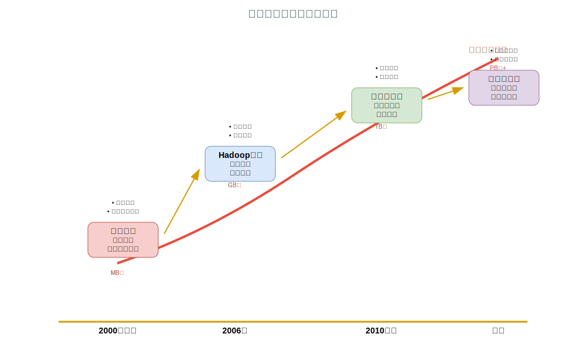
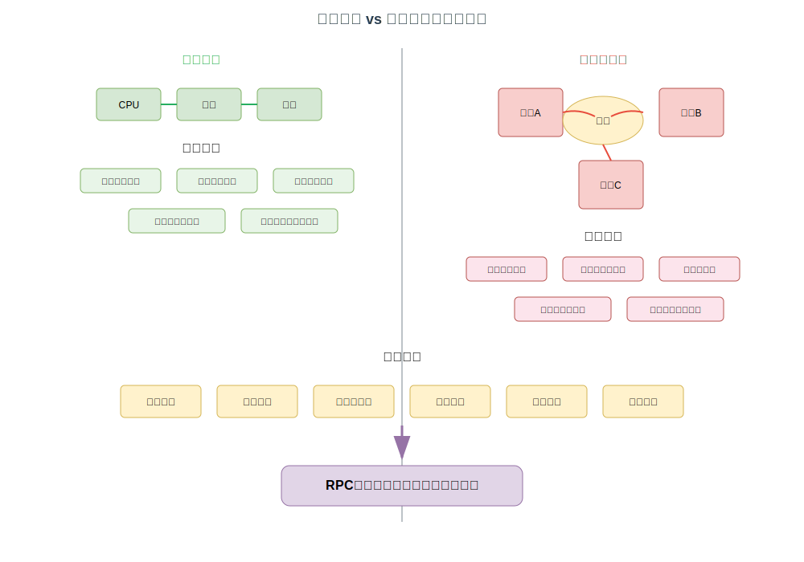
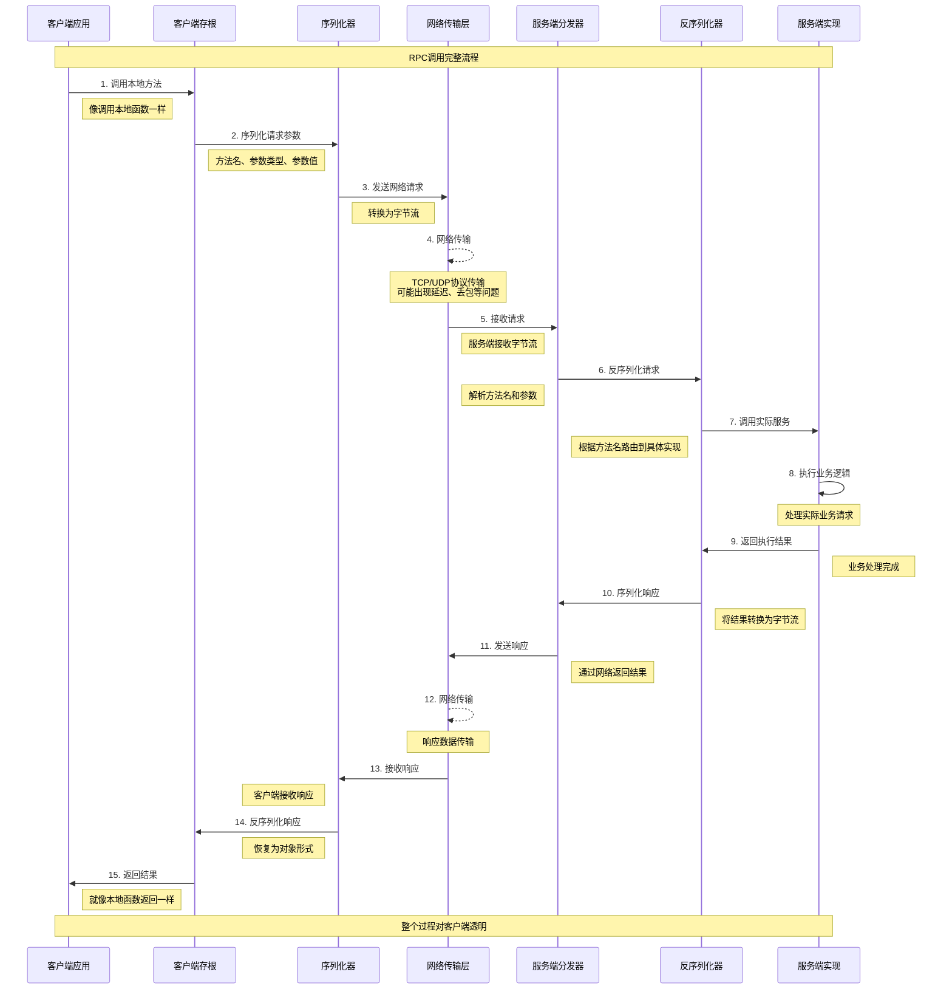
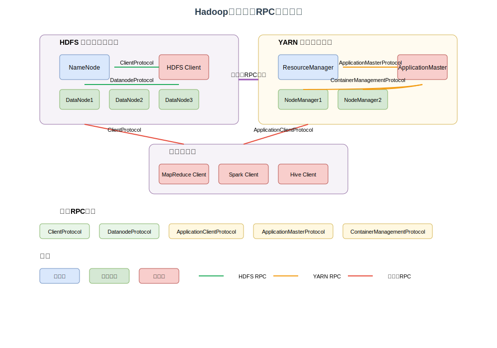

# 第一章 引言

## 大数据时代的技术变革

21世纪初，随着互联网的快速普及和数字化进程的加速，人类社会进入了一个前所未有的数据爆炸时代。从社交媒体的用户行为数据到物联网设备的传感器信息，从金融交易记录到科学研究数据，数据的产生速度和规模呈现出指数级增长的态势。这种变化不仅仅是数量上的增加，更重要的是数据的复杂性、多样性和实时性要求都发生了根本性的改变。

传统的数据处理方式主要依赖于单机系统的垂直扩展，即通过提升单台服务器的CPU性能、内存容量和存储空间来应对数据处理需求的增长。然而，这种方式很快就遇到了物理极限和成本瓶颈。当数据规模达到TB甚至PB级别时，单机系统不仅在处理能力上力不从心，在成本效益上也变得不可接受。更为关键的是，单机系统存在单点故障的风险，一旦系统出现问题，整个数据处理流程就会中断，这对于需要7×24小时连续运行的现代业务系统来说是不可容忍的。

面对这些挑战，分布式计算技术应运而生。分布式计算的核心思想是将大规模的计算任务分解为多个较小的子任务，然后将这些子任务分配到多台普通的商用服务器上并行执行，最后将各个子任务的结果汇总得到最终答案。这种水平扩展的方式不仅能够有效应对数据规模的增长，还能通过冗余设计提高系统的可靠性和容错能力。

在分布式计算技术的发展历程中，Apache Hadoop无疑是一个里程碑式的项目。Hadoop的诞生源于Google在2003年和2004年分别发表的两篇具有划时代意义的论文：《The Google File System》和《MapReduce: Simplified Data Processing on Large Clusters》。这两篇论文首次系统性地阐述了如何在大规模商用服务器集群上构建可靠、高效的分布式存储和计算系统。

Doug Cutting和Mike Cafarella在开发开源搜索引擎Nutch时，深刻认识到了Google论文中描述的技术架构的重要价值。他们意识到，如果能够将这些理念转化为开源实现，将会为整个技术社区带来巨大的价值。2006年，Hadoop项目正式从Nutch中独立出来，成为Apache软件基金会的顶级项目。Hadoop这个名字来源于Doug Cutting儿子的玩具大象，象征着这个项目承载着处理"大象级别"数据的使命。

Hadoop的核心价值在于它将复杂的分布式计算技术民主化，使得普通的开发者和企业也能够构建和运维大规模的分布式系统。在Hadoop出现之前，只有像Google、Yahoo这样的技术巨头才有能力开发和维护分布式计算系统。Hadoop的开源特性和相对简单的使用方式，极大地降低了分布式计算的技术门槛，推动了大数据技术的普及和发展。

*图1-1：大数据时代技术演进历程*

## 分布式系统的通信挑战

然而，分布式计算系统的构建并非易事，其中最核心的挑战之一就是如何实现各个分布式组件之间的高效、可靠通信。在单机系统中，不同模块之间的通信可以通过简单的函数调用或内存共享来实现，这些操作的延迟通常在纳秒级别，可靠性也很高。但在分布式环境中，组件之间的通信需要通过网络进行，这就引入了一系列新的复杂性。

网络通信的延迟比本地调用高出几个数量级，通常在毫秒级别，这就要求系统设计必须考虑异步处理和并发控制。网络的不可靠性也是一个重要挑战，网络分区、数据包丢失、连接中断等问题都可能导致通信失败，系统必须具备相应的容错和恢复机制。此外，分布式系统中的组件可能运行在不同的操作系统、硬件平台和网络环境中，这就要求通信协议具备良好的跨平台兼容性。

在这种背景下，远程过程调用（RPC）技术成为了分布式系统通信的主流解决方案。RPC的核心思想是让远程服务调用看起来像本地函数调用一样简单，从而屏蔽网络通信的复杂性，让开发者能够专注于业务逻辑的实现。

*图1-2：单机通信 vs 分布式通信挑战对比*

## RPC机制的核心价值

远程过程调用（Remote Procedure Call，RPC）是分布式计算领域中一个具有里程碑意义的概念，它的核心思想是让程序能够像调用本地函数一样调用运行在远程计算机上的程序。这种抽象机制有效地屏蔽了网络通信的复杂性，使得分布式应用的开发变得更加直观和简单。

RPC的概念最早由Bruce Jay Nelson在1981年的博士论文中提出，他的愿景是创建一种机制，让分布式程序的编写就像编写单机程序一样自然。在传统的单机环境中，当一个函数调用另一个函数时，调用者会将参数压入栈中，然后跳转到被调用函数的地址执行，执行完毕后返回结果并恢复调用者的执行状态。RPC试图在分布式环境中复制这种简单直接的调用模式，让开发者无需关心底层的网络通信细节。

一个完整的RPC调用过程涉及多个层次的协作，从客户端的调用发起到服务端的结果返回，整个过程可以分解为几个关键步骤。首先，客户端程序调用一个看似本地的函数，这个函数实际上是一个存根（Stub），它负责将函数调用转换为网络请求。存根会将函数名、参数等信息进行序列化，打包成网络消息格式。

序列化是RPC机制中的一个核心环节，它需要将内存中的数据结构转换为可以在网络上传输的字节流。不同的RPC框架采用不同的序列化协议，如JSON、XML、Protocol Buffers、Avro等，每种协议都有其特定的优势和适用场景。序列化协议的选择直接影响到RPC调用的性能、跨语言兼容性和协议的演进能力。

网络传输层负责将序列化后的消息从客户端传输到服务端。这个过程涉及到网络协议的选择（如TCP、UDP、HTTP等）、连接管理、错误处理、重试机制等多个方面。高性能的RPC框架通常会采用连接池技术来复用网络连接，减少连接建立和销毁的开销。

在服务端，网络消息首先被接收和解析，然后进行反序列化，将字节流还原为内存中的数据结构。服务端的分发器（Dispatcher）根据消息中的函数标识找到对应的处理函数，并调用实际的业务逻辑。业务逻辑执行完毕后，返回结果会经过相同的序列化和网络传输过程，最终返回到客户端。

相比传统的消息传递机制，RPC提供了一种更高层次的抽象，它将网络通信封装在函数调用的语义之下，让分布式应用的开发更加接近传统的单机应用开发模式。这种抽象不仅降低了开发难度，还提高了代码的可读性和可维护性。开发者可以专注于业务逻辑的实现，而不需要过多关心底层的通信细节。

在现代分布式系统中，RPC已经成为了组件间通信的标准方式。无论是微服务架构中的服务间调用，还是大数据处理系统中的组件协调，RPC都扮演着核心的角色。它不仅简化了分布式应用的开发，还为系统的模块化和服务化提供了技术基础。

*图1-3：RPC调用完整流程时序图*

## Hadoop RPC的关键地位

在Hadoop这个复杂的分布式生态系统中，RPC机制扮演着神经网络的角色，连接着各个核心组件，协调着整个集群的运行。从HDFS的分布式文件管理到YARN的资源调度，从MapReduce的任务协调到各种上层应用的数据访问，几乎所有的组件间通信都依赖于Hadoop RPC框架。这种深度的依赖关系使得RPC机制的设计质量直接决定了整个Hadoop生态系统的性能表现、可靠性水平和扩展能力。

当我们执行一个简单的`hdfs dfs -ls /`命令时，背后实际上触发了一系列复杂的RPC调用过程。客户端首先通过ClientProtocol向NameNode发起`getListing()`调用，获取目录的元数据信息；如果需要读取文件内容，客户端还会调用`getBlockLocations()`获取数据块的位置信息，然后直接与相应的DataNode进行数据传输。这个看似简单的操作，实际上展现了Hadoop RPC在文件系统操作中的核心作用。

在YARN资源管理场景中，RPC的重要性更加突出。当用户提交一个Spark应用时，整个执行过程涉及多层次的RPC通信：客户端通过ApplicationClientProtocol向ResourceManager提交应用；ResourceManager启动ApplicationMaster后，ApplicationMaster通过ApplicationMasterProtocol向ResourceManager申请资源；获得资源分配后，ApplicationMaster通过ContainerManagementProtocol与NodeManager交互启动容器；任务执行过程中，各个组件还需要持续进行状态汇报和协调。这个复杂的通信网络完全建立在Hadoop RPC的基础之上。

*图1-4：Hadoop生态系统RPC通信架构图*

Hadoop RPC的性能表现对整个系统的吞吐量和响应时间具有决定性影响。在大规模集群环境中，单个NameNode可能需要同时处理数万个并发RPC请求，包括客户端的文件操作请求、DataNode的心跳汇报、以及各种管理操作。RPC框架的处理效率直接影响着这些操作的响应时间，进而影响整个集群的工作效率。

序列化性能是影响RPC效率的关键因素之一。Hadoop RPC经历了从Writable序列化到Protocol Buffers的演进过程，这种演进不仅提升了序列化和反序列化的速度，还减少了网络传输的数据量。在处理大量小文件或频繁的元数据操作时，序列化性能的提升能够带来显著的整体性能改善。

网络通信的效率同样至关重要。Hadoop RPC采用了基于NIO的多线程架构，通过Reactor模式实现了高效的网络I/O处理。服务端的Listener线程负责接受连接，Reader线程负责读取请求，Handler线程负责业务处理，Responder线程负责发送响应。这种分工明确的多线程设计充分利用了多核CPU的优势，在高并发场景下表现出色。

在分布式环境中，网络故障、节点异常、服务重启等问题都是常态，Hadoop RPC必须具备强大的容错能力来保障系统的可靠运行。框架内置了多层次的可靠性保障机制，从网络层的重试机制到应用层的故障检测，形成了完整的容错体系。

重试机制是RPC可靠性的第一道防线。当网络出现临时故障或服务端暂时不可用时，客户端会自动进行重试，避免因为瞬时问题导致的操作失败。超时控制机制确保了系统不会因为某个慢请求而长时间阻塞。故障检测和恢复机制帮助系统快速识别和处理组件故障。版本兼容性机制确保了新旧版本的组件能够正常通信，支持集群的滚动升级。

## 本文分析框架

深入理解Hadoop RPC机制需要一套系统性的分析方法论，这套方法论不仅要能够揭示技术实现的细节，更要能够阐明设计决策背后的深层逻辑。基于前面对大数据背景、RPC概念和Hadoop RPC重要性的分析，我们需要建立一个既有理论深度又有实践指导意义的分析框架。

这个分析框架将采用"层次化递进、理论与实践并重"的方法论。我们将从抽象的设计理念出发，逐步深入到具体的实现细节；从静态的架构分析开始，逐步扩展到动态的运行机制；从单一组件的功能分析开始，逐步扩展到整个生态系统的协作模式。这种多维度、多层次的分析方法能够帮助读者建立对Hadoop RPC机制的全面理解。

为了确保分析的全面性和系统性，我们将从六个核心维度来剖析Hadoop RPC机制：**架构设计维度**关注RPC框架的整体架构和核心组件；**协议机制维度**关注RPC通信的协议设计和消息格式；**实现技术维度**关注RPC框架的具体实现技术；**性能优化维度**关注RPC框架的性能特征和优化策略；**安全机制维度**关注RPC框架的安全设计和实现；**应用实践维度**关注RPC框架在实际系统中的应用模式。

我们将采用"从浅到深、从抽象到具体"的研究路径，这个路径包括基础理论阶段、核心架构阶段、实现机制阶段、高级特性阶段、应用实践阶段和深度分析阶段。每个阶段都为下一阶段奠定基础，形成完整的知识递进体系。

为了确保分析的准确性和深入性，我们将采用多种分析工具和方法，包括源码分析、架构图表、实例分析、对比分析和性能测试。这些工具的选择基于分析对象的特点和分析目标的要求，力求在理论分析和实践验证之间找到最佳平衡。

通过这套分析框架的系统应用，我们期望达到理论理解、技术掌握、应用指导和创新启发四个层次的分析成果。理论理解层面，读者将建立对Hadoop RPC机制的全面理论认知；技术掌握层面，读者将掌握Hadoop RPC的核心技术和实现细节；应用指导层面，读者将获得Hadoop RPC应用和优化的实践指导；创新启发层面，读者将获得分布式系统设计的创新启发。

## 总结

大数据时代的到来催生了分布式计算技术的快速发展，Hadoop作为这一技术浪潮的重要推动者，其RPC机制的设计和演进承载着深刻的技术内涵和历史意义。从最初解决大规模数据处理的迫切需求，到后来不断优化性能和扩展功能，Hadoop RPC的发展历程反映了分布式系统通信技术的演进轨迹。

RPC作为分布式系统通信的基础技术，其核心价值在于将复杂的网络通信抽象为简单的函数调用，从而降低了分布式应用开发的门槛。Hadoop RPC在继承了传统RPC核心思想的基础上，针对大数据处理的特殊需求进行了专门的优化和扩展，形成了独特的技术特色。

在Hadoop生态系统中，RPC机制扮演着神经网络的角色，其设计质量直接决定了整个系统的性能表现、可靠性水平和扩展能力。通过系统性的分析框架，我们将深入探讨Hadoop RPC的设计原理、实现机制和应用实践，为读者提供全面深入的技术理解和实践指导。

在接下来的章节中，我们将严格按照这个分析框架来展开对Hadoop RPC机制的深入剖析，确保分析的系统性、深入性和实用性。每个章节都将在前面章节的基础上递进发展，最终形成一个完整的知识体系。

---

**关键要点总结：**

- **技术背景**：大数据时代推动了从单机计算向分布式计算的技术变革
- **核心挑战**：分布式环境下的网络通信引入了延迟、不可靠性等新复杂性
- **RPC价值**：将复杂的网络通信抽象为简单的函数调用，降低分布式开发门槛
- **关键地位**：Hadoop RPC是生态系统的神经网络，影响整体性能和可靠性
- **分析框架**：采用六维度、六阶段的系统性分析方法，实现理论与实践并重
