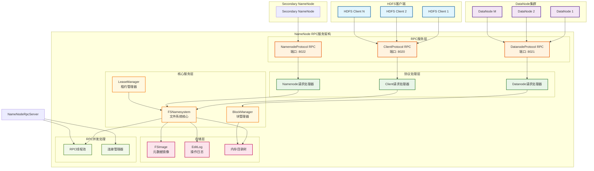
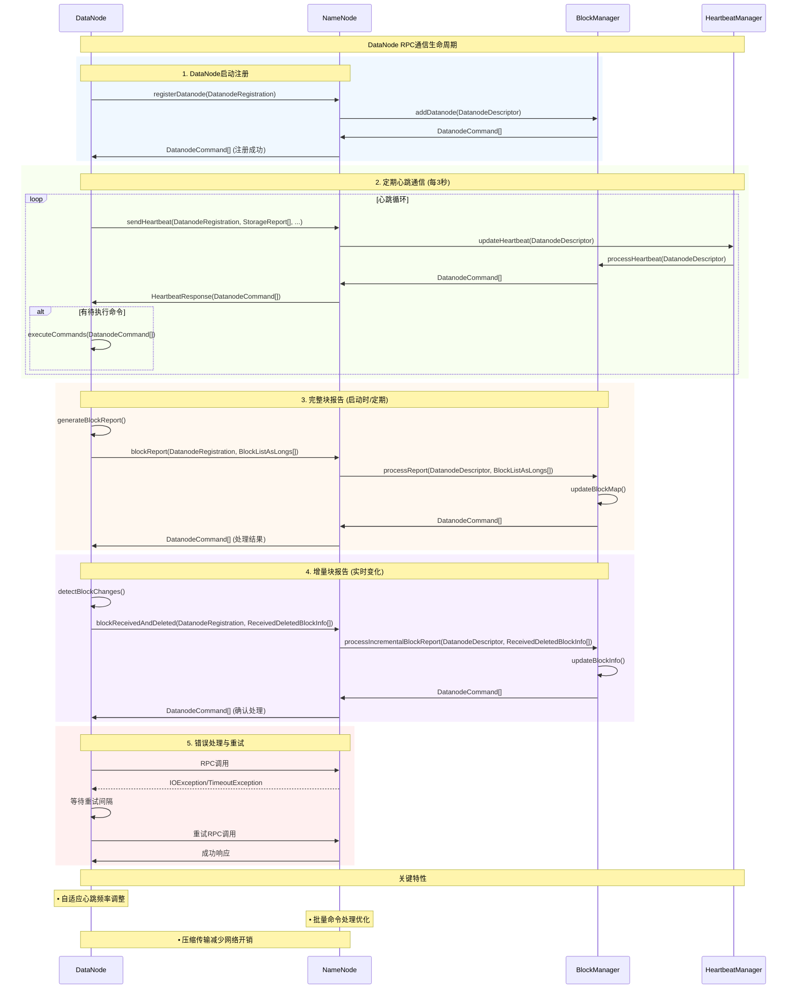
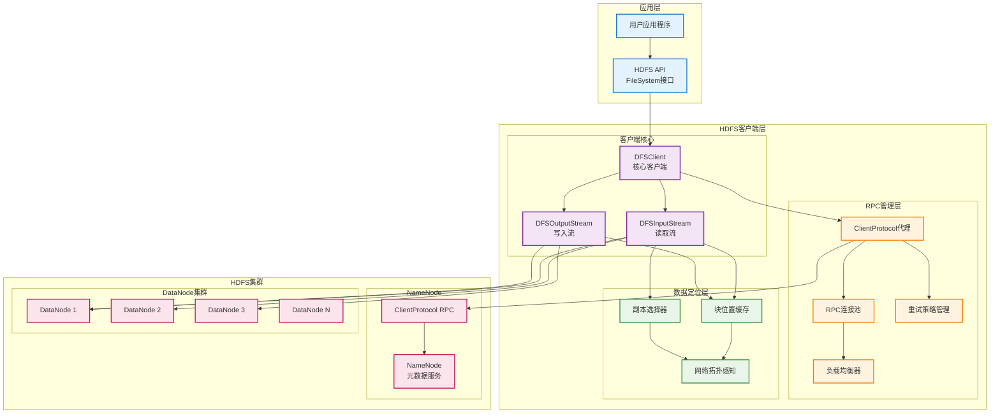
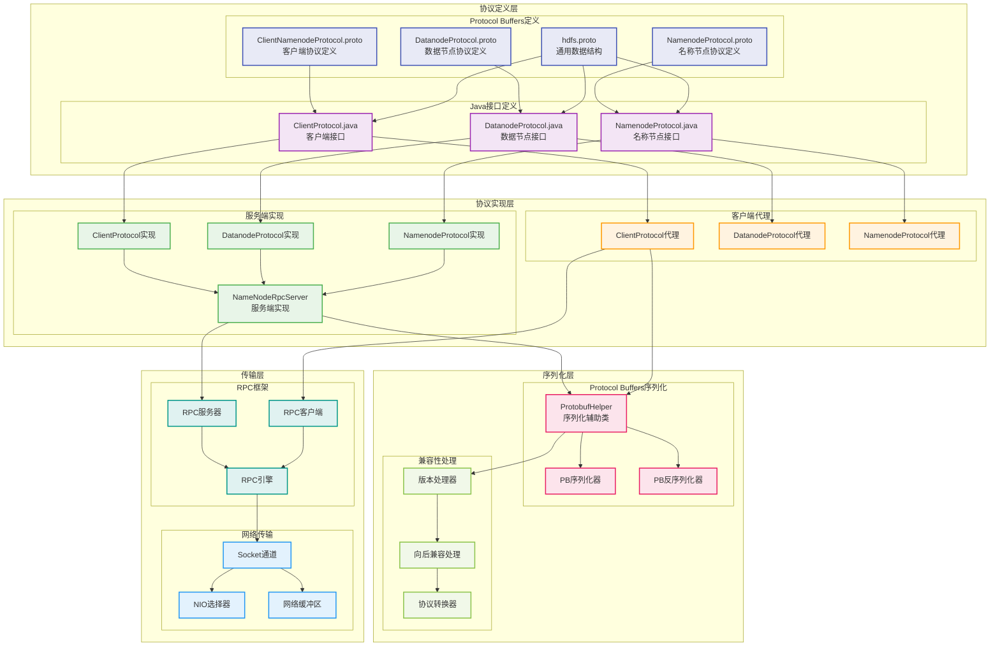

# 第十章 HDFS中的RPC应用

## 10.1 NameNode RPC服务架构

NameNode作为HDFS的核心组件，承担着整个文件系统的元数据管理职责，其RPC服务架构的设计直接影响着HDFS的性能表现和可扩展性。在大规模Hadoop集群中，NameNode需要同时处理来自数千个DataNode的心跳报告、块报告，以及来自大量客户端的文件操作请求，这种高并发、多样化的请求模式对RPC服务架构提出了极高的要求。NameNode的RPC实现不仅要保证高吞吐量和低延迟，还必须确保元数据操作的强一致性和系统的高可用性。

NameNode的RPC服务采用了多端口、多协议的设计策略，针对不同类型的客户端提供专门优化的服务接口。ClientProtocol主要服务于HDFS客户端的文件操作请求，包括文件的创建、删除、重命名等元数据操作。DatanodeProtocol专门处理DataNode的注册、心跳、块报告等管理协议。NamenodeProtocol则用于支持Secondary NameNode和Standby NameNode的元数据同步需求。这种协议分离的设计使得NameNode能够针对不同类型的请求采用相应的优化策略，提高整体的服务效率。

NameNode RPC服务的实现还需要处理复杂的RPC并发处理和线程管理问题。由于需要同时处理大量并发RPC请求，NameNode必须确保RPC调用的线程安全性，避免出现资源竞争和性能瓶颈。系统采用了多线程池架构，针对不同类型的RPC请求使用专门的线程池进行处理。同时，NameNode还实现了RPC连接管理和负载控制机制，确保系统在高并发场景下的稳定性和性能。

为了更好地理解NameNode的RPC服务架构，下图展示了其完整的组件结构和交互关系：



*图9-1：NameNode RPC服务架构全景图*

### NameNode RPC服务实现

NameNode的RPC服务实现基于Hadoop RPC框架，通过多个专门的协议接口为不同类型的客户端提供服务：

```java
/**
 * NameNode RPC服务器实现
 */
public class NameNodeRpcServer implements ClientProtocol, DatanodeProtocol,
        NamenodeProtocol, RefreshAuthorizationPolicyProtocol {

    private final NameNode namenode;
    private final FSNamesystem namesystem;
    private final RPC.Server clientRpcServer;
    private final RPC.Server datanodeRpcServer;
    private final RPC.Server namenodeRpcServer;

    /**
     * 构造函数 - 初始化多个RPC服务器
     */
    public NameNodeRpcServer(Configuration conf, NameNode nn) throws IOException {
        this.namenode = nn;
        this.namesystem = nn.getNamesystem();

        // 创建ClientProtocol RPC服务器
        InetSocketAddress clientRpcAddr = NameNode.getAddress(conf);
        this.clientRpcServer = new RPC.Builder(conf)
            .setProtocol(ClientProtocol.class)
            .setInstance(this)
            .setBindAddress(clientRpcAddr.getHostName())
            .setPort(clientRpcAddr.getPort())
            .setNumHandlers(conf.getInt(DFS_NAMENODE_HANDLER_COUNT_KEY,
                                      DFS_NAMENODE_HANDLER_COUNT_DEFAULT))
            .setVerbose(false)
            .build();

        // 创建DatanodeProtocol RPC服务器
        InetSocketAddress datanodeRpcAddr = NameNode.getDatanodeAddress(conf);
        this.datanodeRpcServer = new RPC.Builder(conf)
            .setProtocol(DatanodeProtocol.class)
            .setInstance(this)
            .setBindAddress(datanodeRpcAddr.getHostName())
            .setPort(datanodeRpcAddr.getPort())
            .setNumHandlers(conf.getInt(DFS_NAMENODE_SERVICE_HANDLER_COUNT_KEY,
                                      DFS_NAMENODE_SERVICE_HANDLER_COUNT_DEFAULT))
            .setVerbose(false)
            .build();

        // 创建NamenodeProtocol RPC服务器
        InetSocketAddress namenodeRpcAddr = NameNode.getNamenodeAddress(conf);
        this.namenodeRpcServer = new RPC.Builder(conf)
            .setProtocol(NamenodeProtocol.class)
            .setInstance(this)
            .setBindAddress(namenodeRpcAddr.getHostName())
            .setPort(namenodeRpcAddr.getPort())
            .setNumHandlers(2) // Secondary NameNode使用较少的处理线程
            .setVerbose(false)
            .build();
    }

    /**
     * 启动所有RPC服务器
     */
    public void start() {
        clientRpcServer.start();
        datanodeRpcServer.start();
        namenodeRpcServer.start();
        LOG.info("NameNode RPC servers started");
    }

    /**
     * ClientProtocol实现 - 文件创建
     */
    @Override
    public HdfsFileStatus create(String src, FsPermission masked, String clientName,
            EnumSetWritable<CreateFlag> flag, boolean createParent,
            short replication, long blockSize, CryptoProtocolVersion[] supportedVersions)
            throws IOException {

        checkNNStartup();
        String clientMachine = getClientMachine();

        if (stateChangeLog.isDebugEnabled()) {
            stateChangeLog.debug("*DIR* NameNode.create: file " + src
                + " for " + clientName + " at " + clientMachine);
        }

        if (!checkPathLength(src)) {
            throw new IOException("create: Pathname too long.  Limit "
                + MAX_PATH_LENGTH + " characters, " + MAX_PATH_DEPTH + " levels.");
        }

        HdfsFileStatus fileStatus = namesystem.startFile(src, new PermissionStatus(
            getRemoteUser().getShortUserName(), null, masked),
            clientName, clientMachine, flag.get(), createParent, replication,
            blockSize, supportedVersions);

        metrics.incrFilesCreated();
        metrics.incrCreateFileOps();
        return fileStatus;
    }
}
```

### RPC线程池管理

NameNode使用专门的线程池来处理不同类型的RPC请求：

```java
/**
 * RPC线程池管理器
 */
public class RPCThreadPoolManager {

    private final ThreadPoolExecutor clientRpcThreadPool;
    private final ThreadPoolExecutor datanodeRpcThreadPool;
    private final ThreadPoolExecutor namenodeRpcThreadPool;
    private final RPCMetrics rpcMetrics;

    public RPCThreadPoolManager(Configuration conf) {
        this.rpcMetrics = new RPCMetrics();

        // 客户端RPC线程池
        int clientHandlerCount = conf.getInt(DFS_NAMENODE_HANDLER_COUNT_KEY,
                                           DFS_NAMENODE_HANDLER_COUNT_DEFAULT);
        this.clientRpcThreadPool = createThreadPool("ClientRPC", clientHandlerCount);

        // DataNode RPC线程池
        int datanodeHandlerCount = conf.getInt(DFS_NAMENODE_SERVICE_HANDLER_COUNT_KEY,
                                             DFS_NAMENODE_SERVICE_HANDLER_COUNT_DEFAULT);
        this.datanodeRpcThreadPool = createThreadPool("DatanodeRPC", datanodeHandlerCount);

        // NameNode RPC线程池
        this.namenodeRpcThreadPool = createThreadPool("NamenodeRPC", 2);
    }

    private ThreadPoolExecutor createThreadPool(String name, int coreSize) {
        return new ThreadPoolExecutor(
            coreSize,                           // 核心线程数
            coreSize * 2,                       // 最大线程数
            60L, TimeUnit.SECONDS,              // 空闲线程存活时间
            new LinkedBlockingQueue<>(1000),    // 任务队列
            new ThreadFactoryBuilder()
                .setNameFormat(name + "-%d")
                .setDaemon(true)
                .build(),
            new ThreadPoolExecutor.CallerRunsPolicy() // 拒绝策略
        );
    }

    /**
     * 提交客户端RPC任务
     */
    public Future<?> submitClientRPCTask(Runnable task) {
        return submitTask(clientRpcThreadPool, task, "ClientRPC");
    }

    /**
     * 提交DataNode RPC任务
     */
    public Future<?> submitDatanodeRPCTask(Runnable task) {
        return submitTask(datanodeRpcThreadPool, task, "DatanodeRPC");
    }

    /**
     * 提交NameNode RPC任务
     */
    public Future<?> submitNamenodeRPCTask(Runnable task) {
        return submitTask(namenodeRpcThreadPool, task, "NamenodeRPC");
    }

    private Future<?> submitTask(ThreadPoolExecutor executor, Runnable task, String poolName) {
        long startTime = System.currentTimeMillis();

        return executor.submit(() -> {
            try {
                task.run();
                rpcMetrics.recordTaskSuccess(poolName, System.currentTimeMillis() - startTime);
            } catch (Exception e) {
                rpcMetrics.recordTaskFailure(poolName, System.currentTimeMillis() - startTime);
                LOG.error("RPC task execution failed in pool: " + poolName, e);
                throw e;
            }
        });
    }

    /**
     * 获取线程池状态
     */
    public ThreadPoolStatus getThreadPoolStatus(String poolName) {
        ThreadPoolExecutor executor = getExecutorByName(poolName);
        if (executor == null) {
            return null;
        }

        return new ThreadPoolStatus(
            poolName,
            executor.getCorePoolSize(),
            executor.getActiveCount(),
            executor.getQueue().size(),
            executor.getCompletedTaskCount()
        );
    }

    private ThreadPoolExecutor getExecutorByName(String poolName) {
        switch (poolName) {
            case "ClientRPC": return clientRpcThreadPool;
            case "DatanodeRPC": return datanodeRpcThreadPool;
            case "NamenodeRPC": return namenodeRpcThreadPool;
            default: return null;
        }
    }

    /**
     * 线程池状态信息
     */
    public static class ThreadPoolStatus {
        private final String poolName;
        private final int corePoolSize;
        private final int activeThreads;
        private final int queueSize;
        private final long completedTasks;

        public ThreadPoolStatus(String poolName, int corePoolSize, int activeThreads,
                              int queueSize, long completedTasks) {
            this.poolName = poolName;
            this.corePoolSize = corePoolSize;
            this.activeThreads = activeThreads;
            this.queueSize = queueSize;
            this.completedTasks = completedTasks;
        }

        // Getters
        public String getPoolName() { return poolName; }
        public int getCorePoolSize() { return corePoolSize; }
        public int getActiveThreads() { return activeThreads; }
        public int getQueueSize() { return queueSize; }
        public long getCompletedTasks() { return completedTasks; }
    }
}
```

NameNode RPC服务架构的关键特征：

- **多协议支持**：针对不同客户端类型提供专门的RPC协议接口
- **高并发处理**：支持数千个并发连接和请求的高效处理
- **强一致性保证**：确保元数据操作的原子性和一致性
- **故障恢复机制**：通过操作日志和检查点实现快速故障恢复
- **性能监控优化**：实时监控RPC性能并进行动态优化

## 10.2 DataNode RPC通信机制

DataNode作为HDFS的数据存储节点，通过RPC机制与NameNode保持密切的通信联系，报告自身的健康状态、存储容量、以及所管理的数据块信息。这种通信机制不仅是HDFS集群管理的基础，也是数据可靠性和一致性保证的重要环节。DataNode的RPC通信需要在保证信息及时性的同时，尽量减少对NameNode的负载压力，特别是在大规模集群中，数千个DataNode的并发通信可能对NameNode造成严重的性能冲击。

DataNode的RPC通信主要包括三种类型的交互：心跳报告、块报告和增量块报告。心跳报告是DataNode向NameNode证明自己仍然存活的机制，通常每隔几秒钟发送一次，包含DataNode的基本状态信息如存储使用率、网络状态等。块报告是DataNode向NameNode汇报其存储的所有数据块信息，这是一个相对重量级的操作，通常在DataNode启动时或定期执行。增量块报告则用于及时通知NameNode关于数据块的变化，如新增、删除或损坏的块信息。

为了优化DataNode RPC通信的性能，Hadoop实现了多种优化策略。首先是通信频率的智能调节，系统会根据集群的负载状况和DataNode的状态动态调整心跳间隔和报告频率。其次是数据压缩和批量传输，特别是在块报告中，系统会对大量的块信息进行压缩传输，并支持分批发送以避免单次传输的数据量过大。最后是异步处理机制，DataNode可以在后台异步准备报告数据，避免阻塞正常的数据服务。

下图详细展示了DataNode与NameNode之间的RPC通信机制和数据流：



*图9-2：DataNode RPC通信时序图*

### RPC调用频率优化

在DataNode与NameNode的RPC通信中，调用频率的优化是关键的性能考量：

```java
/**
 * RPC调用频率优化器
 */
public class RPCFrequencyOptimizer {

    private final long baseInterval;
    private volatile long currentInterval;
    private final RPCMetrics rpcMetrics;

    public RPCFrequencyOptimizer(long baseInterval, RPCMetrics metrics) {
        this.baseInterval = baseInterval;
        this.currentInterval = baseInterval;
        this.rpcMetrics = metrics;
    }

    /**
     * 根据RPC性能动态调整调用频率
     */
    public long getOptimizedInterval() {
        double avgResponseTime = rpcMetrics.getAverageResponseTime();
        double errorRate = rpcMetrics.getErrorRate();

        // 基于RPC性能指标调整频率
        if (avgResponseTime > 1000 || errorRate > 0.05) {
            // RPC性能较差时降低频率
            currentInterval = Math.min(baseInterval * 2, baseInterval * 3);
        } else if (avgResponseTime < 100 && errorRate < 0.01) {
            // RPC性能良好时提高频率
            currentInterval = Math.max(baseInterval / 2, baseInterval / 3);
        } else {
            currentInterval = baseInterval;
        }

        return currentInterval;
    }

    /**
     * RPC批量调用优化
     */
    public <T> List<T> batchRPCCall(List<Callable<T>> rpcCalls) throws IOException {
        List<T> results = new ArrayList<>();
        List<Future<T>> futures = new ArrayList<>();

        // 并发执行多个RPC调用
        ExecutorService executor = Executors.newFixedThreadPool(
            Math.min(rpcCalls.size(), 10));

        try {
            for (Callable<T> call : rpcCalls) {
                futures.add(executor.submit(call));
            }

            // 收集结果
            for (Future<T> future : futures) {
                try {
                    results.add(future.get(30, TimeUnit.SECONDS));
                } catch (Exception e) {
                    throw new IOException("Batch RPC call failed", e);
                }
            }
        } finally {
            executor.shutdown();
        }

        return results;
    }
}
```

### RPC数据压缩传输

在大数据量的RPC调用中，数据压缩是重要的优化手段：

```java
/**
 * RPC数据压缩处理器
 */
public class RPCCompressionHandler {

    private final CompressionCodec codec;
    private final int compressionThreshold;

    public RPCCompressionHandler(Configuration conf) {
        // 选择压缩算法
        String codecName = conf.get("hadoop.rpc.compression.codec", "org.apache.hadoop.io.compress.DefaultCodec");
        this.codec = ReflectionUtils.newInstance(
            conf.getClassByName(codecName).asSubclass(CompressionCodec.class), conf);
        this.compressionThreshold = conf.getInt("hadoop.rpc.compression.threshold", 1024);
    }

    /**
     * 压缩RPC请求数据
     */
    public byte[] compressRequest(Object request) throws IOException {
        byte[] serializedData = serializeObject(request);

        if (serializedData.length < compressionThreshold) {
            return serializedData; // 小数据不压缩
        }

        ByteArrayOutputStream baos = new ByteArrayOutputStream();
        try (CompressionOutputStream cos = codec.createOutputStream(baos)) {
            cos.write(serializedData);
            cos.finish();
        }

        byte[] compressedData = baos.toByteArray();
        LOG.debug("Compressed RPC data from {} to {} bytes (ratio: {:.2f})",
                 serializedData.length, compressedData.length,
                 (double) compressedData.length / serializedData.length);

        return compressedData;
    }

    /**
     * 解压缩RPC响应数据
     */
    public Object decompressResponse(byte[] compressedData, Class<?> responseType) throws IOException {
        if (compressedData.length < compressionThreshold) {
            return deserializeObject(compressedData, responseType);
        }

        ByteArrayInputStream bais = new ByteArrayInputStream(compressedData);
        ByteArrayOutputStream baos = new ByteArrayOutputStream();

        try (CompressionInputStream cis = codec.createInputStream(bais)) {
            IOUtils.copyBytes(cis, baos, 4096);
        }

        return deserializeObject(baos.toByteArray(), responseType);
    }

    /**
     * 批量数据压缩 - 用于块报告等大数据量场景
     */
    public byte[] compressBatchData(List<?> dataList) throws IOException {
        ByteArrayOutputStream baos = new ByteArrayOutputStream();

        try (CompressionOutputStream cos = codec.createOutputStream(baos);
             ObjectOutputStream oos = new ObjectOutputStream(cos)) {

            oos.writeInt(dataList.size());
            for (Object data : dataList) {
                oos.writeObject(data);
            }
            oos.flush();
            cos.finish();
        }

        return baos.toByteArray();
    }

    private byte[] serializeObject(Object obj) throws IOException {
        ByteArrayOutputStream baos = new ByteArrayOutputStream();
        try (ObjectOutputStream oos = new ObjectOutputStream(baos)) {
            oos.writeObject(obj);
        }
        return baos.toByteArray();
    }

    private Object deserializeObject(byte[] data, Class<?> type) throws IOException {
        ByteArrayInputStream bais = new ByteArrayInputStream(data);
        try (ObjectInputStream ois = new ObjectInputStream(bais)) {
            return ois.readObject();
        } catch (ClassNotFoundException e) {
            throw new IOException("Failed to deserialize object", e);
        }
    }
}
```

### RPC异步调用模式

在高并发场景下，异步RPC调用可以显著提升性能：

```java
/**
 * 异步RPC调用管理器
 */
public class AsyncRPCManager {

    private final ExecutorService rpcExecutor;
    private final Map<String, CompletableFuture<Object>> pendingCalls;
    private final RPCMetrics metrics;

    public AsyncRPCManager(int threadPoolSize) {
        this.rpcExecutor = Executors.newFixedThreadPool(threadPoolSize,
            new ThreadFactoryBuilder()
                .setNameFormat("async-rpc-%d")
                .setDaemon(true)
                .build());
        this.pendingCalls = new ConcurrentHashMap<>();
        this.metrics = new RPCMetrics();
    }

    /**
     * 异步执行RPC调用
     */
    public <T> CompletableFuture<T> callAsync(String callId,
                                            Supplier<T> rpcCall) {
        CompletableFuture<T> future = CompletableFuture.supplyAsync(() -> {
            long startTime = System.currentTimeMillis();
            try {
                T result = rpcCall.get();
                metrics.recordSuccess(System.currentTimeMillis() - startTime);
                return result;
            } catch (Exception e) {
                metrics.recordFailure(System.currentTimeMillis() - startTime);
                throw new RuntimeException("Async RPC call failed", e);
            }
        }, rpcExecutor);

        pendingCalls.put(callId, (CompletableFuture<Object>) future);

        // 设置超时处理
        future.orTimeout(30, TimeUnit.SECONDS)
              .whenComplete((result, throwable) -> {
                  pendingCalls.remove(callId);
                  if (throwable != null) {
                      LOG.warn("Async RPC call {} failed", callId, throwable);
                  }
              });

        return future;
    }

    /**
     * 批量异步RPC调用
     */
    public <T> CompletableFuture<List<T>> batchCallAsync(
            Map<String, Supplier<T>> rpcCalls) {

        List<CompletableFuture<T>> futures = rpcCalls.entrySet().stream()
            .map(entry -> callAsync(entry.getKey(), entry.getValue()))
            .collect(Collectors.toList());

        return CompletableFuture.allOf(futures.toArray(new CompletableFuture[0]))
            .thenApply(v -> futures.stream()
                .map(CompletableFuture::join)
                .collect(Collectors.toList()));
    }

    /**
     * 取消待处理的RPC调用
     */
    public boolean cancelCall(String callId) {
        CompletableFuture<Object> future = pendingCalls.remove(callId);
        if (future != null) {
            return future.cancel(true);
        }
        return false;
    }

    /**
     * 获取RPC性能指标
     */
    public RPCMetrics getMetrics() {
        return metrics;
    }

    public void shutdown() {
        rpcExecutor.shutdown();
        try {
            if (!rpcExecutor.awaitTermination(60, TimeUnit.SECONDS)) {
                rpcExecutor.shutdownNow();
            }
        } catch (InterruptedException e) {
            rpcExecutor.shutdownNow();
            Thread.currentThread().interrupt();
        }
    }
}
```

DataNode RPC通信机制的核心特征：

- **RPC调用频率优化**：基于性能指标动态调整RPC调用频率
- **数据压缩传输**：对大数据量RPC请求进行压缩以减少网络开销
- **异步RPC调用**：支持异步和批量RPC调用模式提升并发性能
- **RPC故障处理**：完善的RPC重试和故障恢复机制
- **性能监控优化**：实时监控RPC性能并进行动态调整

## 10.3 客户端RPC调用模式

HDFS客户端的RPC调用模式体现了分布式文件系统在易用性和性能之间的精妙平衡。客户端需要通过RPC调用完成文件的各种操作，包括文件的创建、读取、写入、删除等，同时还要处理文件权限、副本管理、数据一致性等复杂的分布式系统问题。客户端RPC的设计必须对应用程序透明，提供类似本地文件系统的编程接口，同时在底层实现高效的分布式操作和错误处理机制。

HDFS客户端的RPC调用采用了分层的设计架构，上层提供标准的文件系统API，中间层负责RPC调用的封装和管理，底层处理网络通信和协议细节。这种分层设计使得应用程序可以使用熟悉的文件操作接口，而不需要了解底层的分布式实现细节。同时，中间层的RPC管理模块负责连接池管理、重试机制、负载均衡等复杂的分布式系统问题，确保客户端操作的可靠性和性能。

客户端RPC调用的一个重要特征是智能的数据定位和访问优化。当客户端需要读取文件数据时，首先通过RPC调用向NameNode查询文件的块位置信息，然后直接与相应的DataNode建立连接进行数据传输。这种设计避免了数据通过NameNode中转的开销，大大提高了数据访问的效率。同时，客户端还实现了本地副本优先、网络拓扑感知等优化策略，进一步提升数据访问性能。

下图展示了HDFS客户端RPC调用的完整架构和数据流：



*图9-3：HDFS客户端RPC调用架构图*

### DFSClient核心实现

DFSClient是HDFS客户端的核心组件，负责管理与NameNode的RPC通信：

```java
/**
 * HDFS分布式文件系统客户端
 */
public class DFSClient implements java.io.Closeable, RemotePeerFactory,
        DataEncryptionKeyFactory {

    private final Configuration conf;
    private final ClientProtocol namenode;
    private final UserGroupInformation ugi;
    private final SocketFactory socketFactory;
    private final ReplaceDatanodeOnFailure dtpReplaceDatanodeOnFailure;
    private final FileSystem.Statistics stats;
    private final String authority;
    private final Random r = new Random();
    private SocketAddress[] namenodeAddrs;
    private final boolean connectToDnViaHostname;
    private final LeaseRenewer leaserenewer;
    private final int hdfsTimeout;
    private final String clientName;

    /**
     * 构造函数 - 初始化客户端
     */
    public DFSClient(URI nameNodeUri, Configuration conf,
                     FileSystem.Statistics stats) throws IOException {
        this.conf = new Configuration(conf);
        this.stats = stats;
        this.socketFactory = NetUtils.getSocketFactory(conf, ClientProtocol.class);
        this.dtpReplaceDatanodeOnFailure = ReplaceDatanodeOnFailure.get(conf);
        this.ugi = UserGroupInformation.getCurrentUser();
        this.authority = nameNodeUri.getAuthority();
        this.clientName = "DFSClient_" + r.nextInt()
            + "_" + Thread.currentThread().getId();
        this.hdfsTimeout = Client.getTimeout(conf);
        this.connectToDnViaHostname = conf.getBoolean(DFS_CLIENT_USE_DN_HOSTNAME,
                                                     DFS_CLIENT_USE_DN_HOSTNAME_DEFAULT);

        // 创建NameNode代理
        this.namenode = createNameNodeProxy();

        // 启动租约续期器
        this.leaserenewer = LeaseRenewer.getInstance(authority, ugi, this);
    }

    /**
     * 创建NameNode RPC代理
     */
    private ClientProtocol createNameNodeProxy() throws IOException {
        AbstractNNFailoverProxyProvider<ClientProtocol> proxyProvider =
            createFailoverProxyProvider();

        if (proxyProvider == null) {
            // 单NameNode模式
            InetSocketAddress nnAddr = NameNode.getAddress(authority);
            this.namenodeAddrs = new SocketAddress[]{nnAddr};
            return createNameNodeProxyWithClientProtocol(nnAddr, conf, ugi, false);
        } else {
            // HA模式
            this.namenodeAddrs = proxyProvider.getProxyAddresses();
            return createHAProxy(proxyProvider);
        }
    }

    /**
     * 创建文件
     */
    public DFSOutputStream create(String src, FsPermission permission,
            EnumSet<CreateFlag> flag, boolean createParent, short replication,
            long blockSize, Progressable progress, int buffersize,
            ChecksumOpt checksumOpt) throws IOException {

        checkOpen();
        final FsPermission masked = applyUMask(permission);
        LOG.debug("Creating file: {} with permission: {}", src, masked);

        try {
            HdfsFileStatus stat = namenode.create(src, masked, clientName,
                new EnumSetWritable<>(flag, CreateFlag.class), createParent,
                replication, blockSize, SUPPORTED_CRYPTO_VERSIONS);

            return newStreamForCreate(src, stat, flag, progress, buffersize,
                                    checksumOpt);
        } catch (RemoteException re) {
            throw re.unwrapRemoteException(AccessControlException.class,
                                         FileAlreadyExistsException.class,
                                         FileNotFoundException.class,
                                         NSQuotaExceededException.class,
                                         DSQuotaExceededException.class,
                                         UnresolvedPathException.class,
                                         SnapshotAccessControlException.class);
        }
    }

    /**
     * 打开文件进行读取
     */
    public DFSInputStream open(String src, int buffersize, boolean verifyChecksum)
            throws IOException {
        checkOpen();

        // 获取文件状态
        HdfsFileStatus fileStatus = getFileInfo(src);
        if (fileStatus == null) {
            throw new FileNotFoundException("File does not exist: " + src);
        }

        return new DFSInputStream(this, src, verifyChecksum);
    }

    /**
     * 获取块位置信息
     */
    public LocatedBlocks getLocatedBlocks(String src, long start, long length)
            throws IOException {
        TraceScope scope = getPathTraceScope("getBlockLocations", src);
        try {
            return callGetBlockLocations(namenode, src, start, length);
        } finally {
            scope.close();
        }
    }

    private LocatedBlocks callGetBlockLocations(ClientProtocol namenode,
            String src, long start, long length) throws IOException {
        try {
            return namenode.getBlockLocations(src, start, length);
        } catch (RemoteException re) {
            throw re.unwrapRemoteException(AccessControlException.class,
                                         FileNotFoundException.class,
                                         UnresolvedPathException.class);
        }
    }
}
```

### RPC负载均衡策略

客户端通过负载均衡策略优化RPC调用分布：

```java
/**
 * RPC负载均衡器
 */
public class RPCLoadBalancer {

    private final List<InetSocketAddress> serverAddresses;
    private final AtomicInteger currentIndex;
    private final Map<InetSocketAddress, ServerMetrics> serverMetrics;
    private final LoadBalanceStrategy strategy;

    public enum LoadBalanceStrategy {
        ROUND_ROBIN,    // 轮询
        LEAST_CONNECTIONS,  // 最少连接
        RESPONSE_TIME,  // 响应时间
        WEIGHTED_ROUND_ROBIN  // 加权轮询
    }

    public RPCLoadBalancer(List<InetSocketAddress> servers, LoadBalanceStrategy strategy) {
        this.serverAddresses = new ArrayList<>(servers);
        this.currentIndex = new AtomicInteger(0);
        this.serverMetrics = new ConcurrentHashMap<>();
        this.strategy = strategy;

        // 初始化服务器指标
        for (InetSocketAddress addr : servers) {
            serverMetrics.put(addr, new ServerMetrics());
        }
    }

    /**
     * 选择最优的RPC服务器
     */
    public InetSocketAddress selectServer() {
        switch (strategy) {
            case ROUND_ROBIN:
                return roundRobinSelect();
            case LEAST_CONNECTIONS:
                return leastConnectionsSelect();
            case RESPONSE_TIME:
                return responseTimeSelect();
            case WEIGHTED_ROUND_ROBIN:
                return weightedRoundRobinSelect();
            default:
                return roundRobinSelect();
        }
    }

    private InetSocketAddress roundRobinSelect() {
        int index = currentIndex.getAndIncrement() % serverAddresses.size();
        return serverAddresses.get(index);
    }

    private InetSocketAddress leastConnectionsSelect() {
        return serverAddresses.stream()
            .min(Comparator.comparingInt(addr ->
                serverMetrics.get(addr).getActiveConnections()))
            .orElse(serverAddresses.get(0));
    }

    private InetSocketAddress responseTimeSelect() {
        return serverAddresses.stream()
            .min(Comparator.comparingDouble(addr ->
                serverMetrics.get(addr).getAverageResponseTime()))
            .orElse(serverAddresses.get(0));
    }

    private InetSocketAddress weightedRoundRobinSelect() {
        // 基于服务器性能计算权重
        Map<InetSocketAddress, Double> weights = new HashMap<>();
        for (InetSocketAddress addr : serverAddresses) {
            ServerMetrics metrics = serverMetrics.get(addr);
            double weight = calculateWeight(metrics);
            weights.put(addr, weight);
        }

        // 加权轮询选择
        return weightedSelect(weights);
    }

    private double calculateWeight(ServerMetrics metrics) {
        // 权重计算：响应时间越短、连接数越少，权重越高
        double responseTimeFactor = 1.0 / (metrics.getAverageResponseTime() + 1);
        double connectionFactor = 1.0 / (metrics.getActiveConnections() + 1);
        return responseTimeFactor * connectionFactor;
    }

    /**
     * 记录RPC调用指标
     */
    public void recordRPCCall(InetSocketAddress server, long responseTime, boolean success) {
        ServerMetrics metrics = serverMetrics.get(server);
        if (metrics != null) {
            metrics.recordCall(responseTime, success);
        }
    }

    /**
     * 服务器指标类
     */
    private static class ServerMetrics {
        private final AtomicInteger activeConnections = new AtomicInteger(0);
        private final AtomicLong totalResponseTime = new AtomicLong(0);
        private final AtomicInteger totalCalls = new AtomicInteger(0);
        private final AtomicInteger failedCalls = new AtomicInteger(0);

        public void recordCall(long responseTime, boolean success) {
            totalResponseTime.addAndGet(responseTime);
            totalCalls.incrementAndGet();
            if (!success) {
                failedCalls.incrementAndGet();
            }
        }

        public int getActiveConnections() {
            return activeConnections.get();
        }

        public double getAverageResponseTime() {
            int calls = totalCalls.get();
            return calls > 0 ? (double) totalResponseTime.get() / calls : 0;
        }

        public double getFailureRate() {
            int calls = totalCalls.get();
            return calls > 0 ? (double) failedCalls.get() / calls : 0;
        }
    }
}
```

### RPC连接池管理

客户端使用连接池来复用RPC连接，提高性能：

```java
/**
 * RPC连接池管理器
 */
public class RPCConnectionPool {

    private final Map<ConnectionKey, Pool<ClientProtocol>> connectionPools;
    private final Configuration conf;
    private final int maxPoolSize;
    private final long maxIdleTime;
    private final long connectionTimeout;

    public RPCConnectionPool(Configuration conf) {
        this.conf = conf;
        this.connectionPools = new ConcurrentHashMap<>();
        this.maxPoolSize = conf.getInt("dfs.client.rpc.pool.size", 10);
        this.maxIdleTime = conf.getLong("dfs.client.rpc.pool.idle.timeout", 60000);
        this.connectionTimeout = conf.getLong("dfs.client.rpc.connection.timeout", 20000);

        // 启动连接清理线程
        startConnectionCleaner();
    }

    /**
     * 获取RPC连接
     */
    public ClientProtocol getConnection(InetSocketAddress address,
                                      UserGroupInformation ugi) throws IOException {
        ConnectionKey key = new ConnectionKey(address, ugi);
        Pool<ClientProtocol> pool = connectionPools.computeIfAbsent(key,
            k -> createConnectionPool(k));

        try {
            return pool.borrowObject();
        } catch (Exception e) {
            throw new IOException("Failed to get RPC connection", e);
        }
    }

    /**
     * 归还RPC连接
     */
    public void returnConnection(InetSocketAddress address,
                               UserGroupInformation ugi,
                               ClientProtocol connection) {
        ConnectionKey key = new ConnectionKey(address, ugi);
        Pool<ClientProtocol> pool = connectionPools.get(key);

        if (pool != null) {
            try {
                pool.returnObject(connection);
            } catch (Exception e) {
                LOG.warn("Failed to return RPC connection to pool", e);
                // 关闭连接
                closeConnection(connection);
            }
        } else {
            closeConnection(connection);
        }
    }

    /**
     * 创建连接池
     */
    private Pool<ClientProtocol> createConnectionPool(ConnectionKey key) {
        GenericObjectPoolConfig<ClientProtocol> config = new GenericObjectPoolConfig<>();
        config.setMaxTotal(maxPoolSize);
        config.setMaxIdle(maxPoolSize / 2);
        config.setMinIdle(1);
        config.setTestOnBorrow(true);
        config.setTestOnReturn(true);
        config.setTestWhileIdle(true);
        config.setTimeBetweenEvictionRunsMillis(30000);
        config.setMinEvictableIdleTimeMillis(maxIdleTime);

        return new GenericObjectPool<>(new RPCConnectionFactory(key), config);
    }

    /**
     * RPC连接工厂
     */
    private class RPCConnectionFactory extends BasePooledObjectFactory<ClientProtocol> {

        private final ConnectionKey key;

        public RPCConnectionFactory(ConnectionKey key) {
            this.key = key;
        }

        @Override
        public ClientProtocol create() throws Exception {
            return RPC.getProxy(ClientProtocol.class,
                              ClientProtocol.versionID,
                              key.getAddress(),
                              key.getUgi(),
                              conf,
                              NetUtils.getDefaultSocketFactory(conf),
                              (int) connectionTimeout);
        }

        @Override
        public PooledObject<ClientProtocol> wrap(ClientProtocol connection) {
            return new DefaultPooledObject<>(connection);
        }

        @Override
        public boolean validateObject(PooledObject<ClientProtocol> pooledObject) {
            try {
                // 简单的连接有效性检查
                pooledObject.getObject().getServerDefaults();
                return true;
            } catch (Exception e) {
                return false;
            }
        }

        @Override
        public void destroyObject(PooledObject<ClientProtocol> pooledObject) throws Exception {
            closeConnection(pooledObject.getObject());
        }
    }

    private void closeConnection(ClientProtocol connection) {
        try {
            RPC.stopProxy(connection);
        } catch (Exception e) {
            LOG.debug("Error closing RPC connection", e);
        }
    }

    /**
     * 连接键 - 用于标识唯一的连接
     */
    private static class ConnectionKey {
        private final InetSocketAddress address;
        private final UserGroupInformation ugi;

        public ConnectionKey(InetSocketAddress address, UserGroupInformation ugi) {
            this.address = address;
            this.ugi = ugi;
        }

        @Override
        public boolean equals(Object obj) {
            if (this == obj) return true;
            if (obj == null || getClass() != obj.getClass()) return false;

            ConnectionKey that = (ConnectionKey) obj;
            return Objects.equals(address, that.address) &&
                   Objects.equals(ugi, that.ugi);
        }

        @Override
        public int hashCode() {
            return Objects.hash(address, ugi);
        }

        public InetSocketAddress getAddress() { return address; }
        public UserGroupInformation getUgi() { return ugi; }
    }
}
```

HDFS客户端RPC调用模式的技术特征：

- **透明化RPC代理**：提供标准接口，隐藏RPC调用的复杂性
- **RPC负载均衡**：智能选择最优的RPC服务器进行调用
- **RPC连接池管理**：复用RPC连接，减少连接建立开销
- **RPC自动重试机制**：处理RPC异常和服务故障的自动重试
- **RPC性能优化**：连接复用、批量调用、异步处理等优化策略

## 10.4 协议定义与实现细节

HDFS的RPC协议定义体现了分布式文件系统对功能完整性和性能效率的双重要求。协议的设计不仅要覆盖文件系统的所有基本操作，还要考虑分布式环境下的特殊需求，如副本管理、故障恢复、负载均衡等。同时，协议的实现必须具备良好的扩展性和向后兼容性，以支持系统的持续演进和升级。HDFS的协议定义采用了Protocol Buffers作为接口描述语言，确保了跨语言的互操作性和高效的序列化性能。

ClientProtocol是HDFS最重要的RPC协议之一，定义了客户端与NameNode之间的所有交互接口。这个协议包含了文件和目录的基本操作，如create、delete、rename、mkdir等，也包含了HDFS特有的操作，如setReplication、getBlockLocations、reportBadBlocks等。协议的设计充分考虑了操作的原子性和一致性要求，确保即使在并发访问的情况下，文件系统的状态也能保持一致。

DatanodeProtocol定义了DataNode与NameNode之间的管理通信协议，这个协议的设计重点是效率和可靠性。由于DataNode需要定期向NameNode报告大量的状态信息，协议的实现采用了多种优化技术，包括数据压缩、增量更新、批量传输等。同时，协议还定义了详细的错误处理和重试机制，确保在网络异常或服务故障的情况下，通信能够自动恢复。

下图展示了HDFS RPC协议的完整定义结构和实现层次：



*图9-4：HDFS RPC协议定义与实现架构图*

### ClientProtocol协议定义

ClientProtocol是HDFS最重要的RPC协议，定义了客户端与NameNode的所有交互：

```java
/**
 * ClientProtocol - HDFS客户端与NameNode的RPC协议接口
 */
@KerberosInfo(
    serverPrincipal = DFS_NAMENODE_KERBEROS_PRINCIPAL_KEY,
    clientPrincipal = DFS_NAMENODE_KERBEROS_PRINCIPAL_KEY)
@TokenInfo(DelegationTokenSelector.class)
@ProtocolInfo(protocolName = HdfsConstants.CLIENT_NAMENODE_PROTOCOL_NAME,
              protocolVersion = 1)
public interface ClientProtocol {

    /**
     * 协议版本号 - 用于版本兼容性检查
     */
    public static final long versionID = 1L;

    /**
     * 获取协议版本信息
     */
    public ProtocolSignature getProtocolSignature(String protocol,
                                                 long clientVersion,
                                                 int clientMethodsHash) throws IOException;

    /**
     * 文件系统基本操作
     */

    /**
     * 创建文件
     */
    public HdfsFileStatus create(String src, FsPermission masked, String clientName,
                               EnumSetWritable<CreateFlag> flag, boolean createParent,
                               short replication, long blockSize,
                               CryptoProtocolVersion[] supportedVersions) throws IOException;

    /**
     * 追加文件
     */
    public LastBlockWithStatus append(String src, String clientName,
                                    EnumSetWritable<CreateFlag> flag) throws IOException;

    /**
     * 设置副本数
     */
    public boolean setReplication(String src, short replication) throws IOException;

    /**
     * 设置权限
     */
    public void setPermission(String src, FsPermission permission) throws IOException;

    /**
     * 设置所有者
     */
    public void setOwner(String src, String username, String groupname) throws IOException;

    /**
     * 放弃块租约
     */
    public void abandonBlock(ExtendedBlock b, long fileId, String src,
                           String holder) throws IOException;

    /**
     * 添加块
     */
    public LocatedBlock addBlock(String src, String clientName,
                               ExtendedBlock previous, DatanodeInfo[] excludeNodes,
                               long fileId, String[] favoredNodes) throws IOException;

    /**
     * 获取额外的数据节点
     */
    public LocatedBlock getAdditionalDatanode(String src, long fileId,
                                            ExtendedBlock blk, DatanodeInfo[] existings,
                                            String[] existingStorageIDs, DatanodeInfo[] excludes,
                                            int numAdditionalNodes, String clientName) throws IOException;

    /**
     * 完成文件写入
     */
    public boolean complete(String src, String clientName, ExtendedBlock last,
                          long fileId) throws IOException;

    /**
     * 报告坏块
     */
    public void reportBadBlocks(LocatedBlock[] blocks) throws IOException;

    /**
     * 文件和目录操作
     */

    /**
     * 重命名文件或目录
     */
    public boolean rename(String src, String dst) throws IOException;

    /**
     * 重命名文件或目录 (支持选项)
     */
    public void rename2(String src, String dst, Options.Rename... options) throws IOException;

    /**
     * 删除文件或目录
     */
    public boolean delete(String src, boolean recursive) throws IOException;

    /**
     * 创建目录
     */
    public boolean mkdirs(String src, FsPermission masked, boolean createParent) throws IOException;

    /**
     * 列出目录内容
     */
    public DirectoryListing getListing(String src, byte[] startAfter,
                                     boolean needLocation) throws IOException;

    /**
     * 批量列出目录内容
     */
    public BatchedDirectoryListing getBatchedListing(String src, byte[] startAfter,
                                                   boolean needLocation, int batchSize) throws IOException;

    /**
     * 元数据查询操作
     */

    /**
     * 续约
     */
    public void renewLease(String clientName) throws IOException;

    /**
     * 恢复租约
     */
    public boolean recoverLease(String src, String clientName) throws IOException;

    /**
     * 获取文件状态
     */
    public HdfsFileStatus getFileInfo(String src) throws IOException;

    /**
     * 获取文件链接状态
     */
    public HdfsFileStatus getFileLinkInfo(String src) throws IOException;

    /**
     * 获取内容摘要
     */
    public ContentSummary getContentSummary(String path) throws IOException;

    /**
     * 设置配额
     */
    public void setQuota(String path, long namespaceQuota, long storagespaceQuota,
                        StorageType type) throws IOException;

    /**
     * 获取服务器默认配置
     */
    public FsServerDefaults getServerDefaults() throws IOException;

    /**
     * 块位置和数据节点操作
     */

    /**
     * 获取块位置
     */
    public LocatedBlocks getBlockLocations(String src, long offset, long length) throws IOException;

    /**
     * 获取数据节点报告
     */
    public DatanodeInfo[] getDatanodeReport(HdfsConstants.DatanodeReportType type) throws IOException;

    /**
     * 获取数据节点存储报告
     */
    public DatanodeStorageReport[] getDatanodeStorageReport(HdfsConstants.DatanodeReportType type) throws IOException;

    /**
     * 获取首选块大小
     */
    public long getPreferredBlockSize(String filename) throws IOException;

    /**
     * 系统管理操作
     */

    /**
     * 进入安全模式
     */
    public boolean setSafeMode(HdfsConstants.SafeModeAction action, boolean isChecked) throws IOException;

    /**
     * 刷新节点
     */
    public void refreshNodes() throws IOException;

    /**
     * 最终确定升级
     */
    public void finalizeUpgrade() throws IOException;

    /**
     * 滚动升级
     */
    public RollingUpgradeInfo rollingUpgrade(HdfsConstants.RollingUpgradeAction action) throws IOException;

    /**
     * 列出损坏的文件
     */
    public CorruptFileBlocks listCorruptFileBlocks(String path, String cookie) throws IOException;

    /**
     * 元数据保存操作
     */

    /**
     * 保存命名空间
     */
    public void saveNamespace() throws IOException;

    /**
     * 获取统计信息
     */
    public long[] getStats() throws IOException;

    /**
     * 获取数据节点统计信息
     */
    public DatanodeInfo[] getDatanodeStats() throws IOException;
}
```

### Protocol Buffers消息定义

HDFS使用Protocol Buffers定义RPC消息格式：

```protobuf
// ClientNamenodeProtocol.proto - 客户端协议消息定义

syntax = "proto2";
option java_package = "org.apache.hadoop.hdfs.protocol.proto";
option java_outer_classname = "ClientNamenodeProtocolProtos";
option java_generic_services = true;
option java_generate_equals_and_hash = true;
package hadoop.hdfs;

import "hdfs.proto";

/**
 * 创建文件请求
 */
message CreateRequestProto {
  required string src = 1;
  required FsPermissionProto masked = 2;
  required string clientName = 3;
  required CreateFlagProto createFlag = 4;
  required bool createParent = 5;
  required uint32 replication = 6;
  required uint64 blockSize = 7;
  repeated CryptoProtocolVersionProto cryptoProtocolVersion = 8;
}

/**
 * 创建文件响应
 */
message CreateResponseProto {
  optional HdfsFileStatusProto fs = 1;
}

/**
 * 获取块位置请求
 */
message GetBlockLocationsRequestProto {
  required string src = 1;
  required uint64 offset = 2;
  required uint64 length = 3;
}

/**
 * 获取块位置响应
 */
message GetBlockLocationsResponseProto {
  optional LocatedBlocksProto locations = 1;
}

/**
 * 添加块请求
 */
message AddBlockRequestProto {
  required string src = 1;
  required string clientName = 2;
  optional ExtendedBlockProto previous = 3;
  repeated DatanodeInfoProto excludeNodes = 4;
  required uint64 fileId = 5;
  repeated string favoredNodes = 6;
}

/**
 * 添加块响应
 */
message AddBlockResponseProto {
  required LocatedBlockProto block = 1;
}

/**
 * 完成文件请求
 */
message CompleteRequestProto {
  required string src = 1;
  required string clientName = 2;
  optional ExtendedBlockProto last = 3;
  required uint64 fileId = 4;
}

/**
 * 完成文件响应
 */
message CompleteResponseProto {
  required bool result = 1;
}

/**
 * 重命名请求
 */
message RenameRequestProto {
  required string src = 1;
  required string dst = 2;
}

/**
 * 重命名响应
 */
message RenameResponseProto {
  required bool result = 1;
}

/**
 * 删除请求
 */
message DeleteRequestProto {
  required string src = 1;
  required bool recursive = 2;
}

/**
 * 删除响应
 */
message DeleteResponseProto {
  required bool result = 1;
}

/**
 * 获取文件信息请求
 */
message GetFileInfoRequestProto {
  required string src = 1;
}

/**
 * 获取文件信息响应
 */
message GetFileInfoResponseProto {
  optional HdfsFileStatusProto fs = 1;
}

/**
 * ClientNamenodeProtocol服务定义
 */
service ClientNamenodeProtocol {
  rpc getBlockLocations(GetBlockLocationsRequestProto)
      returns(GetBlockLocationsResponseProto);
  rpc getServerDefaults(GetServerDefaultsRequestProto)
      returns(GetServerDefaultsResponseProto);
  rpc create(CreateRequestProto) returns(CreateResponseProto);
  rpc append(AppendRequestProto) returns(AppendResponseProto);
  rpc setReplication(SetReplicationRequestProto) returns(SetReplicationResponseProto);
  rpc setPermission(SetPermissionRequestProto) returns(SetPermissionResponseProto);
  rpc setOwner(SetOwnerRequestProto) returns(SetOwnerResponseProto);
  rpc abandonBlock(AbandonBlockRequestProto) returns(AbandonBlockResponseProto);
  rpc addBlock(AddBlockRequestProto) returns(AddBlockResponseProto);
  rpc getAdditionalDatanode(GetAdditionalDatanodeRequestProto)
      returns(GetAdditionalDatanodeResponseProto);
  rpc complete(CompleteRequestProto) returns(CompleteResponseProto);
  rpc reportBadBlocks(ReportBadBlocksRequestProto) returns(ReportBadBlocksResponseProto);
  rpc rename(RenameRequestProto) returns(RenameResponseProto);
  rpc rename2(Rename2RequestProto) returns(Rename2ResponseProto);
  rpc delete(DeleteRequestProto) returns(DeleteResponseProto);
  rpc mkdirs(MkdirsRequestProto) returns(MkdirsResponseProto);
  rpc getListing(GetListingRequestProto) returns(GetListingResponseProto);
  rpc renewLease(RenewLeaseRequestProto) returns(RenewLeaseResponseProto);
  rpc recoverLease(RecoverLeaseRequestProto) returns(RecoverLeaseResponseProto);
  rpc getFileInfo(GetFileInfoRequestProto) returns(GetFileInfoResponseProto);
  rpc getFileLinkInfo(GetFileLinkInfoRequestProto) returns(GetFileLinkInfoResponseProto);
  rpc getContentSummary(GetContentSummaryRequestProto) returns(GetContentSummaryResponseProto);
  rpc setQuota(SetQuotaRequestProto) returns(SetQuotaResponseProto);
  rpc fsync(FsyncRequestProto) returns(FsyncResponseProto);
  rpc setTimes(SetTimesRequestProto) returns(SetTimesResponseProto);
  rpc createSymlink(CreateSymlinkRequestProto) returns(CreateSymlinkResponseProto);
  rpc getLinkTarget(GetLinkTargetRequestProto) returns(GetLinkTargetResponseProto);
  rpc updateBlockForPipeline(UpdateBlockForPipelineRequestProto)
      returns(UpdateBlockForPipelineResponseProto);
  rpc updatePipeline(UpdatePipelineRequestProto) returns(UpdatePipelineResponseProto);
  rpc getDelegationToken(GetDelegationTokenRequestProto) returns(GetDelegationTokenResponseProto);
  rpc renewDelegationToken(RenewDelegationTokenRequestProto) returns(RenewDelegationTokenResponseProto);
  rpc cancelDelegationToken(CancelDelegationTokenRequestProto) returns(CancelDelegationTokenResponseProto);
  rpc setSafeMode(SetSafeModeRequestProto) returns(SetSafeModeResponseProto);
  rpc saveNamespace(SaveNamespaceRequestProto) returns(SaveNamespaceResponseProto);
  rpc rollEdits(RollEditsRequestProto) returns(RollEditsResponseProto);
  rpc restoreFailedStorage(RestoreFailedStorageRequestProto) returns(RestoreFailedStorageResponseProto);
  rpc refreshNodes(RefreshNodesRequestProto) returns(RefreshNodesResponseProto);
  rpc finalizeUpgrade(FinalizeUpgradeRequestProto) returns(FinalizeUpgradeResponseProto);
  rpc rollingUpgrade(RollingUpgradeRequestProto) returns(RollingUpgradeResponseProto);
  rpc listCorruptFileBlocks(ListCorruptFileBlocksRequestProto) returns(ListCorruptFileBlocksResponseProto);
  rpc metaSave(MetaSaveRequestProto) returns(MetaSaveResponseProto);
  rpc getFileChecksum(GetFileChecksumRequestProto) returns(GetFileChecksumResponseProto);
  rpc setBalancerBandwidth(SetBalancerBandwidthRequestProto) returns(SetBalancerBandwidthResponseProto);
  rpc getDataEncryptionKey(GetDataEncryptionKeyRequestProto) returns(GetDataEncryptionKeyResponseProto);
  rpc createSnapshot(CreateSnapshotRequestProto) returns(CreateSnapshotResponseProto);
  rpc deleteSnapshot(DeleteSnapshotRequestProto) returns(DeleteSnapshotResponseProto);
  rpc allowSnapshot(AllowSnapshotRequestProto) returns(AllowSnapshotResponseProto);
  rpc disallowSnapshot(DisallowSnapshotRequestProto) returns(DisallowSnapshotResponseProto);
  rpc getSnapshottableDirListing(GetSnapshottableDirListingRequestProto)
      returns(GetSnapshottableDirListingResponseProto);
  rpc getSnapshotDiffReport(GetSnapshotDiffReportRequestProto) returns(GetSnapshotDiffReportResponseProto);
  rpc getSnapshotListing(GetSnapshotListingRequestProto) returns(GetSnapshotListingResponseProto);
  rpc isFileClosed(IsFileClosedRequestProto) returns(IsFileClosedResponseProto);
  rpc getCacheDirectiveStats(GetCacheDirectiveStatsRequestProto) returns(GetCacheDirectiveStatsResponseProto);
  rpc getCachePoolStats(GetCachePoolStatsRequestProto) returns(GetCachePoolStatsResponseProto);
  rpc getXAttrs(GetXAttrsRequestProto) returns(GetXAttrsResponseProto);
  rpc setXAttr(SetXAttrRequestProto) returns(SetXAttrResponseProto);
  rpc removeXAttr(RemoveXAttrRequestProto) returns(RemoveXAttrResponseProto);
  rpc listXAttrs(ListXAttrsRequestProto) returns(ListXAttrsResponseProto);
  rpc checkAccess(CheckAccessRequestProto) returns(CheckAccessResponseProto);
  rpc createEncryptionZone(CreateEncryptionZoneRequestProto) returns(CreateEncryptionZoneResponseProto);
  rpc listEncryptionZones(ListEncryptionZonesRequestProto) returns(ListEncryptionZonesResponseProto);
  rpc getEZForPath(GetEZForPathRequestProto) returns(GetEZForPathResponseProto);
  rpc getCurrentEditLogTxid(GetCurrentEditLogTxidRequestProto) returns(GetCurrentEditLogTxidResponseProto);
  rpc getEditsFromTxid(GetEditsFromTxidRequestProto) returns(GetEditsFromTxidResponseProto);
}
```

### 协议版本兼容性处理

HDFS实现了完善的协议版本兼容性机制：

```java
/**
 * 协议版本兼容性处理器
 */
public class ProtocolCompatibilityHandler {

    private static final Map<String, ProtocolVersionInfo> PROTOCOL_VERSIONS =
        new ConcurrentHashMap<>();

    static {
        // 注册支持的协议版本
        registerProtocolVersion(ClientProtocol.class.getName(), 1L, 1L);
        registerProtocolVersion(DatanodeProtocol.class.getName(), 1L, 1L);
        registerProtocolVersion(NamenodeProtocol.class.getName(), 1L, 1L);
    }

    /**
     * 检查协议版本兼容性
     */
    public static boolean isCompatible(String protocolName, long clientVersion) {
        ProtocolVersionInfo versionInfo = PROTOCOL_VERSIONS.get(protocolName);
        if (versionInfo == null) {
            return false;
        }

        return clientVersion >= versionInfo.getMinVersion() &&
               clientVersion <= versionInfo.getMaxVersion();
    }

    /**
     * 获取协议签名
     */
    public static ProtocolSignature getProtocolSignature(String protocolName,
                                                        long clientVersion,
                                                        int clientMethodsHash) {
        ProtocolVersionInfo versionInfo = PROTOCOL_VERSIONS.get(protocolName);
        if (versionInfo == null) {
            throw new IllegalArgumentException("Unknown protocol: " + protocolName);
        }

        if (!isCompatible(protocolName, clientVersion)) {
            throw new IllegalArgumentException(
                String.format("Incompatible protocol version. Client: %d, Server: %d-%d",
                             clientVersion, versionInfo.getMinVersion(),
                             versionInfo.getMaxVersion()));
        }

        return new ProtocolSignature(versionInfo.getCurrentVersion(),
                                   versionInfo.getMethodsHash());
    }

    /**
     * 协议转换器 - 处理不同版本间的消息转换
     */
    public static class ProtocolTranslator {

        /**
         * 转换请求消息
         */
        public static Object translateRequest(String protocolName,
                                            long clientVersion,
                                            String methodName,
                                            Object[] args) {
            // 根据协议版本和方法名进行消息转换
            if (clientVersion < getCurrentVersion(protocolName)) {
                return translateLegacyRequest(protocolName, clientVersion,
                                            methodName, args);
            }
            return args;
        }

        /**
         * 转换响应消息
         */
        public static Object translateResponse(String protocolName,
                                             long clientVersion,
                                             String methodName,
                                             Object response) {
            if (clientVersion < getCurrentVersion(protocolName)) {
                return translateLegacyResponse(protocolName, clientVersion,
                                             methodName, response);
            }
            return response;
        }

        private static Object translateLegacyRequest(String protocolName,
                                                   long clientVersion,
                                                   String methodName,
                                                   Object[] args) {
            // 实现具体的向后兼容转换逻辑
            switch (protocolName) {
                case "org.apache.hadoop.hdfs.protocol.ClientProtocol":
                    return translateClientProtocolRequest(clientVersion, methodName, args);
                case "org.apache.hadoop.hdfs.server.protocol.DatanodeProtocol":
                    return translateDatanodeProtocolRequest(clientVersion, methodName, args);
                default:
                    return args;
            }
        }

        private static Object translateLegacyResponse(String protocolName,
                                                    long clientVersion,
                                                    String methodName,
                                                    Object response) {
            // 实现具体的向后兼容转换逻辑
            switch (protocolName) {
                case "org.apache.hadoop.hdfs.protocol.ClientProtocol":
                    return translateClientProtocolResponse(clientVersion, methodName, response);
                case "org.apache.hadoop.hdfs.server.protocol.DatanodeProtocol":
                    return translateDatanodeProtocolResponse(clientVersion, methodName, response);
                default:
                    return response;
            }
        }
    }

    private static void registerProtocolVersion(String protocolName,
                                              long minVersion,
                                              long maxVersion) {
        PROTOCOL_VERSIONS.put(protocolName,
            new ProtocolVersionInfo(protocolName, minVersion, maxVersion));
    }

    private static long getCurrentVersion(String protocolName) {
        ProtocolVersionInfo versionInfo = PROTOCOL_VERSIONS.get(protocolName);
        return versionInfo != null ? versionInfo.getCurrentVersion() : 1L;
    }

    /**
     * 协议版本信息
     */
    private static class ProtocolVersionInfo {
        private final String protocolName;
        private final long minVersion;
        private final long maxVersion;
        private final long currentVersion;
        private final int methodsHash;

        public ProtocolVersionInfo(String protocolName, long minVersion, long maxVersion) {
            this.protocolName = protocolName;
            this.minVersion = minVersion;
            this.maxVersion = maxVersion;
            this.currentVersion = maxVersion;
            this.methodsHash = calculateMethodsHash(protocolName);
        }

        private int calculateMethodsHash(String protocolName) {
            // 计算协议方法的哈希值，用于版本兼容性检查
            try {
                Class<?> protocolClass = Class.forName(protocolName);
                Method[] methods = protocolClass.getMethods();

                StringBuilder methodSignatures = new StringBuilder();
                for (Method method : methods) {
                    methodSignatures.append(method.toString());
                }

                return methodSignatures.toString().hashCode();
            } catch (ClassNotFoundException e) {
                return 0;
            }
        }

        // Getters
        public String getProtocolName() { return protocolName; }
        public long getMinVersion() { return minVersion; }
        public long getMaxVersion() { return maxVersion; }
        public long getCurrentVersion() { return currentVersion; }
        public int getMethodsHash() { return methodsHash; }
    }
}
```

HDFS协议定义与实现的核心特征：

- **Protocol Buffers规范**：使用标准IDL确保跨语言互操作性
- **完整功能覆盖**：涵盖文件系统所有基本操作和分布式特性
- **原子性保证**：确保复合操作的原子性和一致性
- **性能优化实现**：数据压缩、批量传输等性能优化技术
- **向后兼容设计**：支持协议版本演进和系统平滑升级
