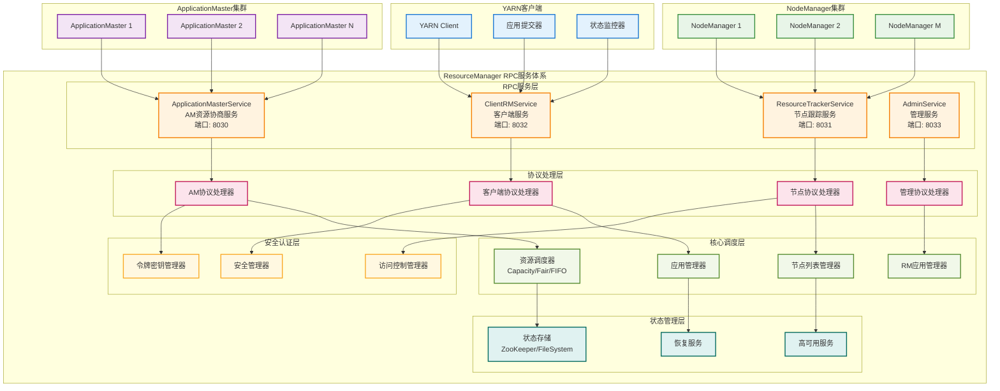
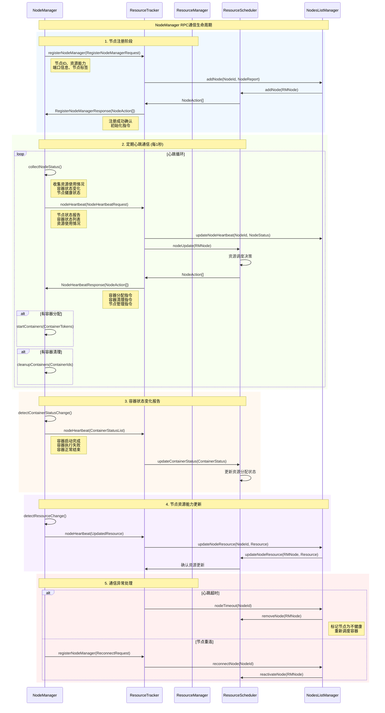
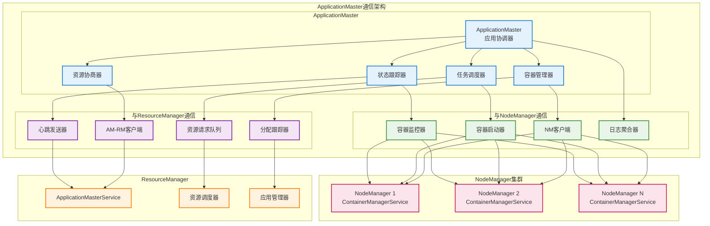
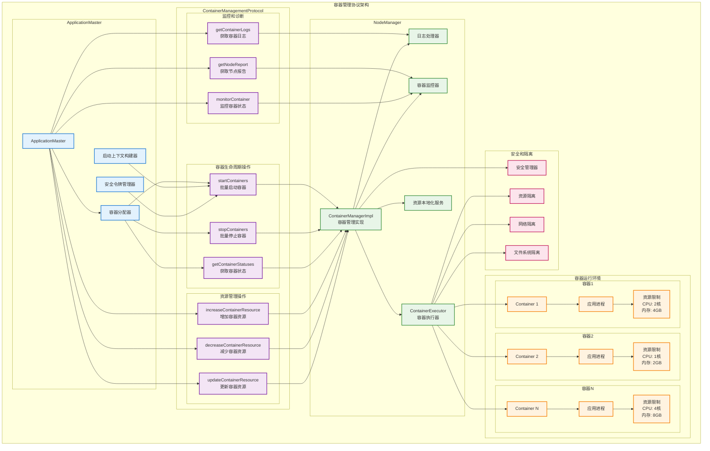

# 第十一章 YARN中的RPC应用

## 11.1 ResourceManager RPC服务体系

ResourceManager作为YARN集群的资源管理中枢，其RPC服务体系承担着整个集群资源调度和应用程序生命周期管理的核心职责。与HDFS的NameNode类似，ResourceManager需要同时处理来自多个维度的RPC请求：NodeManager的资源报告和心跳信息、ApplicationMaster的资源申请和释放请求、以及客户端的应用提交和状态查询操作。这种多元化的服务模式要求ResourceManager的RPC架构具备高度的灵活性和可扩展性，能够在保证服务质量的同时，有效管理集群中可能达到数万个容器的复杂资源分配场景。

ResourceManager的RPC服务采用了模块化的设计理念，将不同类型的服务请求分配给专门的协议处理器。ResourceManagerService负责处理客户端的应用管理请求，包括应用的提交、终止、状态查询等操作。ApplicationMasterService专门服务于ApplicationMaster的资源协商需求，处理资源申请、容器分配、心跳维持等核心调度功能。ResourceTrackerService则负责与NodeManager的通信，接收节点注册、资源报告、容器状态更新等集群管理信息。这种服务分离的设计不仅提高了系统的并发处理能力，还为不同类型的请求提供了针对性的优化空间。

ResourceManager RPC服务的实现还需要处理复杂的状态一致性和故障恢复问题。由于资源调度决策的关键性，ResourceManager必须确保所有的资源分配操作都能被正确记录和恢复。系统采用了基于状态机的设计模式，将应用程序和容器的生命周期建模为明确的状态转换过程，确保在任何异常情况下都能准确恢复到一致的状态。同时，ResourceManager还实现了高可用性机制，通过Active/Standby模式确保服务的连续性。

下图展示了ResourceManager的完整RPC服务体系架构：



*图10-1：ResourceManager RPC服务体系架构图*

### ResourceManager RPC服务实现

ResourceManager通过多个专门的RPC服务来处理不同类型的请求：

```java
/**
 * ResourceManager RPC服务管理器
 */
public class ResourceManagerRPCServices {

    private final ResourceManager resourceManager;
    private final Configuration conf;

    // RPC服务实例
    private ClientRMService clientRMService;
    private ApplicationMasterService applicationMasterService;
    private ResourceTrackerService resourceTrackerService;
    private AdminService adminService;

    public ResourceManagerRPCServices(ResourceManager rm, Configuration conf) {
        this.resourceManager = rm;
        this.conf = conf;
    }

    /**
     * 启动所有RPC服务
     */
    public void startServices() throws Exception {
        // 启动客户端服务
        clientRMService = new ClientRMService(resourceManager, conf);
        clientRMService.start();

        // 启动ApplicationMaster服务
        applicationMasterService = new ApplicationMasterService(resourceManager, conf);
        applicationMasterService.start();

        // 启动资源跟踪服务
        resourceTrackerService = new ResourceTrackerService(resourceManager, conf);
        resourceTrackerService.start();

        // 启动管理服务
        adminService = new AdminService(resourceManager, conf);
        adminService.start();

        LOG.info("All ResourceManager RPC services started successfully");
    }

    /**
     * 停止所有RPC服务
     */
    public void stopServices() {
        if (clientRMService != null) {
            clientRMService.stop();
        }
        if (applicationMasterService != null) {
            applicationMasterService.stop();
        }
        if (resourceTrackerService != null) {
            resourceTrackerService.stop();
        }
        if (adminService != null) {
            adminService.stop();
        }

        LOG.info("All ResourceManager RPC services stopped");
    }
}

/**
 * 客户端RPC服务实现
 */
public class ClientRMService extends AbstractService implements ClientRMProtocol {

    private final ResourceManager resourceManager;
    private final RMContext rmContext;
    private final ApplicationsManager applicationsManager;
    private Server server;

    public ClientRMService(ResourceManager rm, Configuration conf) {
        super(ClientRMService.class.getName());
        this.resourceManager = rm;
        this.rmContext = rm.getRMContext();
        this.applicationsManager = rmContext.getApplicationsManager();
    }

    @Override
    protected void serviceStart() throws Exception {
        Configuration conf = getConfig();
        YarnRPC rpc = YarnRPC.create(conf);

        InetSocketAddress clientBindAddress = conf.getSocketAddr(
            YarnConfiguration.RM_ADDRESS,
            YarnConfiguration.DEFAULT_RM_ADDRESS,
            YarnConfiguration.DEFAULT_RM_PORT);

        server = rpc.getServer(ClientRMProtocol.class, this,
                              clientBindAddress, conf,
                              rmContext.getClientToAMTokenSecretManager(),
                              conf.getInt(YarnConfiguration.RM_CLIENT_THREAD_COUNT,
                                        YarnConfiguration.DEFAULT_RM_CLIENT_THREAD_COUNT));

        server.start();
        LOG.info("ClientRMService started at " + clientBindAddress);
    }

    /**
     * 提交应用程序
     */
    @Override
    public SubmitApplicationResponse submitApplication(SubmitApplicationRequest request)
            throws YarnException, IOException {

        ApplicationSubmissionContext submissionContext = request.getApplicationSubmissionContext();
        ApplicationId applicationId = submissionContext.getApplicationId();

        // 验证应用提交请求
        validateApplicationSubmissionContext(submissionContext);

        // 创建RMApp对象
        RMApp application = createAndPopulateNewRMApp(submissionContext);

        // 提交应用到调度器
        try {
            applicationsManager.submitApplication(submissionContext,
                                                System.currentTimeMillis(),
                                                application.getUser());

            LOG.info("Application {} submitted successfully", applicationId);

        } catch (Exception e) {
            LOG.error("Failed to submit application {}", applicationId, e);
            throw new YarnException("Application submission failed", e);
        }

        return SubmitApplicationResponse.newInstance();
    }

    /**
     * 获取应用程序状态
     */
    @Override
    public GetApplicationReportResponse getApplicationReport(GetApplicationReportRequest request)
            throws YarnException, IOException {

        ApplicationId applicationId = request.getApplicationId();

        RMApp application = rmContext.getRMApps().get(applicationId);
        if (application == null) {
            throw new ApplicationNotFoundException("Application " + applicationId + " not found");
        }

        ApplicationReport report = application.createAndGetApplicationReport(null, true);

        return GetApplicationReportResponse.newInstance(report);
    }

    /**
     * 终止应用程序
     */
    @Override
    public KillApplicationResponse forceKillApplication(KillApplicationRequest request)
            throws YarnException, IOException {

        ApplicationId applicationId = request.getApplicationId();

        RMApp application = rmContext.getRMApps().get(applicationId);
        if (application == null) {
            throw new ApplicationNotFoundException("Application " + applicationId + " not found");
        }

        // 发送终止事件
        rmContext.getDispatcher().getEventHandler().handle(
            new RMAppEvent(applicationId, RMAppEventType.KILL));

        LOG.info("Application {} kill request submitted", applicationId);

        return KillApplicationResponse.newInstance(true);
    }

    private void validateApplicationSubmissionContext(ApplicationSubmissionContext context)
            throws YarnException {

        if (context.getApplicationId() == null) {
            throw new YarnException("ApplicationId cannot be null");
        }

        if (context.getApplicationName() == null || context.getApplicationName().trim().isEmpty()) {
            throw new YarnException("Application name cannot be null or empty");
        }

        if (context.getQueue() == null || context.getQueue().trim().isEmpty()) {
            context.setQueue(YarnConfiguration.DEFAULT_QUEUE_NAME);
        }

        // 验证资源请求
        Resource resource = context.getResource();
        if (resource == null) {
            throw new YarnException("Resource specification cannot be null");
        }

        if (resource.getMemory() <= 0 || resource.getVirtualCores() <= 0) {
            throw new YarnException("Invalid resource specification");
        }
    }

    private RMApp createAndPopulateNewRMApp(ApplicationSubmissionContext submissionContext)
            throws YarnException {

        ApplicationId applicationId = submissionContext.getApplicationId();

        // 创建RMApp实例
        RMAppImpl application = new RMAppImpl(applicationId, rmContext, conf,
                                            submissionContext.getApplicationName(),
                                            submissionContext.getUser(),
                                            submissionContext.getQueue(),
                                            submissionContext,
                                            rmContext.getScheduler(),
                                            rmContext.getApplicationMasterService(),
                                            submissionContext.getApplicationTimeouts(),
                                            submissionContext.getApplicationType());

        // 添加到应用列表
        rmContext.getRMApps().putIfAbsent(applicationId, application);

        return application;
    }
}
```

### ApplicationMaster服务实现

ApplicationMasterService处理AM的资源协商请求：

```java
/**
 * ApplicationMaster服务实现
 */
public class ApplicationMasterService extends AbstractService
        implements ApplicationMasterProtocol {

    private final ResourceManager resourceManager;
    private final RMContext rmContext;
    private final ResourceScheduler scheduler;
    private Server server;

    public ApplicationMasterService(ResourceManager rm, Configuration conf) {
        super(ApplicationMasterService.class.getName());
        this.resourceManager = rm;
        this.rmContext = rm.getRMContext();
        this.scheduler = rmContext.getScheduler();
    }

    @Override
    protected void serviceStart() throws Exception {
        Configuration conf = getConfig();
        YarnRPC rpc = YarnRPC.create(conf);

        InetSocketAddress masterServiceAddress = conf.getSocketAddr(
            YarnConfiguration.RM_SCHEDULER_ADDRESS,
            YarnConfiguration.DEFAULT_RM_SCHEDULER_ADDRESS,
            YarnConfiguration.DEFAULT_RM_SCHEDULER_PORT);

        server = rpc.getServer(ApplicationMasterProtocol.class, this,
                              masterServiceAddress, conf,
                              rmContext.getAMRMTokenSecretManager(),
                              conf.getInt(YarnConfiguration.RM_SCHEDULER_CLIENT_THREAD_COUNT,
                                        YarnConfiguration.DEFAULT_RM_SCHEDULER_CLIENT_THREAD_COUNT));

        server.start();
        LOG.info("ApplicationMasterService started at " + masterServiceAddress);
    }

    /**
     * ApplicationMaster注册
     */
    @Override
    public RegisterApplicationMasterResponse registerApplicationMaster(
            RegisterApplicationMasterRequest request) throws YarnException, IOException {

        ApplicationAttemptId applicationAttemptId = getApplicationAttemptId();

        RMApp app = rmContext.getRMApps().get(applicationAttemptId.getApplicationId());
        if (app == null) {
            throw new ApplicationNotFoundException("Application not found");
        }

        RMAppAttempt appAttempt = app.getRMAppAttempt(applicationAttemptId);
        if (appAttempt == null) {
            throw new ApplicationAttemptNotFoundException("Application attempt not found");
        }

        // 注册ApplicationMaster
        appAttempt.getAMRMToken();

        // 获取集群资源信息
        Resource maxResourceCapability = scheduler.getMaximumResourceCapability();
        Map<ApplicationAccessType, String> applicationACLs = app.getApplicationACLs();

        LOG.info("ApplicationMaster registered: {}", applicationAttemptId);

        return RegisterApplicationMasterResponse.newInstance(
            maxResourceCapability,
            applicationACLs,
            ByteBuffer.wrap("client-to-am-token".getBytes()),
            scheduler.getApplicationResourceUsageReport(applicationAttemptId),
            scheduler.getAppSchedulingInfo(applicationAttemptId).getQueueName(),
            Collections.<Container>emptyList(),
            scheduler.getSchedulerResourceTypes(),
            scheduler.getNodeLabels());
    }

    /**
     * 资源分配请求处理
     */
    @Override
    public AllocateResponse allocate(AllocateRequest request) throws YarnException, IOException {

        ApplicationAttemptId applicationAttemptId = getApplicationAttemptId();

        // 处理资源请求
        List<ResourceRequest> resourceRequests = request.getAskList();
        List<ContainerId> containersToRelease = request.getReleaseList();

        // 更新黑名单
        ResourceBlacklistRequest blacklistRequest = request.getBlacklistRequest();

        // 调用调度器进行资源分配
        Allocation allocation = scheduler.allocate(applicationAttemptId,
                                                 resourceRequests,
                                                 containersToRelease,
                                                 blacklistRequest.getBlacklistAdditions(),
                                                 blacklistRequest.getBlacklistRemovals());

        // 构造响应
        AllocateResponse response = AllocateResponse.newInstance(
            allocation.getResponseId(),
            allocation.getContainers(),
            allocation.getCompletedContainersStatuses(),
            allocation.getResourceLimit(),
            allocation.getUpdatedNodes(),
            allocation.getNumClusterNodes(),
            allocation.getPreemptionMessage(),
            allocation.getNMTokens(),
            allocation.getIncreasedContainers(),
            allocation.getDecreasedContainers());

        return response;
    }

    /**
     * ApplicationMaster完成通知
     */
    @Override
    public FinishApplicationMasterResponse finishApplicationMaster(
            FinishApplicationMasterRequest request) throws YarnException, IOException {

        ApplicationAttemptId applicationAttemptId = getApplicationAttemptId();

        RMApp app = rmContext.getRMApps().get(applicationAttemptId.getApplicationId());
        if (app == null) {
            throw new ApplicationNotFoundException("Application not found");
        }

        // 发送应用完成事件
        rmContext.getDispatcher().getEventHandler().handle(
            new RMAppAttemptEvent(applicationAttemptId,
                                RMAppAttemptEventType.UNREGISTERED,
                                request.getFinalApplicationStatus(),
                                request.getDiagnostics(),
                                request.getTrackingUrl()));

        LOG.info("ApplicationMaster finished: {}", applicationAttemptId);

        return FinishApplicationMasterResponse.newInstance(false);
    }

    private ApplicationAttemptId getApplicationAttemptId() throws YarnException {
        UserGroupInformation remoteUgi = getRemoteUgi();
        String tokenIdentifier = remoteUgi.getTokens().iterator().next().getIdentifier().toString();

        // 从令牌中解析ApplicationAttemptId
        // 这里简化处理，实际实现会更复杂
        return ApplicationAttemptId.fromString(tokenIdentifier);
    }

    private UserGroupInformation getRemoteUgi() throws YarnException {
        try {
            return UserGroupInformation.getCurrentUser();
        } catch (IOException e) {
            throw new YarnException("Failed to get remote user", e);
        }
    }
}
```

ResourceManager RPC服务体系的核心特征：

- **多协议服务架构**：针对不同客户端类型提供专门的RPC服务接口
- **高并发资源调度**：支持大规模集群的并发资源申请和分配处理
- **状态一致性保证**：确保资源分配决策的正确性和可恢复性
- **高可用性设计**：通过Active/Standby模式实现服务的持续可用
- **动态负载均衡**：根据请求类型和系统负载进行智能的请求分发

## 11.2 NodeManager RPC通信协议

NodeManager作为YARN集群中的节点代理，通过RPC协议与ResourceManager保持持续的通信联系，报告节点资源状态、容器执行情况，并接收资源分配指令。这种通信机制是YARN实现分布式资源管理的基础，其设计必须在信息的及时性、准确性和系统开销之间找到最佳平衡点。在大规模集群中，数千个NodeManager的并发通信可能对ResourceManager造成巨大的负载压力，因此通信协议的优化对整个系统的性能表现至关重要。

NodeManager的RPC通信主要围绕资源管理和容器生命周期管理两个核心功能展开。在资源管理方面，NodeManager需要定期向ResourceManager报告节点的资源使用情况，包括CPU、内存、磁盘、网络等各种资源的可用量和使用量。这些信息是ResourceManager进行资源调度决策的重要依据，必须保证数据的准确性和时效性。在容器管理方面，NodeManager需要汇报容器的启动、运行、完成、失败等状态变化，同时接收ResourceManager下发的容器分配和回收指令。

为了优化NodeManager RPC通信的效率，YARN实现了多种技术策略。首先是心跳合并机制，将多种类型的状态信息合并到单次心跳中传输，减少网络往返次数。其次是增量报告策略，只传输发生变化的状态信息，避免重复传输大量静态数据。再次是异步处理模式，NodeManager可以在后台异步收集和准备报告数据，避免阻塞容器的正常执行。最后是智能重试机制，在网络异常或服务故障时自动进行重试，确保关键信息的可靠传输。

下图展示了NodeManager与ResourceManager的RPC通信协议流程：



*图10-2：NodeManager RPC通信协议时序图*

### NodeManager心跳机制实现

NodeManager通过心跳机制与ResourceManager保持通信：

```java
/**
 * NodeManager心跳服务
 */
public class NodeHeartbeatService extends AbstractService {

    private final NodeManager nodeManager;
    private final ResourceTrackerService resourceTracker;
    private final NodeStatusUpdater statusUpdater;
    private final long heartbeatIntervalMs;
    private volatile boolean shouldRun = true;

    public NodeHeartbeatService(NodeManager nm, Configuration conf) {
        super(NodeHeartbeatService.class.getName());
        this.nodeManager = nm;
        this.resourceTracker = nm.getResourceTracker();
        this.statusUpdater = nm.getNodeStatusUpdater();
        this.heartbeatIntervalMs = conf.getLong(
            YarnConfiguration.NM_HEARTBEAT_INTERVAL_MS,
            YarnConfiguration.DEFAULT_NM_HEARTBEAT_INTERVAL_MS);
    }

    @Override
    protected void serviceStart() throws Exception {
        // 启动心跳线程
        Thread heartbeatThread = new Thread(this::heartbeatLoop, "NodeManager Heartbeat");
        heartbeatThread.setDaemon(true);
        heartbeatThread.start();

        LOG.info("NodeManager heartbeat service started with interval {}ms", heartbeatIntervalMs);
    }

    /**
     * 心跳主循环
     */
    private void heartbeatLoop() {
        while (shouldRun && !Thread.currentThread().isInterrupted()) {
            try {
                long startTime = System.currentTimeMillis();

                // 发送心跳
                NodeHeartbeatResponse response = sendHeartbeat();

                // 处理ResourceManager返回的指令
                if (response.getNodeAction() != null) {
                    processNodeActions(response.getNodeAction());
                }

                // 处理容器分配
                if (response.getContainersToCleanup() != null) {
                    processContainerCleanup(response.getContainersToCleanup());
                }

                // 处理应用清理
                if (response.getApplicationsToCleanup() != null) {
                    processApplicationCleanup(response.getApplicationsToCleanup());
                }

                // 计算下次心跳时间
                long elapsed = System.currentTimeMillis() - startTime;
                long sleepTime = heartbeatIntervalMs - elapsed;

                if (sleepTime > 0) {
                    Thread.sleep(sleepTime);
                }

            } catch (InterruptedException e) {
                LOG.info("NodeManager heartbeat interrupted");
                Thread.currentThread().interrupt();
                break;
            } catch (Exception e) {
                LOG.error("Error in heartbeat loop", e);
                try {
                    Thread.sleep(heartbeatIntervalMs);
                } catch (InterruptedException ie) {
                    Thread.currentThread().interrupt();
                    break;
                }
            }
        }
    }

    /**
     * 发送心跳到ResourceManager
     */
    private NodeHeartbeatResponse sendHeartbeat() throws Exception {

        // 收集节点状态
        NodeStatus nodeStatus = statusUpdater.getNodeStatus();

        // 构造心跳请求
        NodeHeartbeatRequest heartbeatRequest = NodeHeartbeatRequest.newInstance(
            nodeStatus,
            getContainerStatuses(),
            getKeepAliveApplications());

        // 发送心跳
        return resourceTracker.nodeHeartbeat(heartbeatRequest);
    }

    /**
     * 收集容器状态
     */
    private List<ContainerStatus> getContainerStatuses() {
        List<ContainerStatus> containerStatuses = new ArrayList<>();

        // 获取所有容器的状态
        Map<ContainerId, Container> containers = nodeManager.getContainersManager().getContainers();

        for (Container container : containers.values()) {
            ContainerStatus status = container.cloneAndGetContainerStatus();
            containerStatuses.add(status);
        }

        return containerStatuses;
    }

    /**
     * 获取需要保持活跃的应用列表
     */
    private List<ApplicationId> getKeepAliveApplications() {
        return new ArrayList<>(nodeManager.getContainersManager().getApplications().keySet());
    }

    /**
     * 处理节点操作指令
     */
    private void processNodeActions(List<NodeAction> nodeActions) {
        for (NodeAction action : nodeActions) {
            switch (action) {
                case NORMAL:
                    // 正常状态，无需特殊处理
                    break;

                case RESYNC:
                    // 重新同步状态
                    LOG.info("Received RESYNC action, resyncing with ResourceManager");
                    statusUpdater.resync();
                    break;

                case SHUTDOWN:
                    // 关闭节点
                    LOG.info("Received SHUTDOWN action, shutting down NodeManager");
                    nodeManager.stop();
                    break;

                default:
                    LOG.warn("Unknown node action: {}", action);
            }
        }
    }

    /**
     * 处理容器清理指令
     */
    private void processContainerCleanup(List<ContainerId> containersToCleanup) {
        for (ContainerId containerId : containersToCleanup) {
            LOG.info("Cleaning up container: {}", containerId);
            nodeManager.getContainersManager().cleanUpContainer(containerId);
        }
    }

    /**
     * 处理应用清理指令
     */
    private void processApplicationCleanup(List<ApplicationId> applicationsToCleanup) {
        for (ApplicationId applicationId : applicationsToCleanup) {
            LOG.info("Cleaning up application: {}", applicationId);
            nodeManager.getContainersManager().cleanUpApplication(applicationId);
        }
    }

    @Override
    protected void serviceStop() throws Exception {
        shouldRun = false;
        LOG.info("NodeManager heartbeat service stopped");
    }
}
```

### 增量状态报告机制

NodeManager实现了增量状态报告来优化网络传输：

```java
/**
 * 增量状态报告管理器
 */
public class IncrementalStatusReporter {

    private final Map<ContainerId, ContainerStatus> lastReportedStatuses = new ConcurrentHashMap<>();
    private final Map<String, Object> lastReportedNodeMetrics = new ConcurrentHashMap<>();
    private volatile long lastReportTime = 0;

    /**
     * 获取需要报告的容器状态变化
     */
    public List<ContainerStatus> getContainerStatusUpdates(List<ContainerStatus> currentStatuses) {
        List<ContainerStatus> updates = new ArrayList<>();

        for (ContainerStatus currentStatus : currentStatuses) {
            ContainerId containerId = currentStatus.getContainerId();
            ContainerStatus lastStatus = lastReportedStatuses.get(containerId);

            // 新容器或状态发生变化
            if (lastStatus == null || hasStatusChanged(lastStatus, currentStatus)) {
                updates.add(currentStatus);
                lastReportedStatuses.put(containerId, currentStatus);
            }
        }

        // 清理已完成的容器状态
        cleanupCompletedContainers(currentStatuses);

        return updates;
    }

    /**
     * 检查容器状态是否发生变化
     */
    private boolean hasStatusChanged(ContainerStatus lastStatus, ContainerStatus currentStatus) {
        return !lastStatus.getState().equals(currentStatus.getState()) ||
               lastStatus.getExitStatus() != currentStatus.getExitStatus() ||
               !Objects.equals(lastStatus.getDiagnostics(), currentStatus.getDiagnostics());
    }

    /**
     * 获取需要报告的节点指标变化
     */
    public Map<String, Object> getNodeMetricsUpdates(Map<String, Object> currentMetrics) {
        Map<String, Object> updates = new HashMap<>();

        for (Map.Entry<String, Object> entry : currentMetrics.entrySet()) {
            String key = entry.getKey();
            Object currentValue = entry.getValue();
            Object lastValue = lastReportedNodeMetrics.get(key);

            // 新指标或值发生变化
            if (lastValue == null || !Objects.equals(lastValue, currentValue)) {
                updates.put(key, currentValue);
                lastReportedNodeMetrics.put(key, currentValue);
            }
        }

        return updates;
    }

    /**
     * 清理已完成容器的状态记录
     */
    private void cleanupCompletedContainers(List<ContainerStatus> currentStatuses) {
        Set<ContainerId> currentContainerIds = currentStatuses.stream()
            .map(ContainerStatus::getContainerId)
            .collect(Collectors.toSet());

        // 移除不再存在的容器状态
        lastReportedStatuses.entrySet().removeIf(entry -> {
            ContainerId containerId = entry.getKey();
            ContainerStatus status = entry.getValue();

            // 如果容器已完成且不在当前列表中，则清理
            return !currentContainerIds.contains(containerId) &&
                   (status.getState() == ContainerState.COMPLETE);
        });
    }

    /**
     * 强制全量报告（用于重新同步）
     */
    public void forceFullReport() {
        lastReportedStatuses.clear();
        lastReportedNodeMetrics.clear();
        lastReportTime = 0;
        LOG.info("Forced full report, cleared all cached statuses");
    }

    /**
     * 获取报告统计信息
     */
    public ReportStatistics getReportStatistics() {
        return new ReportStatistics(
            lastReportedStatuses.size(),
            lastReportedNodeMetrics.size(),
            lastReportTime
        );
    }

    /**
     * 报告统计信息
     */
    public static class ReportStatistics {
        private final int trackedContainers;
        private final int trackedMetrics;
        private final long lastReportTime;

        public ReportStatistics(int trackedContainers, int trackedMetrics, long lastReportTime) {
            this.trackedContainers = trackedContainers;
            this.trackedMetrics = trackedMetrics;
            this.lastReportTime = lastReportTime;
        }

        // Getters
        public int getTrackedContainers() { return trackedContainers; }
        public int getTrackedMetrics() { return trackedMetrics; }
        public long getLastReportTime() { return lastReportTime; }
    }
}
```

### 异步数据收集机制

NodeManager使用异步机制收集节点状态数据：

```java
/**
 * 异步节点状态收集器
 */
public class AsyncNodeStatusCollector {

    private final ScheduledExecutorService collectorExecutor;
    private final NodeResourceMonitor resourceMonitor;
    private final ContainerManager containerManager;
    private volatile NodeStatus latestNodeStatus;
    private final Object statusLock = new Object();

    public AsyncNodeStatusCollector(NodeResourceMonitor monitor,
                                  ContainerManager containerMgr,
                                  Configuration conf) {
        this.resourceMonitor = monitor;
        this.containerManager = containerMgr;
        this.collectorExecutor = Executors.newScheduledThreadPool(2,
            new ThreadFactoryBuilder()
                .setNameFormat("NodeStatusCollector-%d")
                .setDaemon(true)
                .build());
    }

    /**
     * 启动异步数据收集
     */
    public void startCollection() {
        // 定期收集资源状态
        collectorExecutor.scheduleAtFixedRate(
            this::collectResourceStatus,
            0, 5, TimeUnit.SECONDS);

        // 定期收集容器状态
        collectorExecutor.scheduleAtFixedRate(
            this::collectContainerStatus,
            0, 2, TimeUnit.SECONDS);

        LOG.info("Async node status collection started");
    }

    /**
     * 异步收集资源状态
     */
    private void collectResourceStatus() {
        try {
            // 收集CPU使用率
            float cpuUsage = resourceMonitor.getCpuUsage();

            // 收集内存使用情况
            long totalMemory = resourceMonitor.getTotalMemory();
            long usedMemory = resourceMonitor.getUsedMemory();

            // 收集磁盘使用情况
            Map<String, DiskInfo> diskUsage = resourceMonitor.getDiskUsage();

            // 收集网络使用情况
            NetworkInfo networkInfo = resourceMonitor.getNetworkInfo();

            // 更新节点状态
            synchronized (statusLock) {
                if (latestNodeStatus == null) {
                    latestNodeStatus = createInitialNodeStatus();
                }

                // 更新资源使用信息
                updateResourceUsage(latestNodeStatus, cpuUsage, totalMemory,
                                  usedMemory, diskUsage, networkInfo);
            }

        } catch (Exception e) {
            LOG.error("Error collecting resource status", e);
        }
    }

    /**
     * 异步收集容器状态
     */
    private void collectContainerStatus() {
        try {
            // 获取所有容器状态
            List<ContainerStatus> containerStatuses = containerManager.getContainerStatuses();

            // 更新节点状态
            synchronized (statusLock) {
                if (latestNodeStatus != null) {
                    latestNodeStatus.setContainersStatuses(containerStatuses);
                }
            }

        } catch (Exception e) {
            LOG.error("Error collecting container status", e);
        }
    }

    /**
     * 获取最新的节点状态
     */
    public NodeStatus getLatestNodeStatus() {
        synchronized (statusLock) {
            return latestNodeStatus != null ?
                NodeStatus.newInstance(latestNodeStatus) : null;
        }
    }

    private NodeStatus createInitialNodeStatus() {
        NodeId nodeId = NodeId.newInstance("localhost", 8041);
        Resource nodeResource = Resource.newInstance(8192, 8); // 8GB, 8 cores

        return NodeStatus.newInstance(nodeId, 0, new ArrayList<>(),
                                    new ArrayList<>(), nodeResource,
                                    NodeHealthStatus.newInstance(true, "", 0),
                                    new ArrayList<>());
    }

    private void updateResourceUsage(NodeStatus nodeStatus, float cpuUsage,
                                   long totalMemory, long usedMemory,
                                   Map<String, DiskInfo> diskUsage,
                                   NetworkInfo networkInfo) {

        // 更新资源使用情况
        Resource usedResource = Resource.newInstance(
            (int) usedMemory,
            (int) (cpuUsage * nodeStatus.getNodeResource().getVirtualCores() / 100));

        nodeStatus.setUsedResource(usedResource);

        // 更新健康状态
        boolean isHealthy = cpuUsage < 90 &&
                           (usedMemory * 100 / totalMemory) < 90;

        String healthReport = String.format(
            "CPU: %.1f%%, Memory: %d/%d MB, Healthy: %s",
            cpuUsage, usedMemory, totalMemory, isHealthy);

        NodeHealthStatus healthStatus = NodeHealthStatus.newInstance(
            isHealthy, healthReport, System.currentTimeMillis());

        nodeStatus.setNodeHealthStatus(healthStatus);
    }

    /**
     * 停止异步收集
     */
    public void stopCollection() {
        collectorExecutor.shutdown();
        try {
            if (!collectorExecutor.awaitTermination(30, TimeUnit.SECONDS)) {
                collectorExecutor.shutdownNow();
            }
        } catch (InterruptedException e) {
            collectorExecutor.shutdownNow();
            Thread.currentThread().interrupt();
        }

        LOG.info("Async node status collection stopped");
    }
}
```

NodeManager RPC通信协议的技术特征：

- **心跳合并传输**：将多种状态信息合并到单次通信中提高效率
- **增量状态报告**：只传输变化的状态信息减少网络开销
- **异步数据收集**：后台异步准备报告数据不影响容器执行
- **智能重试机制**：自动处理通信故障确保信息可靠传输
- **资源监控集成**：实时监控节点资源使用情况并及时报告

## 11.3 ApplicationMaster通信机制

ApplicationMaster作为YARN应用程序的协调者，需要通过RPC机制与ResourceManager进行密切的资源协商，同时还要与分布在集群各节点的任务容器保持通信联系。这种双向通信模式使得ApplicationMaster成为了YARN架构中最复杂的通信节点之一，其通信机制的设计直接影响着应用程序的执行效率和资源利用率。ApplicationMaster必须在有限的资源约束下，通过智能的通信策略实现应用程序的高效执行和资源的最优分配。

ApplicationMaster与ResourceManager之间的通信主要围绕资源协商过程展开，这是一个动态的、迭代的过程。ApplicationMaster根据应用程序的执行需求，向ResourceManager提交资源申请，包括所需的容器数量、资源规格、位置偏好等信息。ResourceManager根据集群的资源可用情况和调度策略，返回可分配的容器列表。ApplicationMaster接收到容器分配后，需要与相应的NodeManager通信启动容器，并在容器执行过程中持续监控其状态。当容器完成或失败时，ApplicationMaster需要及时释放资源并根据需要申请新的容器。

ApplicationMaster的通信机制还需要处理复杂的故障恢复和状态同步问题。由于ApplicationMaster本身也是运行在容器中的应用程序，可能会因为各种原因失败重启。在重启过程中，ApplicationMaster需要通过RPC调用恢复其之前的状态，包括已分配的容器信息、应用程序的执行进度等。这要求通信协议具备完善的状态查询和恢复机制，确保ApplicationMaster能够在故障后快速恢复正常运行。

下图展示了ApplicationMaster的双向通信机制：



*图10-3：ApplicationMaster双向通信架构图*

### ApplicationMaster资源协商实现

ApplicationMaster通过资源协商机制与ResourceManager交互：

```java
/**
 * ApplicationMaster资源协商器
 */
public class AMResourceNegotiator {

    private final ApplicationMasterProtocol resourceManager;
    private final ApplicationAttemptId applicationAttemptId;
    private final AMRMClientAsync<ContainerRequest> amrmClient;
    private final Map<Priority, Map<String, TreeMap<Resource, ResourceRequestInfo>>> remoteRequestsTable;

    public AMResourceNegotiator(ApplicationAttemptId appAttemptId, Configuration conf) {
        this.applicationAttemptId = appAttemptId;
        this.remoteRequestsTable = new ConcurrentHashMap<>();

        // 创建AM-RM客户端
        this.amrmClient = AMRMClientAsync.createAMRMClientAsync(1000, new AMRMCallbackHandler());
        this.amrmClient.init(conf);
        this.amrmClient.start();

        this.resourceManager = amrmClient.getServiceState() != null ?
            (ApplicationMasterProtocol) amrmClient : null;
    }

    /**
     * 注册ApplicationMaster
     */
    public RegisterApplicationMasterResponse registerApplicationMaster(
            String appHostName, int appHostPort, String appTrackingUrl) throws Exception {

        LOG.info("Registering ApplicationMaster with ResourceManager");

        RegisterApplicationMasterRequest request = RegisterApplicationMasterRequest.newInstance(
            appHostName, appHostPort, appTrackingUrl);

        RegisterApplicationMasterResponse response = amrmClient.registerApplicationMaster(
            appHostName, appHostPort, appTrackingUrl);

        LOG.info("ApplicationMaster registered successfully. Max resource capability: {}",
                response.getMaximumResourceCapability());

        return response;
    }

    /**
     * 添加容器请求
     */
    public void addContainerRequest(ContainerRequest containerRequest) {
        LOG.debug("Adding container request: {}", containerRequest);

        amrmClient.addContainerRequest(containerRequest);

        // 更新本地请求表
        updateLocalRequestTable(containerRequest, true);
    }

    /**
     * 移除容器请求
     */
    public void removeContainerRequest(ContainerRequest containerRequest) {
        LOG.debug("Removing container request: {}", containerRequest);

        amrmClient.removeContainerRequest(containerRequest);

        // 更新本地请求表
        updateLocalRequestTable(containerRequest, false);
    }

    /**
     * 释放容器
     */
    public void releaseAssignedContainer(ContainerId containerId) {
        LOG.info("Releasing container: {}", containerId);
        amrmClient.releaseAssignedContainer(containerId);
    }

    /**
     * 获取分配进度
     */
    public float getProgress() {
        // 计算资源分配进度
        int totalRequests = getTotalOutstandingRequests();
        int satisfiedRequests = getTotalSatisfiedRequests();

        if (totalRequests == 0) {
            return 1.0f;
        }

        return (float) satisfiedRequests / totalRequests;
    }

    /**
     * 更新本地请求表
     */
    private void updateLocalRequestTable(ContainerRequest request, boolean add) {
        Priority priority = request.getPriority();
        Resource capability = request.getCapability();

        Map<String, TreeMap<Resource, ResourceRequestInfo>> locationMap =
            remoteRequestsTable.computeIfAbsent(priority, k -> new ConcurrentHashMap<>());

        for (String location : request.getNodes() != null ? request.getNodes() :
             Arrays.asList(ResourceRequest.ANY)) {

            TreeMap<Resource, ResourceRequestInfo> resourceMap =
                locationMap.computeIfAbsent(location, k -> new TreeMap<>());

            ResourceRequestInfo requestInfo = resourceMap.get(capability);
            if (requestInfo == null && add) {
                requestInfo = new ResourceRequestInfo(priority, location, capability);
                resourceMap.put(capability, requestInfo);
            }

            if (requestInfo != null) {
                if (add) {
                    requestInfo.incrementCount();
                } else {
                    requestInfo.decrementCount();
                    if (requestInfo.getCount() <= 0) {
                        resourceMap.remove(capability);
                    }
                }
            }
        }
    }

    private int getTotalOutstandingRequests() {
        return remoteRequestsTable.values().stream()
            .flatMap(locationMap -> locationMap.values().stream())
            .flatMap(resourceMap -> resourceMap.values().stream())
            .mapToInt(ResourceRequestInfo::getCount)
            .sum();
    }

    private int getTotalSatisfiedRequests() {
        // 这里简化处理，实际实现会更复杂
        return 0;
    }

    /**
     * AM-RM回调处理器
     */
    private class AMRMCallbackHandler implements AMRMClientAsync.CallbackHandler {

        @Override
        public void onContainersCompleted(List<ContainerStatus> completedContainers) {
            LOG.info("Received {} completed containers", completedContainers.size());

            for (ContainerStatus containerStatus : completedContainers) {
                LOG.info("Container {} completed with status: {}",
                        containerStatus.getContainerId(),
                        containerStatus.getState());

                // 处理容器完成事件
                handleContainerCompletion(containerStatus);
            }
        }

        @Override
        public void onContainersAllocated(List<Container> allocatedContainers) {
            LOG.info("Received {} allocated containers", allocatedContainers.size());

            for (Container container : allocatedContainers) {
                LOG.info("Container {} allocated on node {}",
                        container.getId(),
                        container.getNodeId());

                // 处理容器分配事件
                handleContainerAllocation(container);
            }
        }

        @Override
        public void onShutdownRequest() {
            LOG.info("Received shutdown request from ResourceManager");
            // 处理关闭请求
            handleShutdownRequest();
        }

        @Override
        public void onNodesUpdated(List<NodeReport> updatedNodes) {
            LOG.info("Received {} updated nodes", updatedNodes.size());

            for (NodeReport nodeReport : updatedNodes) {
                LOG.debug("Node {} updated: state={}, capability={}",
                         nodeReport.getNodeId(),
                         nodeReport.getNodeState(),
                         nodeReport.getCapability());
            }
        }

        @Override
        public float getProgress() {
            return AMResourceNegotiator.this.getProgress();
        }

        @Override
        public void onError(Throwable e) {
            LOG.error("Error in AM-RM communication", e);
            // 处理通信错误
            handleCommunicationError(e);
        }
    }

    private void handleContainerCompletion(ContainerStatus containerStatus) {
        // 根据容器完成状态决定是否需要重新申请资源
        if (containerStatus.getExitStatus() != 0) {
            LOG.warn("Container {} failed with exit status: {}",
                    containerStatus.getContainerId(),
                    containerStatus.getExitStatus());

            // 可能需要重新申请容器
            requestReplacementContainer(containerStatus);
        }
    }

    private void handleContainerAllocation(Container container) {
        // 启动分配的容器
        try {
            launchContainer(container);
        } catch (Exception e) {
            LOG.error("Failed to launch container {}", container.getId(), e);
            // 释放无法启动的容器
            releaseAssignedContainer(container.getId());
        }
    }

    private void handleShutdownRequest() {
        // 优雅关闭ApplicationMaster
        try {
            unregisterApplicationMaster(FinalApplicationStatus.SUCCEEDED,
                                      "Application completed successfully", null);
        } catch (Exception e) {
            LOG.error("Failed to unregister ApplicationMaster", e);
        }
    }

    private void handleCommunicationError(Throwable error) {
        // 实现重试逻辑或故障转移
        LOG.error("Communication error with ResourceManager", error);
    }

    private void requestReplacementContainer(ContainerStatus failedContainer) {
        // 为失败的容器申请替换容器
        Resource resource = Resource.newInstance(
            failedContainer.getCapability().getMemory(),
            failedContainer.getCapability().getVirtualCores());

        Priority priority = Priority.newInstance(1);
        ContainerRequest request = new ContainerRequest(resource, null, null, priority);

        addContainerRequest(request);
    }

    private void launchContainer(Container container) throws Exception {
        // 启动容器的具体实现
        LOG.info("Launching container {} on node {}",
                container.getId(), container.getNodeId());

        // 这里会调用NodeManager的ContainerManagementProtocol
        // 具体实现在下一节中展示
    }

    /**
     * 注销ApplicationMaster
     */
    public void unregisterApplicationMaster(FinalApplicationStatus finalStatus,
                                          String message, String trackingUrl) throws Exception {

        LOG.info("Unregistering ApplicationMaster with final status: {}", finalStatus);

        FinishApplicationMasterRequest request = FinishApplicationMasterRequest.newInstance(
            finalStatus, message, trackingUrl);

        amrmClient.unregisterApplicationMaster(finalStatus, message, trackingUrl);

        LOG.info("ApplicationMaster unregistered successfully");
    }

    /**
     * 资源请求信息
     */
    private static class ResourceRequestInfo {
        private final Priority priority;
        private final String location;
        private final Resource capability;
        private int count;

        public ResourceRequestInfo(Priority priority, String location, Resource capability) {
            this.priority = priority;
            this.location = location;
            this.capability = capability;
            this.count = 0;
        }

        public void incrementCount() { count++; }
        public void decrementCount() { count--; }
        public int getCount() { return count; }

        // Other getters...
    }
}
```

### ApplicationMaster容器管理

ApplicationMaster需要与NodeManager通信来管理容器：

```java
/**
 * ApplicationMaster容器管理器
 */
public class AMContainerManager {

    private final Map<NodeId, NMClientAsync> nmClients;
    private final Map<ContainerId, Container> allocatedContainers;
    private final Map<ContainerId, ContainerStatus> completedContainers;
    private final Configuration conf;

    public AMContainerManager(Configuration conf) {
        this.conf = conf;
        this.nmClients = new ConcurrentHashMap<>();
        this.allocatedContainers = new ConcurrentHashMap<>();
        this.completedContainers = new ConcurrentHashMap<>();
    }

    /**
     * 启动容器
     */
    public void launchContainer(Container container, ContainerLaunchContext launchContext) {
        ContainerId containerId = container.getId();
        NodeId nodeId = container.getNodeId();

        LOG.info("Launching container {} on node {}", containerId, nodeId);

        // 获取或创建NodeManager客户端
        NMClientAsync nmClient = getNMClient(nodeId);

        // 记录分配的容器
        allocatedContainers.put(containerId, container);

        // 启动容器
        nmClient.startContainerAsync(container, launchContext);
    }

    /**
     * 停止容器
     */
    public void stopContainer(ContainerId containerId) {
        Container container = allocatedContainers.get(containerId);
        if (container == null) {
            LOG.warn("Container {} not found in allocated containers", containerId);
            return;
        }

        NodeId nodeId = container.getNodeId();
        NMClientAsync nmClient = getNMClient(nodeId);

        LOG.info("Stopping container {} on node {}", containerId, nodeId);
        nmClient.stopContainerAsync(containerId, nodeId);
    }

    /**
     * 获取容器状态
     */
    public void getContainerStatus(ContainerId containerId) {
        Container container = allocatedContainers.get(containerId);
        if (container == null) {
            LOG.warn("Container {} not found in allocated containers", containerId);
            return;
        }

        NodeId nodeId = container.getNodeId();
        NMClientAsync nmClient = getNMClient(nodeId);

        nmClient.getContainerStatusAsync(containerId, nodeId);
    }

    /**
     * 获取或创建NodeManager客户端
     */
    private NMClientAsync getNMClient(NodeId nodeId) {
        return nmClients.computeIfAbsent(nodeId, this::createNMClient);
    }

    private NMClientAsync createNMClient(NodeId nodeId) {
        NMClientAsync nmClient = NMClientAsync.createNMClientAsync(new NMCallbackHandler());
        nmClient.init(conf);
        nmClient.start();

        LOG.info("Created NM client for node: {}", nodeId);
        return nmClient;
    }

    /**
     * NodeManager回调处理器
     */
    private class NMCallbackHandler implements NMClientAsync.CallbackHandler {

        @Override
        public void onContainerStarted(ContainerId containerId, Map<String, ByteBuffer> allServiceResponse) {
            LOG.info("Container {} started successfully", containerId);

            // 更新容器状态
            Container container = allocatedContainers.get(containerId);
            if (container != null) {
                // 可以在这里更新容器状态或触发后续操作
                handleContainerStarted(container);
            }
        }

        @Override
        public void onContainerStatusReceived(ContainerId containerId, ContainerStatus containerStatus) {
            LOG.debug("Received status for container {}: {}", containerId, containerStatus.getState());

            // 更新容器状态
            if (containerStatus.getState() == ContainerState.COMPLETE) {
                handleContainerCompleted(containerId, containerStatus);
            }
        }

        @Override
        public void onContainerStopped(ContainerId containerId) {
            LOG.info("Container {} stopped", containerId);

            // 清理容器记录
            allocatedContainers.remove(containerId);
        }

        @Override
        public void onStartContainerError(ContainerId containerId, Throwable t) {
            LOG.error("Failed to start container {}", containerId, t);

            // 处理容器启动失败
            handleContainerStartError(containerId, t);
        }

        @Override
        public void onGetContainerStatusError(ContainerId containerId, Throwable t) {
            LOG.error("Failed to get status for container {}", containerId, t);
        }

        @Override
        public void onStopContainerError(ContainerId containerId, Throwable t) {
            LOG.error("Failed to stop container {}", containerId, t);
        }
    }

    private void handleContainerStarted(Container container) {
        // 容器启动成功后的处理逻辑
        LOG.info("Container {} is now running on {}",
                container.getId(), container.getNodeHttpAddress());
    }

    private void handleContainerCompleted(ContainerId containerId, ContainerStatus status) {
        // 记录完成的容器
        completedContainers.put(containerId, status);
        allocatedContainers.remove(containerId);

        LOG.info("Container {} completed with exit status: {}",
                containerId, status.getExitStatus());

        // 根据退出状态决定是否需要重试
        if (status.getExitStatus() != 0) {
            handleContainerFailure(containerId, status);
        }
    }

    private void handleContainerStartError(ContainerId containerId, Throwable error) {
        // 移除失败的容器
        allocatedContainers.remove(containerId);

        // 可能需要重新申请容器或报告错误
        LOG.error("Container {} failed to start: {}", containerId, error.getMessage());
    }

    private void handleContainerFailure(ContainerId containerId, ContainerStatus status) {
        // 处理容器失败，可能需要重启或重新分配
        LOG.warn("Container {} failed: {}", containerId, status.getDiagnostics());
    }

    /**
     * 获取所有活跃容器
     */
    public Map<ContainerId, Container> getAllocatedContainers() {
        return new HashMap<>(allocatedContainers);
    }

    /**
     * 获取所有完成的容器
     */
    public Map<ContainerId, ContainerStatus> getCompletedContainers() {
        return new HashMap<>(completedContainers);
    }

    /**
     * 清理资源
     */
    public void cleanup() {
        // 停止所有NodeManager客户端
        for (NMClientAsync nmClient : nmClients.values()) {
            nmClient.stop();
        }
        nmClients.clear();

        // 清理容器记录
        allocatedContainers.clear();
        completedContainers.clear();

        LOG.info("AM Container Manager cleaned up");
    }
}
```

ApplicationMaster通信机制的核心特征：

- **双向通信协调**：同时与ResourceManager和NodeManager进行通信协调
- **动态资源协商**：根据应用需求动态申请和释放资源
- **状态同步机制**：确保ApplicationMaster状态与集群状态的一致性
- **故障恢复支持**：支持ApplicationMaster故障后的状态恢复
- **性能优化策略**：批量请求、预测性分配等性能优化技术

## 11.4 容器管理协议设计

容器作为YARN资源分配和任务执行的基本单位，其管理协议的设计是整个YARN RPC体系的重要组成部分。容器管理协议不仅要支持容器的基本生命周期操作，如启动、停止、监控等，还要处理复杂的资源隔离、安全控制、故障处理等分布式系统问题。协议的设计必须在功能完整性、性能效率和安全可靠性之间找到最佳平衡点，确保容器能够在多租户环境中安全、高效地执行各种类型的应用程序。

容器管理协议的核心是ContainerManagementProtocol，它定义了ApplicationMaster与NodeManager之间关于容器操作的所有交互接口。这个协议包含了容器的启动请求、状态查询、资源更新、停止指令等基本操作，同时还支持容器的批量操作以提高效率。协议的设计充分考虑了容器执行环境的复杂性，包括环境变量设置、文件系统挂载、网络配置、安全令牌等多个方面的需求。每个容器启动请求都包含详细的执行规范，确保容器能够在正确的环境中执行指定的任务。

容器管理协议还需要处理资源隔离和安全控制的复杂需求。在多租户环境中，不同用户的容器必须被严格隔离，防止相互干扰和资源争抢。协议定义了详细的资源限制参数，包括CPU、内存、磁盘、网络等各种资源的使用上限。同时，协议还集成了安全令牌机制，确保只有经过授权的ApplicationMaster才能操作相应的容器。这种多层次的安全设计为YARN在企业环境中的部署提供了可靠的安全保障。

下图展示了容器管理协议的完整设计架构：



*图10-4：容器管理协议设计架构图*

### ContainerManagementProtocol实现

容器管理协议定义了ApplicationMaster与NodeManager之间的所有容器操作接口：

```java
/**
 * 容器管理协议实现
 */
public class ContainerManagerImpl extends AbstractService implements ContainerManagementProtocol {

    private final Context context;
    private final ContainerExecutor containerExecutor;
    private final DeletionService deletionService;
    private final ResourceLocalizationService resourceLocalizationService;
    private final ContainersMonitor containersMonitor;
    private final AuxiliaryServices auxiliaryServices;

    // 容器状态管理
    private final Map<ContainerId, Container> containers = new ConcurrentHashMap<>();
    private final Map<ApplicationId, Application> applications = new ConcurrentHashMap<>();

    public ContainerManagerImpl(Context context, ContainerExecutor exec,
                               DeletionService deletionContext,
                               ResourceLocalizationService rsrcLocalizationSrvc,
                               ContainersMonitor containersMonitor,
                               AuxiliaryServices auxiliaryServices) {
        super(ContainerManagerImpl.class.getName());
        this.context = context;
        this.containerExecutor = exec;
        this.deletionService = deletionContext;
        this.resourceLocalizationService = rsrcLocalizationSrvc;
        this.containersMonitor = containersMonitor;
        this.auxiliaryServices = auxiliaryServices;
    }

    /**
     * 批量启动容器
     */
    @Override
    public StartContainersResponse startContainers(StartContainersRequest requests)
            throws YarnException, IOException {

        if (requests.getStartContainerRequests().isEmpty()) {
            throw new YarnException("Container start request list is empty");
        }

        Map<ContainerId, SerializedException> failedContainers = new HashMap<>();
        Map<ContainerId, ByteBuffer> servicesMetaData = new HashMap<>();

        for (StartContainerRequest request : requests.getStartContainerRequests()) {
            ContainerId containerId = request.getContainerToken().getContainerID();

            try {
                // 验证容器令牌
                validateContainerToken(request.getContainerToken());

                // 启动单个容器
                startContainerInternal(request);

                LOG.info("Container {} started successfully", containerId);

            } catch (Exception e) {
                LOG.error("Failed to start container {}", containerId, e);
                failedContainers.put(containerId, SerializedException.newInstance(e));
            }
        }

        return StartContainersResponse.newInstance(servicesMetaData, failedContainers);
    }

    /**
     * 启动单个容器的内部实现
     */
    private void startContainerInternal(StartContainerRequest request) throws Exception {
        ContainerTokenIdentifier containerTokenIdentifier =
            BuilderUtils.newContainerTokenIdentifier(request.getContainerToken());

        ContainerId containerId = containerTokenIdentifier.getContainerID();
        ApplicationId applicationId = containerId.getApplicationAttemptId().getApplicationId();

        // 检查容器是否已存在
        if (containers.containsKey(containerId)) {
            throw new YarnException("Container " + containerId + " already running");
        }

        // 创建应用程序上下文（如果不存在）
        Application application = applications.computeIfAbsent(applicationId,
            appId -> createApplication(appId, request));

        // 创建容器
        Container container = new ContainerImpl(getConfig(), context.getDispatcher(),
                                              request.getContainerLaunchContext(),
                                              containerTokenIdentifier, context.getNodeId(),
                                              application.getUser(), context.getContainerManager());

        // 添加到容器列表
        containers.put(containerId, container);
        application.getContainers().put(containerId, container);

        // 发送容器初始化事件
        context.getDispatcher().getEventHandler().handle(
            new ContainerInitEvent(containerId, request.getContainerLaunchContext()));

        // 启动资源本地化
        resourceLocalizationService.handleInitContainerResources(container);

        // 启动容器监控
        containersMonitor.startMonitoring(container);
    }

    /**
     * 批量停止容器
     */
    @Override
    public StopContainersResponse stopContainers(StopContainersRequest requests)
            throws YarnException, IOException {

        Map<ContainerId, SerializedException> failedContainers = new HashMap<>();

        for (ContainerId containerId : requests.getContainerIds()) {
            try {
                stopContainerInternal(containerId);
                LOG.info("Container {} stopped successfully", containerId);

            } catch (Exception e) {
                LOG.error("Failed to stop container {}", containerId, e);
                failedContainers.put(containerId, SerializedException.newInstance(e));
            }
        }

        return StopContainersResponse.newInstance(failedContainers);
    }

    /**
     * 停止单个容器的内部实现
     */
    private void stopContainerInternal(ContainerId containerId) throws Exception {
        Container container = containers.get(containerId);
        if (container == null) {
            throw new YarnException("Container " + containerId + " not found");
        }

        // 发送容器停止事件
        context.getDispatcher().getEventHandler().handle(
            new ContainerKillEvent(containerId, ContainerExitStatus.KILLED_BY_APPMASTER,
                                 "Container killed by ApplicationMaster"));

        // 停止容器监控
        containersMonitor.stopMonitoring(containerId);
    }

    /**
     * 获取容器状态
     */
    @Override
    public GetContainerStatusesResponse getContainerStatuses(GetContainerStatusesRequest request)
            throws YarnException, IOException {

        List<ContainerStatus> containerStatuses = new ArrayList<>();
        Map<ContainerId, SerializedException> failedRequests = new HashMap<>();

        for (ContainerId containerId : request.getContainerIds()) {
            try {
                Container container = containers.get(containerId);
                if (container == null) {
                    throw new YarnException("Container " + containerId + " not found");
                }

                ContainerStatus status = container.cloneAndGetContainerStatus();
                containerStatuses.add(status);

            } catch (Exception e) {
                failedRequests.put(containerId, SerializedException.newInstance(e));
            }
        }

        return GetContainerStatusesResponse.newInstance(containerStatuses, failedRequests);
    }

    /**
     * 增加容器资源
     */
    @Override
    public IncreaseContainersResourceResponse increaseContainersResource(
            IncreaseContainersResourceRequest request) throws YarnException, IOException {

        Map<ContainerId, SerializedException> failedRequests = new HashMap<>();

        for (Token containerToken : request.getContainersToIncrease()) {
            try {
                ContainerTokenIdentifier tokenIdentifier =
                    BuilderUtils.newContainerTokenIdentifier(containerToken);
                ContainerId containerId = tokenIdentifier.getContainerID();

                Container container = containers.get(containerId);
                if (container == null) {
                    throw new YarnException("Container " + containerId + " not found");
                }

                // 验证资源增加请求
                Resource newResource = tokenIdentifier.getResource();
                validateResourceIncrease(container, newResource);

                // 更新容器资源
                updateContainerResource(container, newResource);

                LOG.info("Increased resource for container {} to {}", containerId, newResource);

            } catch (Exception e) {
                ContainerId containerId = BuilderUtils.newContainerTokenIdentifier(containerToken).getContainerID();
                failedRequests.put(containerId, SerializedException.newInstance(e));
            }
        }

        return IncreaseContainersResourceResponse.newInstance(failedRequests);
    }

    /**
     * 减少容器资源
     */
    @Override
    public DecreaseContainersResourceResponse decreaseContainersResource(
            DecreaseContainersResourceRequest request) throws YarnException, IOException {

        Map<ContainerId, SerializedException> failedRequests = new HashMap<>();

        for (ContainerId containerId : request.getContainersToDecrease().keySet()) {
            try {
                Container container = containers.get(containerId);
                if (container == null) {
                    throw new YarnException("Container " + containerId + " not found");
                }

                Resource newResource = request.getContainersToDecrease().get(containerId);

                // 验证资源减少请求
                validateResourceDecrease(container, newResource);

                // 更新容器资源
                updateContainerResource(container, newResource);

                LOG.info("Decreased resource for container {} to {}", containerId, newResource);

            } catch (Exception e) {
                failedRequests.put(containerId, SerializedException.newInstance(e));
            }
        }

        return DecreaseContainersResourceResponse.newInstance(failedRequests);
    }

    /**
     * 验证容器令牌
     */
    private void validateContainerToken(Token containerToken) throws YarnException {
        try {
            ContainerTokenIdentifier tokenIdentifier =
                BuilderUtils.newContainerTokenIdentifier(containerToken);

            // 验证令牌有效性
            if (tokenIdentifier.getExpiryTimeStamp() < System.currentTimeMillis()) {
                throw new YarnException("Container token has expired");
            }

            // 验证节点ID
            if (!tokenIdentifier.getNodeId().equals(context.getNodeId())) {
                throw new YarnException("Container token is not for this node");
            }

        } catch (IOException e) {
            throw new YarnException("Invalid container token", e);
        }
    }

    /**
     * 创建应用程序上下文
     */
    private Application createApplication(ApplicationId applicationId, StartContainerRequest request) {
        String user = request.getContainerLaunchContext().getUser();

        Application application = new ApplicationImpl(context.getDispatcher(), user, applicationId,
                                                    context.getCredentials(), context);

        // 初始化应用程序
        context.getDispatcher().getEventHandler().handle(
            new ApplicationInitEvent(applicationId, request.getContainerLaunchContext().getApplicationACLs()));

        return application;
    }

    /**
     * 验证资源增加请求
     */
    private void validateResourceIncrease(Container container, Resource newResource) throws YarnException {
        Resource currentResource = container.getResource();

        if (newResource.getMemory() < currentResource.getMemory() ||
            newResource.getVirtualCores() < currentResource.getVirtualCores()) {
            throw new YarnException("New resource cannot be less than current resource");
        }

        // 检查节点资源限制
        Resource nodeResource = context.getNodeResourceManager().getAvailableResource();
        Resource additionalResource = Resources.subtract(newResource, currentResource);

        if (!Resources.fitsIn(additionalResource, nodeResource)) {
            throw new YarnException("Insufficient node resources for container resource increase");
        }
    }

    /**
     * 验证资源减少请求
     */
    private void validateResourceDecrease(Container container, Resource newResource) throws YarnException {
        Resource currentResource = container.getResource();

        if (newResource.getMemory() > currentResource.getMemory() ||
            newResource.getVirtualCores() > currentResource.getVirtualCores()) {
            throw new YarnException("New resource cannot be greater than current resource");
        }

        if (newResource.getMemory() <= 0 || newResource.getVirtualCores() <= 0) {
            throw new YarnException("Resource values must be positive");
        }
    }

    /**
     * 更新容器资源
     */
    private void updateContainerResource(Container container, Resource newResource) {
        // 发送容器资源更新事件
        context.getDispatcher().getEventHandler().handle(
            new ContainerResourceUpdateEvent(container.getContainerId(), newResource));

        // 更新资源监控
        containersMonitor.updateResourceMonitoring(container.getContainerId(), newResource);
    }

    /**
     * 获取所有容器
     */
    public Map<ContainerId, Container> getContainers() {
        return new HashMap<>(containers);
    }

    /**
     * 获取所有应用程序
     */
    public Map<ApplicationId, Application> getApplications() {
        return new HashMap<>(applications);
    }

    /**
     * 清理完成的容器
     */
    public void cleanUpContainer(ContainerId containerId) {
        Container container = containers.remove(containerId);
        if (container != null) {
            ApplicationId applicationId = containerId.getApplicationAttemptId().getApplicationId();
            Application application = applications.get(applicationId);
            if (application != null) {
                application.getContainers().remove(containerId);

                // 如果应用程序没有容器了，清理应用程序
                if (application.getContainers().isEmpty()) {
                    applications.remove(applicationId);
                }
            }

            LOG.info("Cleaned up container: {}", containerId);
        }
    }

    /**
     * 清理应用程序
     */
    public void cleanUpApplication(ApplicationId applicationId) {
        Application application = applications.remove(applicationId);
        if (application != null) {
            // 停止应用程序的所有容器
            for (ContainerId containerId : application.getContainers().keySet()) {
                try {
                    stopContainerInternal(containerId);
                } catch (Exception e) {
                    LOG.error("Failed to stop container {} during application cleanup", containerId, e);
                }
                containers.remove(containerId);
            }

            LOG.info("Cleaned up application: {}", applicationId);
        }
    }
}
```

### 容器安全和隔离机制

容器管理协议集成了完善的安全控制和资源隔离机制：

```java
/**
 * 容器安全管理器
 */
public class ContainerSecurityManager {

    private final Configuration conf;
    private final ContainerTokenSecretManager containerTokenSecretManager;
    private final NMTokenSecretManagerInNM nmTokenSecretManager;

    public ContainerSecurityManager(Configuration conf) {
        this.conf = conf;
        this.containerTokenSecretManager = new ContainerTokenSecretManagerInNM();
        this.nmTokenSecretManager = new NMTokenSecretManagerInNM();
    }

    /**
     * 验证容器访问权限
     */
    public void verifyContainerAccess(ContainerId containerId, String user) throws YarnException {
        // 检查用户是否有权限访问该容器
        Container container = getContainer(containerId);
        if (container == null) {
            throw new YarnException("Container " + containerId + " not found");
        }

        if (!container.getUser().equals(user)) {
            throw new YarnException("User " + user + " does not have access to container " + containerId);
        }
    }

    /**
     * 验证NM令牌
     */
    public void verifyNMToken(NMTokenIdentifier nmTokenIdentifier) throws YarnException {
        try {
            nmTokenSecretManager.retrievePassword(nmTokenIdentifier);
        } catch (InvalidToken e) {
            throw new YarnException("Invalid NM token", e);
        }
    }

    /**
     * 设置容器安全上下文
     */
    public void setupContainerSecurity(Container container, ContainerLaunchContext launchContext)
            throws YarnException {

        // 设置用户权限
        setupUserPermissions(container.getUser(), container.getContainerId());

        // 设置文件系统权限
        setupFileSystemPermissions(container);

        // 设置网络隔离
        setupNetworkIsolation(container);

        // 设置资源限制
        setupResourceLimits(container);
    }

    private void setupUserPermissions(String user, ContainerId containerId) throws YarnException {
        try {
            // 创建容器专用的用户上下文
            UserGroupInformation containerUGI = UserGroupInformation.createRemoteUser(user);

            // 设置容器工作目录权限
            Path containerWorkDir = getContainerWorkDir(containerId);
            FileSystem fs = FileSystem.getLocal(conf);

            // 确保只有容器用户可以访问工作目录
            fs.setPermission(containerWorkDir, new FsPermission((short) 0700));
            fs.setOwner(containerWorkDir, user, user);

        } catch (IOException e) {
            throw new YarnException("Failed to setup user permissions", e);
        }
    }

    private void setupFileSystemPermissions(Container container) throws YarnException {
        try {
            ContainerId containerId = container.getContainerId();

            // 创建容器专用的临时目录
            Path containerTmpDir = getContainerTmpDir(containerId);
            FileSystem fs = FileSystem.getLocal(conf);

            if (!fs.exists(containerTmpDir)) {
                fs.mkdirs(containerTmpDir);
                fs.setPermission(containerTmpDir, new FsPermission((short) 0700));
                fs.setOwner(containerTmpDir, container.getUser(), container.getUser());
            }

            // 设置日志目录权限
            Path containerLogDir = getContainerLogDir(containerId);
            if (!fs.exists(containerLogDir)) {
                fs.mkdirs(containerLogDir);
                fs.setPermission(containerLogDir, new FsPermission((short) 0755));
                fs.setOwner(containerLogDir, container.getUser(), container.getUser());
            }

        } catch (IOException e) {
            throw new YarnException("Failed to setup filesystem permissions", e);
        }
    }

    private void setupNetworkIsolation(Container container) throws YarnException {
        // 为容器分配独立的网络命名空间（如果支持）
        if (conf.getBoolean("yarn.nodemanager.container-executor.network.isolation.enabled", false)) {
            try {
                // 创建网络命名空间
                String networkNamespace = "container_" + container.getContainerId().toString();
                createNetworkNamespace(networkNamespace);

                // 配置网络接口
                configureNetworkInterface(container, networkNamespace);

            } catch (Exception e) {
                LOG.warn("Failed to setup network isolation for container " +
                        container.getContainerId(), e);
            }
        }
    }

    private void setupResourceLimits(Container container) throws YarnException {
        Resource resource = container.getResource();
        ContainerId containerId = container.getContainerId();

        // 设置内存限制
        long memoryLimitBytes = resource.getMemory() * 1024 * 1024; // MB to bytes
        setCgroupMemoryLimit(containerId, memoryLimitBytes);

        // 设置CPU限制
        int cpuShares = resource.getVirtualCores() * 1024; // 每个核心1024 shares
        setCgroupCpuShares(containerId, cpuShares);

        // 设置磁盘I/O限制（如果配置了）
        if (conf.getBoolean("yarn.nodemanager.disk-health-checker.enable", true)) {
            setDiskIOLimits(containerId, resource);
        }
    }

    private void createNetworkNamespace(String namespace) throws Exception {
        // 使用ip netns命令创建网络命名空间
        ProcessBuilder pb = new ProcessBuilder("ip", "netns", "add", namespace);
        Process process = pb.start();
        int exitCode = process.waitFor();

        if (exitCode != 0) {
            throw new Exception("Failed to create network namespace: " + namespace);
        }
    }

    private void configureNetworkInterface(Container container, String namespace) throws Exception {
        // 为容器配置虚拟网络接口
        String vethPair = "veth_" + container.getContainerId().toString();

        // 创建veth pair
        ProcessBuilder pb = new ProcessBuilder("ip", "link", "add", vethPair + "_host",
                                             "type", "veth", "peer", "name", vethPair + "_container");
        Process process = pb.start();
        process.waitFor();

        // 将容器端移动到网络命名空间
        pb = new ProcessBuilder("ip", "link", "set", vethPair + "_container", "netns", namespace);
        process = pb.start();
        process.waitFor();
    }

    private void setCgroupMemoryLimit(ContainerId containerId, long memoryLimitBytes) {
        try {
            String cgroupPath = "/sys/fs/cgroup/memory/yarn/" + containerId.toString();
            Path memoryLimitFile = Paths.get(cgroupPath, "memory.limit_in_bytes");

            Files.createDirectories(Paths.get(cgroupPath));
            Files.write(memoryLimitFile, String.valueOf(memoryLimitBytes).getBytes());

        } catch (IOException e) {
            LOG.error("Failed to set memory limit for container " + containerId, e);
        }
    }

    private void setCgroupCpuShares(ContainerId containerId, int cpuShares) {
        try {
            String cgroupPath = "/sys/fs/cgroup/cpu/yarn/" + containerId.toString();
            Path cpuSharesFile = Paths.get(cgroupPath, "cpu.shares");

            Files.createDirectories(Paths.get(cgroupPath));
            Files.write(cpuSharesFile, String.valueOf(cpuShares).getBytes());

        } catch (IOException e) {
            LOG.error("Failed to set CPU shares for container " + containerId, e);
        }
    }

    private void setDiskIOLimits(ContainerId containerId, Resource resource) {
        // 根据容器资源设置磁盘I/O限制
        try {
            String cgroupPath = "/sys/fs/cgroup/blkio/yarn/" + containerId.toString();

            // 设置读写速度限制（示例：每个vcore 10MB/s）
            long readBps = resource.getVirtualCores() * 10 * 1024 * 1024; // 10MB/s per vcore
            long writeBps = resource.getVirtualCores() * 10 * 1024 * 1024;

            Files.createDirectories(Paths.get(cgroupPath));

            // 这里需要根据具体的块设备设置限制
            // 示例：8:0 表示 /dev/sda
            String device = "8:0";
            Files.write(Paths.get(cgroupPath, "blkio.throttle.read_bps_device"),
                       (device + " " + readBps).getBytes());
            Files.write(Paths.get(cgroupPath, "blkio.throttle.write_bps_device"),
                       (device + " " + writeBps).getBytes());

        } catch (IOException e) {
            LOG.error("Failed to set disk I/O limits for container " + containerId, e);
        }
    }

    private Container getContainer(ContainerId containerId) {
        // 从容器管理器获取容器实例
        return null; // 实际实现中会从ContainerManager获取
    }

    private Path getContainerWorkDir(ContainerId containerId) {
        return new Path("/tmp/yarn/containers/" + containerId.toString());
    }

    private Path getContainerTmpDir(ContainerId containerId) {
        return new Path("/tmp/yarn/containers/" + containerId.toString() + "/tmp");
    }

    private Path getContainerLogDir(ContainerId containerId) {
        return new Path("/var/log/yarn/containers/" + containerId.toString());
    }
}
```

容器管理协议设计的技术特征：

- **完整生命周期管理**：支持容器从创建到销毁的全生命周期操作
- **批量操作支持**：提供批量容器操作接口提高管理效率
- **资源隔离保证**：确保多租户环境中容器间的资源隔离
- **安全控制集成**：集成安全令牌和权限控制机制
- **故障处理机制**：完善的容器故障检测和恢复策略
