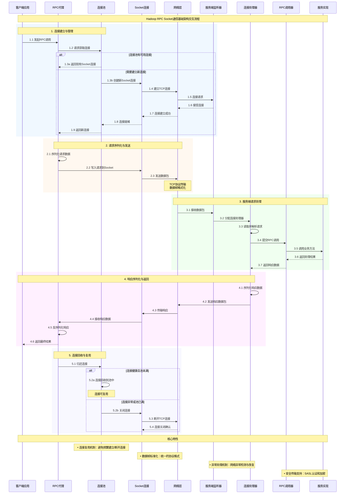
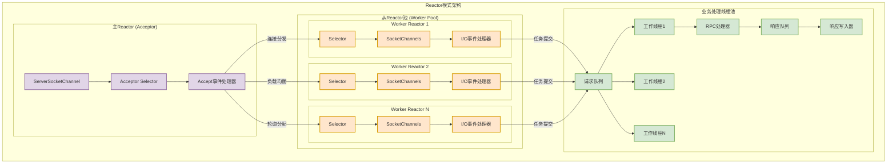
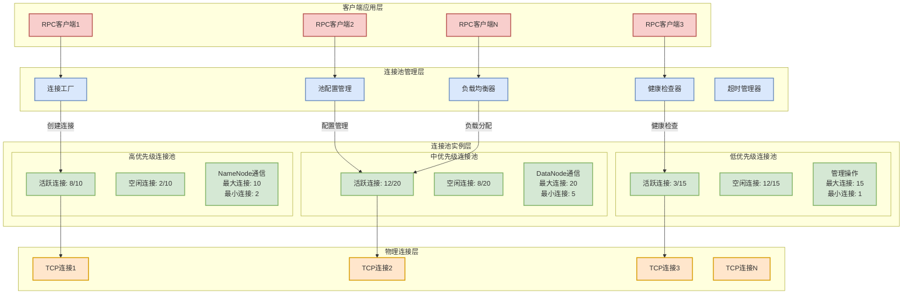
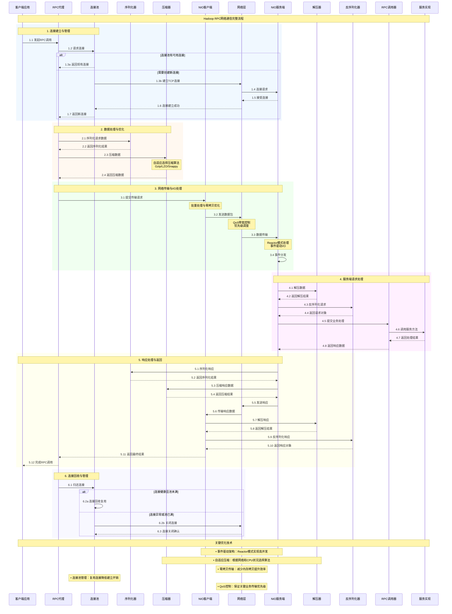

# 第六章 网络通信实现

## 6.1 Socket通信基础

在分布式系统的网络通信架构中，Socket作为应用层与传输层之间的编程接口，承担着数据传输的基础职责。Hadoop RPC框架的网络通信实现建立在Java Socket API之上，通过对底层网络连接的精细化管理，实现了高效、可靠的分布式通信机制。理解Socket通信的工作原理和Hadoop的具体实现方式，对于深入掌握RPC框架的性能特征和优化策略具有重要意义。

传统的阻塞式Socket通信模型在处理大量并发连接时面临着线程资源消耗过大的问题。每个客户端连接都需要独立的线程来处理，当连接数量增加时，系统的线程切换开销和内存占用会急剧上升，最终导致性能瓶颈。Hadoop在早期版本中采用了这种模型，但随着集群规模的扩大和并发需求的增长，逐步演进到了基于NIO的非阻塞通信模式。

在Hadoop的Socket通信实现中，客户端和服务端的交互遵循严格的协议规范。客户端首先建立到服务端的TCP连接，然后发送包含协议版本、认证信息和调用参数的请求数据。服务端接收到请求后，根据协议头部信息进行解析，执行相应的业务逻辑，并将结果封装后返回给客户端。这个过程中，数据的序列化和反序列化、网络传输的可靠性保证、以及连接的生命周期管理都是需要精心设计的关键环节。

Hadoop RPC的Socket通信基础架构具有以下核心特征：

- **连接复用机制**：客户端与服务端之间建立长连接，避免频繁的连接建立和断开开销
- **协议版本协商**：支持多版本协议共存，确保系统升级时的向后兼容性
- **数据帧格式标准化**：定义统一的数据帧结构，包含长度字段、协议标识和负载数据
- **异常处理机制**：完善的网络异常检测和恢复策略，提高系统的容错能力
- **安全传输支持**：集成SASL认证和数据加密功能，保障通信安全

*图6-1：Hadoop RPC Socket通信基础架构*

## 6.2 NIO实现机制

Java NIO（New I/O）的引入为Hadoop RPC框架带来了革命性的性能提升，特别是在处理大规模并发连接时展现出了传统阻塞I/O无法比拟的优势。NIO的核心思想是通过单线程或少量线程管理多个网络连接，利用事件驱动的方式处理I/O操作，从而大幅降低了系统的资源消耗和上下文切换开销。在Hadoop的实际部署环境中，一个NameNode可能需要同时处理数千个DataNode的连接请求，传统的一连接一线程模型显然无法满足这种规模的并发需求。

Hadoop RPC的NIO实现基于Java的Selector机制构建了高效的事件循环架构。Selector作为多路复用器，能够监控多个Channel的I/O事件状态，当某个Channel准备好进行读写操作时，Selector会通知相应的处理器进行数据处理。这种设计模式使得单个线程能够管理数百甚至数千个并发连接，极大地提高了系统的吞吐量和资源利用率。在具体实现中，Hadoop采用了Reactor模式，将网络I/O操作与业务逻辑处理分离，通过事件分发机制确保系统的响应性和稳定性。

NIO实现机制中的关键组件包括Selector、Channel、Buffer等核心元素的协调工作。Selector负责监听多个Channel上的I/O事件，当事件发生时触发相应的处理逻辑。Channel代表与客户端的网络连接，提供非阻塞的读写操作接口。Buffer作为数据缓冲区，管理着网络传输过程中的数据流转。这三者的有机结合构成了Hadoop RPC高性能网络通信的基础架构。

Hadoop NIO实现的核心特征体现在以下几个方面：

- **事件驱动架构**：基于Selector的事件监听机制，实现高效的I/O多路复用
- **非阻塞操作**：读写操作不会阻塞线程，提高系统并发处理能力
- **内存映射优化**：利用DirectBuffer减少数据拷贝，提升传输效率
- **连接状态管理**：精确跟踪每个连接的状态变化，确保数据传输的可靠性
- **负载均衡机制**：通过多个Selector实例分担连接负载，避免单点瓶颈

*图6-2：Hadoop RPC NIO实现机制详解*

## 6.3 连接池管理

在分布式系统的网络通信中，连接的建立和销毁是相对昂贵的操作，涉及TCP三次握手、四次挥手等网络协议开销。Hadoop RPC框架通过实现sophisticated的连接池管理机制，有效地复用网络连接资源，显著降低了通信延迟和系统开销。连接池的设计不仅要考虑连接的创建和回收策略，还需要处理连接的健康检查、超时管理、以及在网络异常情况下的故障恢复等复杂场景。

Hadoop的连接池实现采用了分层管理的设计思路，针对不同类型的RPC调用建立相应的连接池实例。对于频繁交互的组件之间，如NameNode与DataNode，系统会维护长期稳定的连接池，确保通信的低延迟和高可靠性。而对于偶发性的管理操作，则采用按需创建、用后回收的策略，避免资源的无效占用。这种差异化的管理策略使得系统能够在保证性能的同时，有效控制资源消耗。

连接池的生命周期管理是一个复杂的协调过程，需要平衡性能、资源利用率和系统稳定性等多个目标。当客户端需要发起RPC调用时，连接池首先检查是否有可用的空闲连接，如果有则直接复用，否则根据当前池的状态决定是创建新连接还是等待现有连接释放。连接使用完毕后，系统会根据连接的健康状态和池的容量限制决定是否将其放回池中供后续使用。这个过程中，连接的有效性验证、超时检测、以及异常连接的清理都是确保系统稳定运行的关键环节。

Hadoop连接池管理的核心机制包括：

- **分级连接策略**：根据通信频率和重要性建立不同级别的连接池
- **动态扩缩容**：根据负载情况自动调整连接池大小，优化资源利用
- **健康状态监控**：定期检查连接有效性，及时清理无效连接
- **超时管理机制**：设置合理的连接超时和空闲超时，防止资源泄露
- **故障恢复策略**：在网络异常时自动重建连接，保证服务连续性

*图6-3：Hadoop RPC连接池管理架构*

## 6.4 数据传输优化

数据传输效率直接影响着Hadoop RPC框架的整体性能表现，特别是在处理大规模数据集和高并发请求时，传输优化策略的重要性更加凸显。Hadoop在数据传输层面实施了多层次的优化措施，从底层的网络协议调优到上层的数据压缩算法，形成了一套完整的性能优化体系。这些优化不仅要考虑传输速度的提升，还需要兼顾CPU使用率、内存消耗、以及网络带宽的合理分配等多个维度的平衡。

零拷贝技术是Hadoop数据传输优化的重要组成部分，通过减少数据在用户空间和内核空间之间的拷贝次数，显著提升了大文件传输的效率。在传统的网络传输过程中，数据需要经历多次内存拷贝操作：从磁盘到内核缓冲区，从内核缓冲区到用户空间，再从用户空间到网络协议栈。零拷贝技术通过直接在内核空间完成数据传输，避免了不必要的内存拷贝开销，特别是在HDFS的数据块传输场景中，这种优化能够带来显著的性能提升。

数据压缩是另一个重要的传输优化手段，Hadoop支持多种压缩算法，包括Gzip、LZO、Snappy等，每种算法在压缩率和处理速度之间有不同的权衡。在RPC通信中，系统会根据数据的特征和网络条件动态选择最适合的压缩策略。对于网络带宽受限的环境，优先选择高压缩率的算法以减少传输数据量；而在CPU资源紧张的情况下，则倾向于使用快速压缩算法以降低处理开销。这种自适应的压缩策略确保了系统在不同环境下都能获得最优的传输性能。

Hadoop数据传输优化的关键技术特征：

- **零拷贝传输**：利用sendfile等系统调用减少内存拷贝开销
- **自适应压缩**：根据网络和CPU状况动态选择压缩算法
- **批量传输机制**：将多个小请求合并传输，减少网络往返次数
- **流水线处理**：并行处理数据的读取、压缩和传输操作
- **带宽控制策略**：实现QoS机制，保证关键业务的传输优先级

*图6-4：网络通信完整流程时序图*
