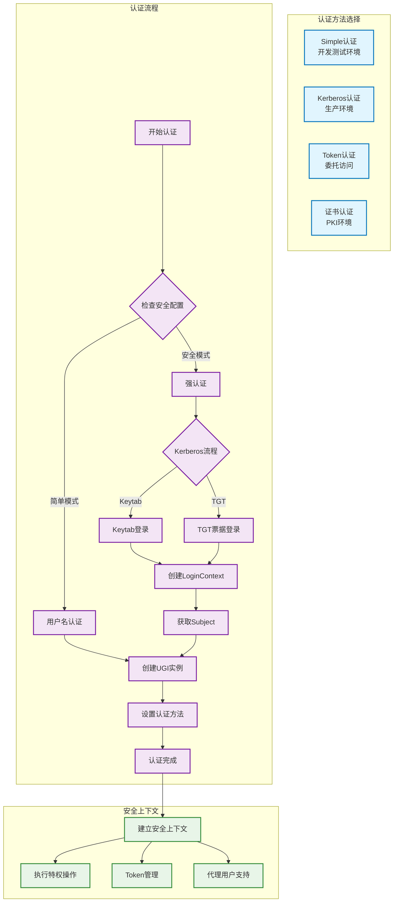
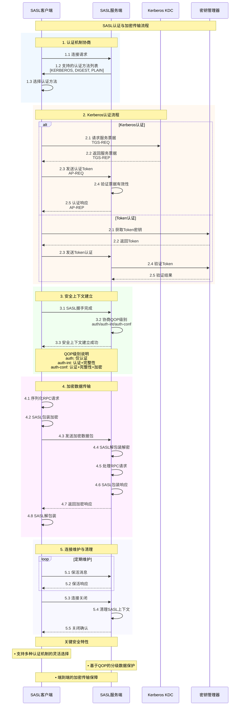
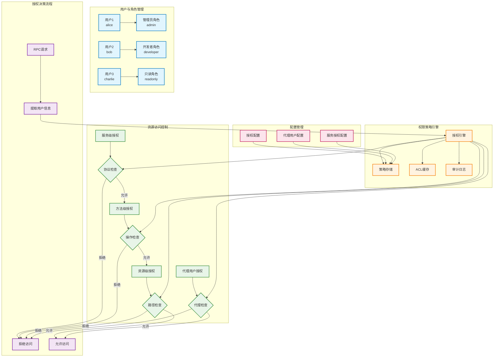

# 第七章 安全机制

## 7.1 认证框架设计

在企业级分布式系统的部署环境中，安全性是不可妥协的核心需求。Hadoop RPC框架的认证机制承担着验证通信双方身份合法性的重要职责，确保只有经过授权的用户和服务才能访问集群资源。随着Hadoop在金融、医疗、政府等安全敏感行业的广泛应用，其认证框架的设计必须满足严格的安全标准和合规要求。传统的简单认证方式已经无法应对现代网络环境中日益复杂的安全威胁，因此Hadoop采用了多层次、可扩展的认证架构来构建robust的安全防护体系。

Hadoop的认证框架基于可插拔的设计理念，支持多种认证机制的灵活配置和组合使用。系统默认提供了Simple认证和Kerberos认证两种主要方式，同时预留了扩展接口以支持自定义认证协议的集成。Simple认证主要用于开发和测试环境，通过用户名进行基本的身份标识，虽然实现简单但安全性有限。Kerberos认证则是生产环境的首选方案，基于票据机制实现了强身份验证和单点登录功能，能够有效防范网络窃听、重放攻击等常见安全威胁。

认证过程的实现涉及客户端、服务端和认证服务器之间的复杂交互协议。当客户端发起RPC调用时，首先需要向认证服务器申请访问票据，然后将票据信息包含在RPC请求中发送给目标服务。服务端接收到请求后，会验证票据的有效性和完整性，确认客户端身份后才会处理具体的业务逻辑。这个过程中，时间戳、随机数、加密签名等安全元素的使用确保了认证信息的不可伪造性和时效性。

Hadoop认证框架的核心特征包括：

- **可插拔架构**：支持多种认证协议的灵活配置和动态切换
- **强身份验证**：基于Kerberos的票据机制提供robust的身份保证
- **单点登录支持**：用户一次认证后可访问集群内所有授权服务
- **时效性控制**：通过票据过期机制防范长期凭证泄露风险
- **审计日志记录**：完整记录认证过程，支持安全事件的追溯分析

### 认证方法枚举定义

Hadoop支持多种认证方式，通过`AuthenticationMethod`枚举进行定义：

```java
public enum AuthenticationMethod {
    // 简单认证：仅基于用户名，适用于开发测试环境
    SIMPLE(AuthMethod.SIMPLE,
           HadoopConfiguration.SIMPLE_CONFIG_NAME),

    // Kerberos认证：基于票据的强认证，生产环境首选
    KERBEROS(AuthMethod.KERBEROS,
             HadoopConfiguration.KERBEROS_CONFIG_NAME),

    // Token认证：基于委托令牌的认证方式
    TOKEN(AuthMethod.TOKEN),

    // 证书认证：基于X.509证书的认证
    CERTIFICATE(null),

    // Kerberos SSL：结合Kerberos和SSL的混合认证
    KERBEROS_SSL(null),

    // 代理认证：支持用户代理的认证方式
    PROXY(null);

    private final AuthMethod authMethod;
    private final String loginAppName;

    private AuthenticationMethod(AuthMethod authMethod) {
        this(authMethod, null);
    }

    private AuthenticationMethod(AuthMethod authMethod, String loginAppName) {
        this.authMethod = authMethod;
        this.loginAppName = loginAppName;
    }

    public AuthMethod getAuthMethod() {
        return authMethod;
    }

    public String getLoginAppName() {
        return loginAppName;
    }
}
```



*图7-1：Hadoop RPC认证框架流程*

### UserGroupInformation核心实现

`UserGroupInformation`类是Hadoop安全机制的核心，负责用户身份管理：

```java
public class UserGroupInformation {
    // 当前登录用户的UGI实例
    private static UserGroupInformation loginUser = null;

    // 认证方法
    private AuthenticationMethod authMethod = null;

    // 用户主体信息
    private Subject subject;

    /**
     * 获取当前登录用户
     */
    public static UserGroupInformation getCurrentUser() throws IOException {
        AccessControlContext context = AccessController.getContext();
        Subject subject = Subject.getSubject(context);

        if (subject == null || subject.getPrincipals(User.class).isEmpty()) {
            return getLoginUser();
        } else {
            return new UserGroupInformation(subject);
        }
    }

    /**
     * 从Keytab文件登录用户
     */
    public static UserGroupInformation loginUserFromKeytabAndReturnUGI(
            String principal, String keytabFile) throws IOException {

        if (isSecurityEnabled()) {
            // Kerberos环境下的登录逻辑
            UserGroupInformation ugi = new UserGroupInformation(principal);
            ugi.setAuthenticationMethod(AuthenticationMethod.KERBEROS);

            // 使用Keytab进行登录
            LoginContext login = newLoginContext(
                HadoopConfiguration.KEYTAB_KERBEROS_CONFIG_NAME,
                principal, keytabFile);
            login.login();

            ugi.subject = login.getSubject();
            return ugi;
        } else {
            // 简单认证环境
            return createRemoteUser(principal, AuthenticationMethod.SIMPLE);
        }
    }

    /**
     * 以当前用户身份执行特权操作
     */
    public <T> T doAs(PrivilegedExceptionAction<T> action)
            throws IOException, InterruptedException {
        try {
            return Subject.doAs(subject, action);
        } catch (PrivilegedActionException pae) {
            Throwable cause = pae.getCause();
            if (cause instanceof IOException) {
                throw (IOException) cause;
            } else if (cause instanceof Error) {
                throw (Error) cause;
            } else if (cause instanceof RuntimeException) {
                throw (RuntimeException) cause;
            } else if (cause instanceof InterruptedException) {
                throw (InterruptedException) cause;
            } else {
                throw new UndeclaredThrowableException(cause);
            }
        }
    }

    /**
     * 创建远程用户UGI
     */
    public static UserGroupInformation createRemoteUser(String user,
            AuthenticationMethod authMethod) {
        if (user == null || user.isEmpty()) {
            throw new IllegalArgumentException("Null user");
        }

        UserGroupInformation ugi = new UserGroupInformation(user);
        ugi.setAuthenticationMethod(authMethod);
        return ugi;
    }

    /**
     * 检查是否启用了安全认证
     */
    public static boolean isSecurityEnabled() {
        return !isSimpleAuthentication();
    }

    private static boolean isSimpleAuthentication() {
        return (getConfiguration().get(HADOOP_SECURITY_AUTHENTICATION, "simple")
                .equals("simple"));
    }
}
```

## 7.2 SASL集成机制

Simple Authentication and Security Layer（SASL）作为一个标准化的认证框架，为Hadoop RPC提供了统一的安全协商和数据保护机制。SASL的引入使得Hadoop能够支持多种认证方法的无缝集成，包括PLAIN、DIGEST-MD5、GSSAPI等不同的安全机制，同时提供了数据完整性检查和加密传输的可选功能。这种标准化的设计不仅简化了安全机制的实现复杂度，还增强了系统与其他企业安全基础设施的互操作性。

在Hadoop RPC的SASL实现中，安全协商过程遵循标准的SASL协议流程。客户端和服务端首先进行机制协商，确定双方都支持的认证方法和安全级别。然后通过多轮消息交换完成身份验证过程，建立安全上下文。一旦安全上下文建立成功，后续的RPC通信就可以在这个安全通道中进行，享受数据完整性保护和可选的加密服务。这种设计确保了即使在不可信的网络环境中，Hadoop集群的通信安全也能得到有效保障。

SASL集成的技术实现涉及多个层面的协调配合。在网络传输层，SASL负责对RPC消息进行包装和解包装，添加必要的安全头部信息。在应用层，SASL与Hadoop的用户身份管理系统集成，确保认证结果能够正确映射到系统的权限控制机制。在配置管理层，SASL提供了灵活的参数配置选项，允许管理员根据安全需求和性能要求调整安全策略。

为了更好地理解SASL在Hadoop RPC中的工作流程，下图展示了从认证协商到加密传输的完整时序过程：



*图7-2：SASL认证与加密传输时序图*

上图详细展示了SASL认证的完整流程，包括机制协商、身份验证、安全上下文建立和加密数据传输等关键步骤。接下来我们通过具体的代码实现来深入理解这些过程。

Hadoop SASL集成的关键技术特征：

- **标准协议支持**：完全兼容SASL RFC规范，确保互操作性
- **多机制选择**：支持PLAIN、DIGEST-MD5、GSSAPI等多种认证机制
- **安全级别协商**：动态选择数据完整性检查和加密保护级别
- **性能优化设计**：最小化安全处理对RPC性能的影响
- **配置灵活性**：提供丰富的配置选项满足不同安全需求

### SASL服务端实现

在Hadoop RPC的服务端，SASL认证的核心逻辑由`SaslRpcServer`类实现。该类负责处理不同认证机制的创建、配置和消息处理。以下代码展示了SASL服务端的关键实现：

```java
public class SaslRpcServer {

    /**
     * SASL认证方法枚举
     */
    public static enum AuthMethod {
        SIMPLE((byte) 80, "", UserGroupInformation.AuthenticationMethod.SIMPLE),
        KERBEROS((byte) 81, "GSSAPI", UserGroupInformation.AuthenticationMethod.KERBEROS),
        DIGEST((byte) 82, "DIGEST-MD5", UserGroupInformation.AuthenticationMethod.TOKEN),
        PLAIN((byte) 83, "PLAIN", UserGroupInformation.AuthenticationMethod.SIMPLE);

        public final byte code;
        public final String mechanismName;
        public final UserGroupInformation.AuthenticationMethod authenticationMethod;

        private AuthMethod(byte code, String mechanismName,
                UserGroupInformation.AuthenticationMethod authMethod) {
            this.code = code;
            this.mechanismName = mechanismName;
            this.authenticationMethod = authMethod;
        }
    }

    /**
     * 创建SASL服务器实例
     */
    public static SaslServer create(AuthMethod authMethod,
            Map<String, String> saslProps, SecretManager secretManager)
            throws IOException, InterruptedException {

        UserGroupInformation current = UserGroupInformation.getCurrentUser();
        String fullName = current.getUserName();

        switch (authMethod) {
            case DIGEST:
                if (secretManager == null) {
                    throw new AccessControlException("Server does not support DIGEST authentication");
                }
                SaslDigestCallbackHandler ch = new SaslDigestCallbackHandler(secretManager);
                return Sasl.createSaslServer(AuthMethod.DIGEST.mechanismName,
                        null, SaslRpcServer.SASL_DEFAULT_REALM, saslProps, ch);

            case KERBEROS:
                if (fullName == null || fullName.isEmpty()) {
                    throw new AccessControlException("Kerberos principal name does NOT have the expected hostname part: " + fullName);
                }
                return current.doAs(new PrivilegedExceptionAction<SaslServer>() {
                    @Override
                    public SaslServer run() throws SaslException {
                        return Sasl.createSaslServer(AuthMethod.KERBEROS.mechanismName,
                                SASL_PROTOCOL_NAME, fullName, saslProps,
                                new SaslGssCallbackHandler());
                    }
                });

            default:
                throw new IOException("Unknown authentication method " + authMethod);
        }
    }

    /**
     * SASL消息处理
     */
    public static class SaslDigestCallbackHandler implements CallbackHandler {
        private SecretManager secretManager;

        public SaslDigestCallbackHandler(SecretManager secretManager) {
            this.secretManager = secretManager;
        }

        @Override
        public void handle(Callback[] callbacks) throws IOException, UnsupportedCallbackException {
            NameCallback nc = null;
            PasswordCallback pc = null;
            AuthorizeCallback ac = null;

            for (Callback callback : callbacks) {
                if (callback instanceof AuthorizeCallback) {
                    ac = (AuthorizeCallback) callback;
                } else if (callback instanceof NameCallback) {
                    nc = (NameCallback) callback;
                } else if (callback instanceof PasswordCallback) {
                    pc = (PasswordCallback) callback;
                } else if (callback instanceof RealmCallback) {
                    continue; // realm is ignored
                } else {
                    throw new UnsupportedCallbackException(callback, "Unrecognized SASL DIGEST-MD5 Callback");
                }
            }

            if (pc != null) {
                TokenIdentifier tokenIdentifier = getTokenIdentifier(nc.getDefaultName());
                char[] password = encodePassword(secretManager.retrievePassword(tokenIdentifier));
                pc.setPassword(password);
            }

            if (ac != null) {
                String authid = ac.getAuthenticationID();
                String authzid = ac.getAuthorizationID();
                if (authid.equals(authzid)) {
                    ac.setAuthorized(true);
                } else {
                    ac.setAuthorized(false);
                }
                if (ac.isAuthorized()) {
                    ac.setAuthorizedID(authzid);
                }
            }
        }
    }
}
```

### SASL客户端实现

与服务端对应，客户端的SASL认证由`SaslRpcClient`类负责处理。该类需要根据服务端提供的认证方法列表选择合适的认证机制，并完成认证握手过程。客户端实现的关键在于正确处理不同认证方法的初始化和消息交换：

```java
public class SaslRpcClient {
    private final UserGroupInformation ugi;
    private final Class<?> protocol;
    private final InetAddress serverAddr;
    private final SecurityInfo securityInfo;

    private SaslClient saslClient;

    /**
     * 选择并创建SASL客户端
     */
    public boolean selectSaslClient(List<AuthMethod> authMethods) throws IOException {
        for (AuthMethod authMethod : authMethods) {
            if (isValidAuthMethod(authMethod)) {
                saslClient = createSaslClient(authMethod);
                if (saslClient != null) {
                    return true;
                }
            }
        }
        return false;
    }

    /**
     * 创建SASL客户端实例
     */
    private SaslClient createSaslClient(AuthMethod authMethod) throws IOException {
        String[] mechanismNames = new String[] { authMethod.mechanismName };
        Map<String, String> saslProps = createSaslProperties();
        CallbackHandler callbackHandler = null;

        switch (authMethod) {
            case DIGEST:
                Token<? extends TokenIdentifier> token = selectDigestToken();
                if (token != null) {
                    callbackHandler = new SaslClientCallbackHandler(token);
                    return Sasl.createSaslClient(mechanismNames, null,
                            SaslRpcServer.SASL_PROTOCOL_NAME,
                            SaslRpcServer.SASL_DEFAULT_REALM,
                            saslProps, callbackHandler);
                }
                break;

            case KERBEROS:
                if (ugi.getRealAuthenticationMethod() == AuthenticationMethod.KERBEROS) {
                    String serverPrincipal = getServerPrincipal();
                    callbackHandler = new SaslClientCallbackHandler(null);
                    return ugi.doAs(new PrivilegedExceptionAction<SaslClient>() {
                        @Override
                        public SaslClient run() throws SaslException {
                            return Sasl.createSaslClient(mechanismNames, null,
                                    SaslRpcServer.SASL_PROTOCOL_NAME,
                                    serverPrincipal, saslProps, callbackHandler);
                        }
                    });
                }
                break;
        }

        return null;
    }

    /**
     * 执行SASL认证握手
     */
    public boolean saslConnect(InputStream inS, OutputStream outS) throws IOException {
        DataInputStream inStream = new DataInputStream(inS);
        DataOutputStream outStream = new DataOutputStream(outS);

        try {
            byte[] saslToken = new byte[0];
            if (saslClient.hasInitialResponse()) {
                saslToken = saslClient.evaluateChallenge(saslToken);
            }

            while (!saslClient.isComplete()) {
                sendSaslMessage(outStream, saslToken);
                SaslResponseWithNegotiatedCipherOption response = readSaslMessage(inStream);
                saslToken = saslClient.evaluateChallenge(response.payload);
            }

            if (saslClient.isComplete()) {
                return true;
            }
        } catch (SaslException se) {
            try {
                saslClient.dispose();
            } catch (SaslException ignored) {
            }
            throw se;
        }

        return false;
    }
}
```

## 7.3 授权控制体系

认证解决了"你是谁"的问题，而授权则要回答"你能做什么"的关键问题。Hadoop RPC的授权控制体系建立在细粒度权限管理的基础之上，通过多维度的访问控制策略确保用户只能执行其被明确授权的操作。这种精确的权限控制不仅是安全合规的基本要求，也是多租户环境下资源隔离和数据保护的重要保障。在大型企业的Hadoop部署中，可能涉及数百个用户和数千个作业的并发执行，授权体系的设计必须既要保证安全性，又要具备良好的可管理性和性能表现。

Hadoop的授权机制采用了基于角色的访问控制（RBAC）模型，结合了用户、角色、权限三个核心要素的灵活组合。用户通过被分配到特定角色来获得相应的权限集合，而角色则可以根据业务需求进行动态调整和组合。这种设计大大简化了大规模用户权限的管理复杂度，管理员只需要维护相对稳定的角色定义，而不必为每个用户单独配置权限。同时，系统还支持基于资源的细粒度授权，可以针对特定的文件、目录、服务接口设置独立的访问控制策略。

授权决策的执行过程涉及多个组件的协同工作。当RPC请求到达服务端时，授权模块会提取请求中的用户身份信息和目标资源标识，然后查询权限策略数据库确定用户是否具有执行该操作的权限。这个过程中，系统会考虑用户的直接权限、角色继承权限、以及可能存在的权限委托关系。为了提高授权决策的性能，Hadoop实现了多级缓存机制，将频繁访问的权限信息缓存在内存中，避免每次请求都进行完整的权限查询。

Hadoop授权控制体系的核心机制：

- **RBAC权限模型**：基于角色的访问控制简化权限管理复杂度
- **细粒度授权**：支持文件、目录、服务接口级别的精确权限控制
- **动态权限更新**：支持权限策略的实时修改和生效
- **权限继承机制**：通过角色层次结构实现权限的灵活继承
- **审计追踪功能**：完整记录权限检查和访问行为，支持合规审计



*图7-3：Hadoop RPC授权控制体系架构*

### 连接授权实现

上图展示了Hadoop RPC授权控制体系的完整架构，包括用户角色管理、权限策略引擎、资源访问控制和配置管理等核心组件。在实际的代码实现中，授权控制主要在RPC连接建立和请求处理过程中进行。以下代码展示了连接级别授权控制的具体实现：

```java
public class Server {

    public abstract static class Connection {
        private UserGroupInformation user = null;
        private UserGroupInformation realUser = null;

        /**
         * 授权连接访问
         */
        private void authorizeConnection() throws IOException {
            try {
                // 检查是否为代理用户
                if (user != null && user.getRealUser() != null
                        && (authMethod != AuthMethod.TOKEN)) {
                    ProxyUsers.authorize(user, this.getHostAddress());
                }

                // 执行服务级别授权
                authorize(user, protocolName, getHostInetAddress());

                if (LOG.isDebugEnabled()) {
                    LOG.debug("Successfully authorized " + connectionContext);
                }
                rpcMetrics.incrAuthorizationSuccesses();
            } catch (AuthorizationException ae) {
                LOG.info("Authorization failed for " + connectionContext + ": " + ae.getMessage());
                rpcMetrics.incrAuthorizationFailures();
                throw ae;
            }
        }

        /**
         * 处理连接上下文
         */
        private void processConnectionContext(RpcRequestWrapper request) throws IOException {
            // 解析连接上下文
            IpcConnectionContextProto connectionContext = request.connectionContext;

            // 提取用户信息
            String protocolName = connectionContext.getProtocol();
            UserGroupInformation protocolUser = getAuthorizedUgi(connectionContext.getUserInfo());

            // 设置连接用户
            if (authMethod == AuthMethod.TOKEN) {
                // Token认证的特殊处理
                this.user = protocolUser;
            } else {
                this.user = protocolUser;
                this.realUser = protocolUser.getRealUser();
            }

            // 执行授权检查
            authorizeConnection();
        }

        /**
         * 获取授权用户信息
         */
        private UserGroupInformation getAuthorizedUgi(String authorizedId) throws IOException {
            if (authMethod == AuthMethod.TOKEN) {
                TokenIdentifier tokenId = SaslRpcServer.getIdentifier(authorizedId, secretManager);
                UserGroupInformation ugi = tokenId.getUser();
                if (ugi == null) {
                    throw new AccessControlException("Can't retrieve username from tokenIdentifier.");
                }
                ugi.addTokenIdentifier(tokenId);
                return ugi;
            } else {
                return UserGroupInformation.createRemoteUser(authorizedId, authMethod.authenticationMethod);
            }
        }
    }

    /**
     * 服务级别授权检查
     */
    public void authorize(UserGroupInformation user, String protocolName,
            InetAddress addr) throws AuthorizationException {

        if (authorize) {
            if (protocolName == null) {
                throw new AuthorizationException("Null protocol not authorized");
            }

            Class<?> protocol = null;
            try {
                protocol = getProtocolClass(protocolName, getConf());
            } catch (ClassNotFoundException cfne) {
                throw new AuthorizationException("Unknown protocol: " + protocolName);
            }

            // 执行具体的授权逻辑
            serviceAuthorizationManager.authorize(user, protocol, getConf(), addr);
        }
    }
}
```

### 代理用户授权

在企业环境中，经常需要支持代理用户（Proxy User）的场景，即允许某个服务用户代表其他用户执行操作。Hadoop通过`ProxyUsers`类提供了完善的代理用户授权机制，确保只有被明确授权的用户才能进行代理操作：

```java
public class ProxyUsers {

    /**
     * 授权代理用户访问
     */
    public static void authorize(UserGroupInformation user, String remoteAddress)
            throws AuthorizationException {

        UserGroupInformation realUser = user.getRealUser();
        if (realUser != null) {
            AccessControlList acl = proxyHosts.get(realUser.getShortUserName());
            if (acl == null || !acl.isUserAllowed(realUser)) {
                throw new AuthorizationException("User: " + realUser.getUserName()
                        + " is not allowed to impersonate " + user.getUserName());
            }

            MachineList machineList = proxyHosts.get(realUser.getShortUserName());
            if (machineList == null || !machineList.includes(remoteAddress)) {
                throw new AuthorizationException("Unauthorized connection for super-user: "
                        + realUser.getUserName() + " from IP " + remoteAddress);
            }
        }
    }

    /**
     * 刷新代理用户配置
     */
    public static void refreshSuperUserGroupsConfiguration(Configuration conf) {
        // 清除现有配置
        proxyGroups.clear();
        proxyHosts.clear();

        // 重新加载配置
        Map<String, Collection<String>> groupMap =
                conf.getValByRegex(CONF_HADOOP_PROXYUSER_RE);
        Map<String, Collection<String>> hostMap =
                conf.getValByRegex(CONF_HADOOP_PROXYUSER_RE);

        // 解析并设置新的代理配置
        for (Map.Entry<String, Collection<String>> entry : groupMap.entrySet()) {
            String[] parts = entry.getKey().split("\\.");
            if (parts.length == 3 && parts[1].equals("groups")) {
                Collection<String> groups = entry.getValue();
                proxyGroups.put(parts[0], new AccessControlList(groups));
            }
        }

        for (Map.Entry<String, Collection<String>> entry : hostMap.entrySet()) {
            String[] parts = entry.getKey().split("\\.");
            if (parts.length == 3 && parts[1].equals("hosts")) {
                Collection<String> hosts = entry.getValue();
                proxyHosts.put(parts[0], new MachineList(hosts));
            }
        }
    }
}
```

## 7.4 加密传输实现

在网络通信的安全防护中，数据加密是防范窃听攻击和数据泄露的最后一道防线。Hadoop RPC框架的加密传输实现不仅要保护数据在网络传输过程中的机密性，还要确保数据的完整性和真实性不被破坏。考虑到Hadoop集群通常处理的是大规模数据集，加密算法的选择必须在安全强度和性能效率之间找到最佳平衡点。过强的加密可能导致不可接受的性能损失，而过弱的加密则无法提供足够的安全保护。

Hadoop的加密传输实现支持多种加密算法和密钥管理策略，包括对称加密、非对称加密以及混合加密模式。对于大量数据的传输，系统主要采用高效的对称加密算法如AES，而密钥的交换和管理则依赖于RSA等非对称加密技术。这种混合模式既保证了加密强度，又避免了非对称加密在大数据量处理时的性能瓶颈。同时，系统还实现了密钥的定期轮换机制，即使某个密钥被泄露，其影响范围也会被限制在有限的时间窗口内。

加密传输的实现涉及多个技术层面的精密协调。在协议层面，系统需要在RPC握手阶段完成加密参数的协商，包括加密算法、密钥长度、初始化向量等关键参数。在数据处理层面，加密和解密操作必须与数据的序列化、压缩等处理流程无缝集成，确保整个数据处理管道的高效运行。在性能优化层面，系统采用了硬件加速、批量处理、流水线操作等多种技术手段，最大限度地降低加密操作对整体性能的影响。

Hadoop加密传输的技术实现特征：

- **混合加密模式**：结合对称和非对称加密的优势，平衡安全性和性能
- **算法灵活配置**：支持多种加密算法的选择和动态切换
- **密钥生命周期管理**：实现密钥的安全生成、分发、轮换和销毁
- **硬件加速支持**：利用专用硬件提升加密解密性能
- **端到端保护**：确保数据从源到目的地的全程加密保护

```mermaid
graph TB
    subgraph "加密算法选择"
        AES[AES对称加密<br/>高性能数据加密]
        RSA[RSA非对称加密<br/>密钥交换]
        DES[DES加密<br/>兼容性支持]
        Blowfish[Blowfish加密<br/>轻量级选择]
    end

    subgraph "QOP保护级别"
        Auth[authentication<br/>仅认证]
        AuthInt[auth-int<br/>认证+完整性]
        AuthConf[auth-conf<br/>认证+完整性+加密]

        Auth --> NoEncrypt[无加密传输]
        AuthInt --> Integrity[完整性检查]
        AuthConf --> FullEncrypt[完全加密]
    end

    subgraph "密钥管理生命周期"
        KeyGen[密钥生成<br/>SecureRandom]
        KeyDist[密钥分发<br/>安全通道]
        KeyRotate[密钥轮换<br/>定期更新]
        KeyDestroy[密钥销毁<br/>安全清理]

        KeyGen --> KeyDist
        KeyDist --> KeyRotate
        KeyRotate --> KeyDestroy
        KeyDestroy -.-> KeyGen
    end

    subgraph "加密传输流程"
        PlainData[原始数据] --> Serialize[序列化]
        Serialize --> Compress[压缩处理]
        Compress --> Encrypt[SASL包装加密]
        Encrypt --> Network[网络传输]

        Network --> Decrypt[SASL解包装]
        Decrypt --> Decompress[解压处理]
        Decompress --> Deserialize[反序列化]
        Deserialize --> ProcessedData[处理后数据]
    end

    subgraph "性能优化"
        HWAccel[硬件加速<br/>AES-NI指令]
        BatchProc[批量处理<br/>减少调用开销]
        Pipeline[流水线处理<br/>并行加解密]
        Cache[密钥缓存<br/>避免重复计算]

        HWAccel --> Performance[性能提升]
        BatchProc --> Performance
        Pipeline --> Performance
        Cache --> Performance
    end

    subgraph "安全配置"
        Config[hadoop.rpc.protection]
        CipherSuite[加密套件选择]
        KeyLength[密钥长度配置]
        Timeout[密钥超时设置]

        Config --> QOPSelect{QOP选择}
        QOPSelect --> Auth
        QOPSelect --> AuthInt
        QOPSelect --> AuthConf
    end

    classDef algoStyle fill:#e1f5fe,stroke:#0277bd,stroke-width:2px
    classDef qopStyle fill:#fff3e0,stroke:#f57c00,stroke-width:2px
    classDef keyStyle fill:#e8f5e8,stroke:#388e3c,stroke-width:2px
    classDef flowStyle fill:#f3e5f5,stroke:#7b1fa2,stroke-width:2px
    classDef perfStyle fill:#fce4ec,stroke:#c2185b,stroke-width:2px
    classDef configStyle fill:#f1f8e9,stroke:#689f38,stroke-width:2px

    class AES,RSA,DES,Blowfish algoStyle
    class Auth,AuthInt,AuthConf,NoEncrypt,Integrity,FullEncrypt qopStyle
    class KeyGen,KeyDist,KeyRotate,KeyDestroy keyStyle
    class PlainData,Serialize,Compress,Encrypt,Network,Decrypt,Decompress,Deserialize,ProcessedData flowStyle
    class HWAccel,BatchProc,Pipeline,Cache,Performance perfStyle
    class Config,CipherSuite,KeyLength,Timeout,QOPSelect configStyle
```



*图7-4：Hadoop RPC加密传输架构*

上图展示了Hadoop RPC加密传输的完整架构，包括加密算法选择、QOP保护级别、密钥管理生命周期、加密传输流程和性能优化等关键组件。

### SASL数据包装与加密

在SASL认证完成后，根据协商的QOP（Quality of Protection）级别，系统可以启用数据包装来实现完整性检查和加密传输。以下代码展示了SASL数据包装的具体实现过程：

```java
public class Server {

    public abstract static class Connection {
        private SaslServer saslServer;
        private boolean useWrap = false;

        /**
         * SASL处理完成后的安全上下文建立
         */
        private void saslProcess(RpcSaslProto saslMessage) throws IOException, InterruptedException {
            if (saslContextEstablished) {
                throw new AccessControlException("SASL authentication already complete");
            }

            RpcSaslProto.Builder response = RpcSaslProto.newBuilder();

            try {
                byte[] saslToken = null;
                if (saslMessage.hasToken()) {
                    saslToken = saslMessage.getToken().toByteArray();
                    saslToken = saslServer.evaluateResponse(saslToken);
                } else {
                    saslToken = new byte[0];
                }

                if (saslServer.isComplete()) {
                    // SASL认证完成，检查QOP设置
                    String qop = (String) saslServer.getNegotiatedProperty(Sasl.QOP);
                    useWrap = qop != null && (
                        "auth-int".equalsIgnoreCase(qop) ||
                        "auth-conf".equalsIgnoreCase(qop)
                    );

                    if (LOG.isDebugEnabled()) {
                        LOG.debug("SASL server context established. Negotiated QOP is " + qop);
                    }

                    response.setState(RpcSaslProto.SaslState.SUCCESS);
                    saslContextEstablished = true;
                } else {
                    response.setState(RpcSaslProto.SaslState.NEGOTIATE);
                }

                if (saslToken != null) {
                    response.setToken(ByteString.copyFrom(saslToken));
                }

            } catch (SaslException se) {
                response.setState(RpcSaslProto.SaslState.ERROR);
                response.setToken(ByteString.copyFromUtf8(se.getLocalizedMessage()));
                LOG.warn("SASL authentication failed: " + se.getLocalizedMessage());
            }

            doSaslReply(response.build());
        }

        /**
         * 解包装加密的RPC数据包
         */
        private void unwrapPacketAndProcessRpcs(byte[] inBuf) throws IOException, InterruptedException {
            if (LOG.isDebugEnabled()) {
                LOG.debug("Have read input token of size " + inBuf.length + " for processing");
            }

            byte[] realBuf = inBuf;
            if (useWrap) {
                try {
                    realBuf = saslServer.unwrap(inBuf, 0, inBuf.length);
                } catch (SaslException se) {
                    throw new IOException("SASL unwrap error", se);
                }
            }

            ReadableByteChannel ch = Channels.newChannel(new ByteArrayInputStream(realBuf));
            processRpcs(ch);
        }

        /**
         * 包装响应数据进行加密
         */
        private void wrapWithSasl(ByteArrayOutputStream response, Call call) throws IOException {
            if (useWrap) {
                byte[] token = response.toByteArray();
                try {
                    token = saslServer.wrap(token, 0, token.length);
                } catch (SaslException se) {
                    LOG.error("SASL wrap error", se);
                    throw new IOException("SASL wrap error", se);
                }

                if (LOG.isDebugEnabled()) {
                    LOG.debug("Adding saslServer wrapped token of size " + token.length + " as call response.");
                }

                response.reset();
                DataOutputStream saslOut = new DataOutputStream(response);
                saslOut.writeInt(token.length);
                saslOut.write(token, 0, token.length);
            }
        }
    }
}
```

### 加密配置管理

为了支持不同安全需求和性能要求，Hadoop提供了灵活的加密配置选项。管理员可以通过配置参数来控制RPC通信的保护级别，从仅认证到完全加密的多种选择：

```java
public class CommonConfigurationKeysPublic {

    // RPC保护级别配置
    public static final String HADOOP_RPC_PROTECTION = "hadoop.rpc.protection";
    public static final String HADOOP_RPC_PROTECTION_DEFAULT = "authentication";

    // 支持的保护级别
    public enum QualityOfProtection {
        AUTHENTICATION("authentication"),  // 仅认证
        INTEGRITY("integrity"),           // 认证 + 完整性检查
        PRIVACY("privacy");              // 认证 + 完整性检查 + 加密

        public final String name;

        private QualityOfProtection(String name) {
            this.name = name;
        }

        public static QualityOfProtection valueOf(String name) {
            for (QualityOfProtection qop : values()) {
                if (qop.name.equals(name)) {
                    return qop;
                }
            }
            throw new IllegalArgumentException("Unknown QOP: " + name);
        }
    }

    /**
     * 获取SASL属性配置
     */
    public static Map<String, String> getSaslProperties(Configuration conf) {
        Map<String, String> saslProps = new HashMap<String, String>();

        String protection = conf.get(HADOOP_RPC_PROTECTION, HADOOP_RPC_PROTECTION_DEFAULT);
        QualityOfProtection qop = QualityOfProtection.valueOf(protection);

        switch (qop) {
            case AUTHENTICATION:
                saslProps.put(Sasl.QOP, "auth");
                break;
            case INTEGRITY:
                saslProps.put(Sasl.QOP, "auth-int");
                break;
            case PRIVACY:
                saslProps.put(Sasl.QOP, "auth-conf");
                saslProps.put(Sasl.STRENGTH, "high");
                break;
        }

        saslProps.put(Sasl.SERVER_AUTH, "true");
        return saslProps;
    }
}
```

### 密钥管理实现

在加密传输中，密钥的安全管理是至关重要的环节。Hadoop通过`SecretManager`抽象类提供了完整的密钥生命周期管理，包括密钥生成、存储、验证、轮换和销毁等关键功能：

```java
public abstract class SecretManager<T extends TokenIdentifier> {

    /**
     * 检索Token密钥
     */
    public abstract byte[] retrievePassword(T identifier) throws InvalidToken;

    /**
     * 创建新的Token密钥
     */
    public abstract T createIdentifier();

    /**
     * 验证Token有效性
     */
    public byte[] verifyToken(T identifier, byte[] password) throws InvalidToken {
        byte[] storedPassword = retrievePassword(identifier);
        if (!MessageDigest.isEqual(password, storedPassword)) {
            throw new InvalidToken("Invalid token");
        }
        return storedPassword;
    }

    /**
     * 密钥轮换实现
     */
    protected void rollMasterKey() throws IOException {
        // 生成新的主密钥
        SecretKey newKey = generateSecret();

        // 更新密钥存储
        synchronized (this) {
            currentKey = newKey;
            allKeys.put(newKey.getKeyId(), newKey);

            // 清理过期密钥
            removeExpiredKeys();
        }

        LOG.info("Rolled master key, got key id " + newKey.getKeyId());
    }

    /**
     * 生成安全随机密钥
     */
    protected SecretKey generateSecret() {
        SecretKey key = new SecretKey();
        key.setKeyId(serialNo.incrementAndGet());
        key.setKey(randomKeyGenerator.generateKey());
        key.setExpiryDate(Time.now() + keyUpdateInterval + tokenMaxLifetime);
        return key;
    }
}
```
