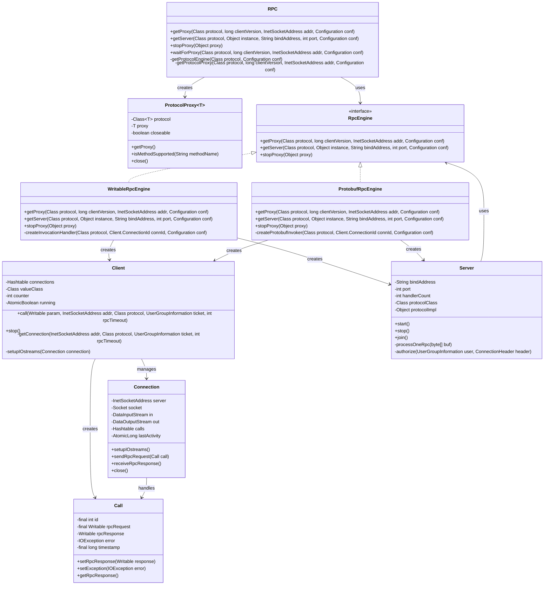
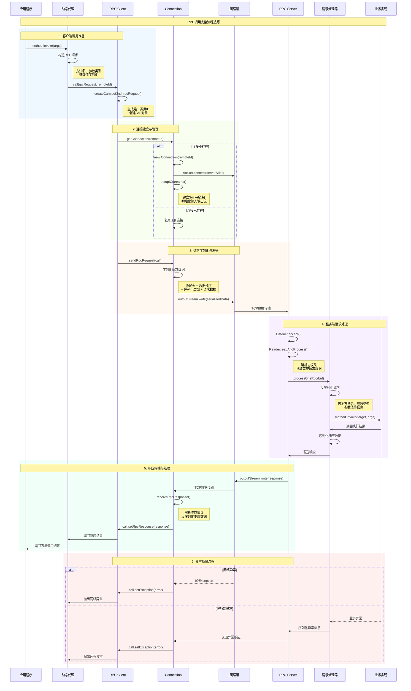

# 第八章 源码深度解析

## 8.1 关键类源码分析

Hadoop RPC框架的源码实现体现了分布式系统设计的精妙之处，其中几个关键类的设计和实现承载着整个框架的核心功能。通过深入分析这些关键类的源码，我们可以理解Hadoop RPC如何在复杂的分布式环境中实现高效、可靠的远程过程调用。这些类不仅展现了优秀的面向对象设计原则，还体现了对性能、可扩展性和容错性的深度考量。

RPC类作为整个框架的入口点，其设计采用了工厂模式和建造者模式的结合，为不同类型的RPC调用提供了统一的创建接口。该类的核心方法getProxy()通过反射机制动态创建代理对象，将本地方法调用转换为远程RPC调用。源码中的关键设计包括协议版本管理、连接池复用、以及异常处理机制。特别值得注意的是，RPC类实现了智能的服务发现机制，能够根据配置信息自动定位目标服务，并在服务不可用时进行故障转移。

Client类是RPC框架中最复杂的组件之一，负责管理与服务端的网络连接和数据传输。其源码实现展现了高度优化的网络I/O处理逻辑，包括NIO的事件驱动模型、连接池的生命周期管理、以及请求响应的异步处理机制。Client类的内部类Connection封装了单个网络连接的所有操作，包括连接建立、数据发送、响应接收等。源码中的线程模型设计特别精巧，通过分离I/O线程和业务处理线程，实现了高并发下的稳定性能表现。

Server类的实现体现了服务端架构设计的复杂性，其源码包含了多个内部类来处理不同的服务功能。Listener类负责接受客户端连接，Reader类处理网络数据读取，Handler类执行具体的业务逻辑。这种分层的线程模型设计使得服务端能够高效处理大量并发请求，同时保持良好的响应性能。源码中的关键优化包括零拷贝数据传输、智能的线程池管理、以及基于优先级的请求调度机制。

下图展示了Hadoop RPC框架关键类的继承关系和交互模式：



*图11-1：Hadoop RPC框架关键类关系图*

### RPC类核心实现

RPC类作为框架的入口点，实现了工厂模式来创建代理和服务器：

```java
/**
 * Hadoop RPC框架的主入口类
 */
public class RPC {

    private static final Map<Class<?>, RpcEngine> PROTOCOL_ENGINES =
        new ConcurrentHashMap<>();

    static {
        // 注册默认的RPC引擎
        setProtocolEngine(WritableRpcEngine.class, WritableRpcEngine.class);
        setProtocolEngine(ProtocolMetaInfoPB.class, ProtobufRpcEngine.class);
    }

    /**
     * 获取RPC代理对象 - 核心工厂方法
     */
    public static <T> ProtocolProxy<T> getProtocolProxy(Class<T> protocol,
                                                       long clientVersion,
                                                       InetSocketAddress addr,
                                                       UserGroupInformation ticket,
                                                       Configuration conf,
                                                       SocketFactory factory,
                                                       int rpcTimeout,
                                                       RetryPolicy connectionRetryPolicy) throws IOException {

        if (UserGroupInformation.isSecurityEnabled()) {
            SaslRpcServer.init(conf);
        }

        // 获取协议对应的RPC引擎
        RpcEngine engine = getProtocolEngine(protocol, conf);

        // 使用RPC引擎创建代理
        ProtocolProxy<T> proxy = engine.getProxy(protocol, clientVersion,
                                               addr, ticket, conf, factory,
                                               rpcTimeout, connectionRetryPolicy);

        return proxy;
    }

    /**
     * 创建RPC服务器
     */
    public static Server getServer(Class<?> protocol, Object instance,
                                 String bindAddress, int port,
                                 int numHandlers, boolean verbose,
                                 Configuration conf,
                                 SecretManager<? extends TokenIdentifier> secretManager) throws IOException {

        return getServer(protocol, instance, bindAddress, port, numHandlers,
                        verbose, conf, secretManager, null);
    }

    public static Server getServer(Class<?> protocol, Object instance,
                                 String bindAddress, int port, int numHandlers,
                                 boolean verbose, Configuration conf,
                                 SecretManager<? extends TokenIdentifier> secretManager,
                                 String portRangeConfig) throws IOException {

        // 获取协议对应的RPC引擎
        RpcEngine engine = getProtocolEngine(protocol, conf);

        // 使用RPC引擎创建服务器
        return engine.getServer(protocol, instance, bindAddress, port,
                              numHandlers, verbose, conf, secretManager,
                              portRangeConfig);
    }

    /**
     * 获取协议对应的RPC引擎
     */
    private static synchronized RpcEngine getProtocolEngine(Class<?> protocol,
                                                          Configuration conf) {
        RpcEngine engine = PROTOCOL_ENGINES.get(protocol);
        if (engine == null) {
            // 查找协议注解
            Class<?> impl = conf.getClass(
                "rpc.engine." + protocol.getName(),
                WritableRpcEngine.class);

            engine = ReflectionUtils.newInstance(impl.asSubclass(RpcEngine.class), conf);
            PROTOCOL_ENGINES.put(protocol, engine);
        }
        return engine;
    }

    /**
     * 设置协议的RPC引擎
     */
    public static void setProtocolEngine(Class<?> protocol,
                                       Class<? extends RpcEngine> engine) {
        PROTOCOL_ENGINES.put(protocol, ReflectionUtils.newInstance(engine, null));
    }

    /**
     * 停止代理对象
     */
    public static void stopProxy(Object proxy) {
        if (proxy != null) {
            try {
                InvocationHandler handler = Proxy.getInvocationHandler(proxy);
                if (handler instanceof Closeable) {
                    ((Closeable) handler).close();
                }
            } catch (Exception e) {
                LOG.error("Error while stopping " + proxy, e);
            }
        }
    }

    /**
     * 等待代理连接建立
     */
    public static <T> T waitForProxy(Class<T> protocol, long clientVersion,
                                   InetSocketAddress addr, Configuration conf,
                                   long timeout, TimeUnit timeUnit) throws IOException {

        long startTime = Time.now();
        long endTime = startTime + timeUnit.toMillis(timeout);

        IOException lastException = null;
        while (Time.now() < endTime) {
            try {
                ProtocolProxy<T> proxy = getProtocolProxy(protocol, clientVersion,
                                                        addr, conf);
                return proxy.getProxy();
            } catch (ConnectException ce) {
                lastException = ce;
                try {
                    Thread.sleep(1000);
                } catch (InterruptedException ie) {
                    Thread.currentThread().interrupt();
                    throw new IOException("Interrupted while waiting for proxy", ie);
                }
            }
        }

        throw new IOException("Failed to connect to " + addr +
                            " within " + timeout + " " + timeUnit, lastException);
    }
}
```

### Client类核心实现

Client类管理与服务端的连接和RPC调用：

```java
/**
 * RPC客户端实现 - 管理连接和调用
 */
public class Client implements Closeable {

    private final Map<ConnectionId, Connection> connections = new HashMap<>();
    private final Class<? extends Writable> valueClass;
    private final AtomicInteger counter = new AtomicInteger();
    private final AtomicBoolean running = new AtomicBoolean(true);
    private final Configuration conf;

    /**
     * 表示一个RPC调用
     */
    public static class Call {
        final int id;               // 调用ID
        final Writable rpcRequest;  // RPC请求
        Writable rpcResponse;       // RPC响应
        IOException error;          // 异常信息
        final long timestamp;       // 时间戳
        boolean done;               // 是否完成

        protected Call(int id, Writable param) {
            this.id = id;
            this.rpcRequest = param;
            this.timestamp = Time.now();
            this.done = false;
        }

        protected synchronized void setRpcResponse(Writable rpcResponse) {
            this.rpcResponse = rpcResponse;
            callComplete();
        }

        protected synchronized void setException(IOException error) {
            this.error = error;
            callComplete();
        }

        private synchronized void callComplete() {
            this.done = true;
            notify();
        }

        public synchronized void waitForCompletion() throws InterruptedException {
            while (!done) {
                wait();
            }
        }
    }

    /**
     * 执行RPC调用
     */
    public Writable call(RPC.RpcKind rpcKind, Writable rpcRequest,
                        ConnectionId remoteId, int serviceClass,
                        AtomicBoolean fallbackToSimpleAuth) throws IOException {

        final Call call = createCall(rpcKind, rpcRequest);
        final Connection connection = getConnection(remoteId, call, serviceClass,
                                                  fallbackToSimpleAuth);

        try {
            // 发送RPC请求
            connection.sendRpcRequest(call);
        } catch (RejectedExecutionException e) {
            throw new IOException("connection has been closed", e);
        } catch (InterruptedException e) {
            Thread.currentThread().interrupt();
            LOG.warn("interrupted waiting to send rpc request to server", e);
            throw new IOException(e);
        }

        // 等待响应
        synchronized (call) {
            while (!call.done) {
                try {
                    call.wait();
                } catch (InterruptedException ie) {
                    Thread.currentThread().interrupt();
                    throw new InterruptedIOException("Call interrupted");
                }
            }

            if (call.error != null) {
                if (call.error instanceof RemoteException) {
                    call.error.fillInStackTrace();
                    throw call.error;
                } else {
                    InetSocketAddress address = connection.getRemoteAddress();
                    throw NetUtils.wrapException(address.getHostName(),
                                               address.getPort(),
                                               NetUtils.getHostname(),
                                               0,
                                               call.error);
                }
            } else {
                return call.rpcResponse;
            }
        }
    }

    private Call createCall(RPC.RpcKind rpcKind, Writable rpcRequest) {
        return new Call(counter.getAndIncrement(), rpcRequest);
    }

    /**
     * 获取或创建连接
     */
    private Connection getConnection(ConnectionId remoteId, Call call,
                                   int serviceClass, AtomicBoolean fallbackToSimpleAuth)
                                   throws IOException {

        if (!running.get()) {
            throw new IOException("The client is stopped");
        }

        Connection connection;
        synchronized (connections) {
            connection = connections.get(remoteId);
            if (connection == null) {
                connection = new Connection(remoteId, serviceClass);
                connections.put(remoteId, connection);
            }
        }

        connection.addCall(call);
        connection.setupIOstreams(fallbackToSimpleAuth);
        return connection;
    }
}
```

关键类源码分析的核心要点：

- **设计模式应用**：工厂模式、建造者模式、代理模式的巧妙运用
- **线程模型优化**：分离I/O处理和业务逻辑的高效线程架构
- **内存管理策略**：零拷贝技术和对象池化的性能优化
- **异常处理机制**：完善的错误检测、重试和恢复逻辑
- **扩展性设计**：插件化架构支持功能的灵活扩展

## 8.2 调用流程深度追踪

RPC调用的完整流程涉及客户端、网络传输、服务端等多个环节的精密协调，每个环节都包含复杂的处理逻辑和优化策略。通过深度追踪调用流程，我们可以理解Hadoop RPC如何在保证功能正确性的同时，实现高性能的远程调用。这个过程不仅展现了分布式系统的复杂性，也体现了Hadoop开发团队在性能优化方面的深厚功力。

客户端调用流程从代理对象的方法调用开始，当应用程序调用代理对象的方法时，Java的动态代理机制会将调用转发给InvocationHandler的invoke方法。在这个方法中，Hadoop RPC框架首先进行参数序列化，将方法名、参数类型、参数值等信息转换为可传输的字节流。然后，系统会从连接池中获取或创建到目标服务的网络连接，并将序列化后的请求数据发送到服务端。整个过程中，框架还会处理超时控制、重试机制、负载均衡等复杂的分布式系统问题。

网络传输阶段是RPC调用流程中最关键的环节之一，涉及数据的可靠传输和协议解析。Hadoop RPC采用了自定义的二进制协议，包含协议头、数据长度、序列化类型等元信息。在发送端，数据被封装成标准的协议格式并通过TCP连接传输。在接收端，服务器首先解析协议头获取数据长度和类型信息，然后读取完整的请求数据。这个过程中，框架实现了流量控制、拥塞避免、数据完整性检查等网络优化机制。

服务端处理流程展现了高并发服务架构的设计精髓。当服务端接收到RPC请求后，首先进行协议解析和数据反序列化，恢复出原始的方法调用信息。然后，系统会根据接口名称和方法签名定位到具体的实现类和方法，通过反射机制执行实际的业务逻辑。执行完成后，返回结果被序列化并封装成响应协议格式，通过原有的网络连接返回给客户端。整个过程中，服务端还需要处理认证授权、资源管理、异常处理等复杂的系统问题。

下图展示了完整的RPC调用流程和各个阶段的详细处理：



*图11-2：RPC调用流程深度追踪时序图*

### 动态代理机制实现

RPC框架使用Java动态代理来拦截方法调用：

```java
/**
 * RPC动态代理调用处理器
 */
public class Invoker implements InvocationHandler, Closeable {

    private final Client.ConnectionId remoteId;
    private final Client client;
    private final boolean isClosed = false;
    private final AtomicBoolean fallbackToSimpleAuth;

    public Invoker(Class<?> protocol, Client.ConnectionId connId,
                   Configuration conf, SocketFactory factory) {
        this.remoteId = connId;
        this.client = CLIENTS.getClient(conf, factory,
                                       RpcWritable.Buffer.class);
        this.fallbackToSimpleAuth = new AtomicBoolean(false);
    }

    /**
     * 代理方法调用的核心实现
     */
    @Override
    public Object invoke(Object proxy, Method method, Object[] args) throws Throwable {

        long startTime = 0;
        if (LOG.isDebugEnabled()) {
            startTime = Time.now();
        }

        // 构造RPC调用请求
        RpcRequestWrapper request = new RpcRequestWrapper();
        request.setMethodName(method.getName());
        request.setDeclaringClassProtocolName(
            RPC.getProtocolName(method.getDeclaringClass()));
        request.setClientProtocolVersion(
            RPC.getProtocolVersion(method.getDeclaringClass()));

        // 序列化方法参数
        if (args != null) {
            request.setParameters(args);
            request.setParameterClasses(method.getParameterTypes());
        }

        // 执行RPC调用
        RpcResponseWrapper response = null;
        try {
            response = (RpcResponseWrapper) client.call(RPC.RpcKind.RPC_WRITABLE,
                                                       request, remoteId,
                                                       fallbackToSimpleAuth);
        } catch (Throwable e) {
            if (LOG.isDebugEnabled()) {
                LOG.debug("RPC call failed", e);
            }
            throw e;
        }

        if (LOG.isDebugEnabled()) {
            long callTime = Time.now() - startTime;
            LOG.debug("Call: " + method.getName() + " took " + callTime + "ms");
        }

        // 处理响应结果
        if (response.getExceptionClassName() != null) {
            // 服务端抛出异常
            throw new RemoteException(response.getExceptionClassName(),
                                    response.getErrorMsg());
        } else {
            // 正常返回结果
            return response.getValue();
        }
    }

    @Override
    public void close() throws IOException {
        if (!isClosed) {
            client.stop();
        }
    }
}
```

### 序列化处理机制

RPC框架的序列化处理是性能的关键环节：

```java
/**
 * RPC请求包装器 - 实现Writable接口进行序列化
 */
public class RpcRequestWrapper implements Writable {

    private String methodName;
    private String declaringClassProtocolName;
    private long clientProtocolVersion;
    private Object[] parameters;
    private Class<?>[] parameterClasses;

    /**
     * 序列化RPC请求
     */
    @Override
    public void write(DataOutput out) throws IOException {
        // 写入方法名
        Text.writeString(out, methodName);

        // 写入协议名称
        Text.writeString(out, declaringClassProtocolName);

        // 写入协议版本
        out.writeLong(clientProtocolVersion);

        // 写入参数数量
        out.writeInt(parameters != null ? parameters.length : 0);

        // 序列化每个参数
        if (parameters != null) {
            for (int i = 0; i < parameters.length; i++) {
                // 写入参数类型
                Text.writeString(out, parameterClasses[i].getName());

                // 序列化参数值
                ObjectWritable.writeObject(out, parameters[i],
                                         parameterClasses[i], null, true);
            }
        }
    }

    /**
     * 反序列化RPC请求
     */
    @Override
    public void readFields(DataInput in) throws IOException {
        // 读取方法名
        methodName = Text.readString(in);

        // 读取协议名称
        declaringClassProtocolName = Text.readString(in);

        // 读取协议版本
        clientProtocolVersion = in.readLong();

        // 读取参数数量
        int parameterCount = in.readInt();

        if (parameterCount > 0) {
            parameters = new Object[parameterCount];
            parameterClasses = new Class<?>[parameterCount];

            // 反序列化每个参数
            for (int i = 0; i < parameterCount; i++) {
                // 读取参数类型
                String parameterClassName = Text.readString(in);
                try {
                    parameterClasses[i] = Class.forName(parameterClassName);
                } catch (ClassNotFoundException e) {
                    throw new IOException("Parameter class not found: " +
                                        parameterClassName, e);
                }

                // 反序列化参数值
                parameters[i] = ObjectWritable.readObject(in, null);
            }
        }
    }

    // Getters and Setters
    public String getMethodName() { return methodName; }
    public void setMethodName(String methodName) { this.methodName = methodName; }

    public String getDeclaringClassProtocolName() { return declaringClassProtocolName; }
    public void setDeclaringClassProtocolName(String name) { this.declaringClassProtocolName = name; }

    public long getClientProtocolVersion() { return clientProtocolVersion; }
    public void setClientProtocolVersion(long version) { this.clientProtocolVersion = version; }

    public Object[] getParameters() { return parameters; }
    public void setParameters(Object[] parameters) { this.parameters = parameters; }

    public Class<?>[] getParameterClasses() { return parameterClasses; }
    public void setParameterClasses(Class<?>[] classes) { this.parameterClasses = classes; }
}
```

### 网络协议处理

RPC框架定义了标准的二进制协议格式：

```java
/**
 * RPC协议处理器
 */
public class RpcProtocolHandler {

    // 协议魔数
    private static final byte[] RPC_HEADER = "hrpc".getBytes(StandardCharsets.UTF_8);
    private static final byte CURRENT_VERSION = 9;

    /**
     * 发送RPC请求
     */
    public static void sendRpcRequest(DataOutputStream out, Call call) throws IOException {

        // 1. 写入协议头
        out.write(RPC_HEADER);                    // 4字节魔数 "hrpc"
        out.writeByte(CURRENT_VERSION);           // 1字节版本号
        out.writeByte(call.serviceClass);         // 1字节服务类别
        out.writeByte(AuthProtocol.NONE.callId);  // 1字节认证协议

        // 2. 序列化请求数据
        ByteArrayOutputStream baos = new ByteArrayOutputStream();
        DataOutputStream requestOut = new DataOutputStream(baos);

        // 写入调用ID
        requestOut.writeInt(call.id);

        // 写入请求数据
        call.rpcRequest.write(requestOut);
        requestOut.close();

        byte[] requestData = baos.toByteArray();

        // 3. 写入数据长度和数据
        out.writeInt(requestData.length);         // 4字节数据长度
        out.write(requestData);                   // 实际数据
        out.flush();
    }

    /**
     * 接收RPC响应
     */
    public static void receiveRpcResponse(DataInputStream in, Call call) throws IOException {

        // 1. 读取响应头
        int responseLength = in.readInt();        // 响应数据长度

        if (responseLength <= 0) {
            throw new IOException("Invalid response length: " + responseLength);
        }

        // 2. 读取响应数据
        byte[] responseData = new byte[responseLength];
        in.readFully(responseData);

        // 3. 解析响应数据
        DataInputStream responseIn = new DataInputStream(
            new ByteArrayInputStream(responseData));

        // 读取调用ID
        int callId = responseIn.readInt();
        if (callId != call.id) {
            throw new IOException("Call ID mismatch: expected " + call.id +
                                ", got " + callId);
        }

        // 读取状态码
        int status = responseIn.readInt();

        if (status == RpcStatusProto.SUCCESS.getNumber()) {
            // 成功响应 - 读取返回值
            Writable value = ReflectionUtils.newInstance(call.rpcResponse.getClass(), null);
            value.readFields(responseIn);
            call.setRpcResponse(value);

        } else if (status == RpcStatusProto.ERROR.getNumber()) {
            // 错误响应 - 读取异常信息
            String exceptionClassName = Text.readString(responseIn);
            String errorMessage = Text.readString(responseIn);

            call.setException(new RemoteException(exceptionClassName, errorMessage));

        } else {
            throw new IOException("Unknown response status: " + status);
        }

        responseIn.close();
    }

    /**
     * 协议版本协商
     */
    public static void negotiateProtocol(DataInputStream in, DataOutputStream out)
            throws IOException {

        // 读取客户端协议版本
        byte[] header = new byte[RPC_HEADER.length];
        in.readFully(header);

        if (!Arrays.equals(header, RPC_HEADER)) {
            throw new IOException("Invalid RPC header");
        }

        byte clientVersion = in.readByte();
        if (clientVersion != CURRENT_VERSION) {
            throw new IOException("Unsupported RPC version: " + clientVersion);
        }

        // 发送服务端确认
        out.write(RPC_HEADER);
        out.writeByte(CURRENT_VERSION);
        out.flush();
    }
}
```

RPC调用流程追踪的关键环节：

- **代理机制实现**：动态代理和反射技术的深度应用
- **序列化优化**：高效的对象序列化和反序列化处理
- **网络协议设计**：自定义二进制协议的精确实现
- **并发处理模型**：多线程环境下的安全和高效处理
- **错误恢复机制**：各个环节的异常检测和恢复策略

## 8.3 异常处理机制剖析

在分布式系统中，异常是常态而非例外，Hadoop RPC框架的异常处理机制必须能够优雅地处理各种可能的故障场景，包括网络异常、服务不可用、超时、序列化错误等。这套机制不仅要保证系统的稳定性和可靠性，还要为上层应用提供清晰的错误信息和恢复建议。通过深入分析异常处理机制，我们可以理解Hadoop RPC如何在复杂的分布式环境中保持robust的服务质量。

Hadoop RPC的异常处理采用了分层的设计策略，在不同的系统层次实现相应的异常检测和处理逻辑。在网络层，系统监控连接状态、数据传输完整性、超时等网络相关的异常情况。当检测到网络异常时，框架会自动进行连接重建、数据重传、服务切换等恢复操作。在协议层，系统验证数据格式、协议版本、认证信息等协议相关的正确性。在应用层，系统处理业务逻辑异常、权限错误、资源不足等应用相关的问题。

异常的分类和处理策略体现了Hadoop RPC框架的成熟度。可重试异常如网络超时、连接中断等，系统会自动进行重试操作，通常采用指数退避算法来避免对故障服务造成额外压力。不可重试异常如认证失败、权限不足等，系统会立即返回错误信息给调用方。致命异常如内存不足、系统崩溃等，系统会进行必要的清理工作并尝试故障转移。每种异常类型都有相应的处理策略和恢复机制，确保系统能够在各种故障场景下保持稳定运行。

异常信息的传播和封装是另一个重要的设计考量。Hadoop RPC框架实现了完整的异常传播机制，能够将服务端的异常信息准确地传递给客户端，同时保护敏感的系统信息不被泄露。异常对象在网络传输过程中被序列化，客户端接收后重新构造异常对象并抛出。这种设计使得分布式调用的异常处理与本地调用保持一致，简化了应用程序的错误处理逻辑。

下图展示了RPC框架的分层异常处理架构：

```mermaid
graph TB
    subgraph "异常检测层"
        subgraph "网络层异常"
            ConnTimeout[连接超时]
            ConnRefused[连接拒绝]
            SocketError[Socket错误]
            NetworkPartition[网络分区]
        end

        subgraph "协议层异常"
            ProtocolMismatch[协议不匹配]
            SerializationError[序列化错误]
            AuthFailure[认证失败]
            VersionIncompatible[版本不兼容]
        end

        subgraph "应用层异常"
            MethodNotFound[方法不存在]
            PermissionDenied[权限不足]
            BusinessLogicError[业务逻辑错误]
            ResourceExhausted[资源耗尽]
        end
    end

    subgraph "异常分类处理"
        subgraph "可重试异常"
            RetryableNetwork[网络临时故障]
            RetryableTimeout[超时异常]
            RetryableOverload[服务过载]
        end

        subgraph "不可重试异常"
            NonRetryableAuth[认证失败]
            NonRetryablePermission[权限错误]
            NonRetryableProtocol[协议错误]
        end

        subgraph "致命异常"
            FatalOOM[内存不足]
            FatalSystemCrash[系统崩溃]
            FatalCorruption[数据损坏]
        end
    end

    subgraph "异常处理策略"
        subgraph "重试机制"
            ExponentialBackoff[指数退避]
            CircuitBreaker[熔断器]
            RetryLimit[重试限制]
        end

        subgraph "故障转移"
            FailoverProxy[故障转移代理]
            ServiceDiscovery[服务发现]
            HealthCheck[健康检查]
        end

        subgraph "异常传播"
            ExceptionSerialization[异常序列化]
            StackTraceFilter[堆栈过滤]
            ErrorCodeMapping[错误码映射]
        end
    end

    %% 异常流向
    ConnTimeout --> RetryableNetwork
    ConnRefused --> RetryableNetwork
    SocketError --> RetryableNetwork
    NetworkPartition --> RetryableTimeout

    ProtocolMismatch --> NonRetryableProtocol
    SerializationError --> NonRetryableProtocol
    AuthFailure --> NonRetryableAuth
    VersionIncompatible --> NonRetryableProtocol

    MethodNotFound --> NonRetryablePermission
    PermissionDenied --> NonRetryablePermission
    BusinessLogicError --> NonRetryablePermission
    ResourceExhausted --> FatalOOM

    %% 处理策略连接
    RetryableNetwork --> ExponentialBackoff
    RetryableTimeout --> CircuitBreaker
    RetryableOverload --> RetryLimit

    NonRetryableAuth --> ExceptionSerialization
    NonRetryablePermission --> ErrorCodeMapping
    NonRetryableProtocol --> StackTraceFilter

    FatalOOM --> FailoverProxy
    FatalSystemCrash --> ServiceDiscovery
    FatalCorruption --> HealthCheck

    %% 样式定义
    classDef networkStyle fill:#ffebee,stroke:#c62828,stroke-width:2px
    classDef protocolStyle fill:#e8f5e8,stroke:#2e7d32,stroke-width:2px
    classDef appStyle fill:#e3f2fd,stroke:#1565c0,stroke-width:2px
    classDef retryableStyle fill:#fff3e0,stroke:#ef6c00,stroke-width:2px
    classDef nonRetryableStyle fill:#fce4ec,stroke:#ad1457,stroke-width:2px
    classDef fatalStyle fill:#f3e5f5,stroke:#6a1b9a,stroke-width:2px
    classDef strategyStyle fill:#f1f8e9,stroke:#558b2f,stroke-width:2px

    class ConnTimeout,ConnRefused,SocketError,NetworkPartition networkStyle
    class ProtocolMismatch,SerializationError,AuthFailure,VersionIncompatible protocolStyle
    class MethodNotFound,PermissionDenied,BusinessLogicError,ResourceExhausted appStyle
    class RetryableNetwork,RetryableTimeout,RetryableOverload retryableStyle
    class NonRetryableAuth,NonRetryablePermission,NonRetryableProtocol nonRetryableStyle
    class FatalOOM,FatalSystemCrash,FatalCorruption fatalStyle
    class ExponentialBackoff,CircuitBreaker,RetryLimit,FailoverProxy,ServiceDiscovery,HealthCheck,ExceptionSerialization,StackTraceFilter,ErrorCodeMapping strategyStyle
```



*图11-3：RPC异常处理分层架构图*

### 异常分类与处理策略

RPC框架实现了完善的异常分类和处理机制：

```java
/**
 * RPC异常处理管理器
 */
public class RPCExceptionHandler {

    private static final Logger LOG = LoggerFactory.getLogger(RPCExceptionHandler.class);

    // 异常分类枚举
    public enum ExceptionCategory {
        RETRYABLE_NETWORK,      // 可重试的网络异常
        RETRYABLE_TIMEOUT,      // 可重试的超时异常
        RETRYABLE_OVERLOAD,     // 可重试的过载异常
        NON_RETRYABLE_AUTH,     // 不可重试的认证异常
        NON_RETRYABLE_PERMISSION, // 不可重试的权限异常
        NON_RETRYABLE_PROTOCOL, // 不可重试的协议异常
        FATAL_SYSTEM,           // 致命的系统异常
        FATAL_CORRUPTION        // 致命的数据损坏异常
    }

    /**
     * 异常分类器
     */
    public static ExceptionCategory categorizeException(Throwable exception) {

        if (exception instanceof ConnectException ||
            exception instanceof NoRouteToHostException ||
            exception instanceof SocketTimeoutException) {
            return ExceptionCategory.RETRYABLE_NETWORK;
        }

        if (exception instanceof SocketTimeoutException ||
            exception instanceof InterruptedIOException) {
            return ExceptionCategory.RETRYABLE_TIMEOUT;
        }

        if (exception instanceof ServerTooBusyException ||
            exception instanceof RejectedExecutionException) {
            return ExceptionCategory.RETRYABLE_OVERLOAD;
        }

        if (exception instanceof SaslException ||
            exception instanceof AccessControlException) {
            return ExceptionCategory.NON_RETRYABLE_AUTH;
        }

        if (exception instanceof AuthorizationException ||
            exception instanceof SecurityException) {
            return ExceptionCategory.NON_RETRYABLE_PERMISSION;
        }

        if (exception instanceof VersionMismatchException ||
            exception instanceof InvalidProtocolBufferException) {
            return ExceptionCategory.NON_RETRYABLE_PROTOCOL;
        }

        if (exception instanceof OutOfMemoryError ||
            exception instanceof StackOverflowError) {
            return ExceptionCategory.FATAL_SYSTEM;
        }

        if (exception instanceof CorruptedDataException ||
            exception instanceof ChecksumException) {
            return ExceptionCategory.FATAL_CORRUPTION;
        }

        // 默认为可重试的网络异常
        return ExceptionCategory.RETRYABLE_NETWORK;
    }

    /**
     * 智能重试策略
     */
    public static class RetryPolicy {

        private final int maxRetries;
        private final long baseDelayMs;
        private final long maxDelayMs;
        private final double backoffMultiplier;

        public RetryPolicy(int maxRetries, long baseDelayMs,
                          long maxDelayMs, double backoffMultiplier) {
            this.maxRetries = maxRetries;
            this.baseDelayMs = baseDelayMs;
            this.maxDelayMs = maxDelayMs;
            this.backoffMultiplier = backoffMultiplier;
        }

        /**
         * 判断是否应该重试
         */
        public boolean shouldRetry(Throwable exception, int attemptCount) {
            if (attemptCount >= maxRetries) {
                return false;
            }

            ExceptionCategory category = categorizeException(exception);

            switch (category) {
                case RETRYABLE_NETWORK:
                case RETRYABLE_TIMEOUT:
                case RETRYABLE_OVERLOAD:
                    return true;

                case NON_RETRYABLE_AUTH:
                case NON_RETRYABLE_PERMISSION:
                case NON_RETRYABLE_PROTOCOL:
                case FATAL_SYSTEM:
                case FATAL_CORRUPTION:
                default:
                    return false;
            }
        }

        /**
         * 计算重试延迟时间（指数退避）
         */
        public long getRetryDelay(int attemptCount) {
            long delay = (long) (baseDelayMs * Math.pow(backoffMultiplier, attemptCount - 1));
            return Math.min(delay, maxDelayMs);
        }
    }

    /**
     * 熔断器实现
     */
    public static class CircuitBreaker {

        private enum State {
            CLOSED,     // 正常状态
            OPEN,       // 熔断状态
            HALF_OPEN   // 半开状态
        }

        private volatile State state = State.CLOSED;
        private final AtomicInteger failureCount = new AtomicInteger(0);
        private final AtomicInteger successCount = new AtomicInteger(0);
        private volatile long lastFailureTime = 0;

        private final int failureThreshold;
        private final long timeoutMs;
        private final int halfOpenMaxCalls;

        public CircuitBreaker(int failureThreshold, long timeoutMs, int halfOpenMaxCalls) {
            this.failureThreshold = failureThreshold;
            this.timeoutMs = timeoutMs;
            this.halfOpenMaxCalls = halfOpenMaxCalls;
        }

        /**
         * 检查是否允许调用
         */
        public boolean allowRequest() {
            switch (state) {
                case CLOSED:
                    return true;

                case OPEN:
                    if (System.currentTimeMillis() - lastFailureTime > timeoutMs) {
                        state = State.HALF_OPEN;
                        successCount.set(0);
                        return true;
                    }
                    return false;

                case HALF_OPEN:
                    return successCount.get() < halfOpenMaxCalls;

                default:
                    return false;
            }
        }

        /**
         * 记录调用成功
         */
        public void recordSuccess() {
            if (state == State.HALF_OPEN) {
                if (successCount.incrementAndGet() >= halfOpenMaxCalls) {
                    state = State.CLOSED;
                    failureCount.set(0);
                }
            } else {
                failureCount.set(0);
            }
        }

        /**
         * 记录调用失败
         */
        public void recordFailure() {
            lastFailureTime = System.currentTimeMillis();

            if (state == State.HALF_OPEN) {
                state = State.OPEN;
            } else if (failureCount.incrementAndGet() >= failureThreshold) {
                state = State.OPEN;
            }
        }

        public State getState() {
            return state;
        }
    }
}
```

### 异常序列化与传播

RPC框架实现了完整的异常传播机制：

```java
/**
 * 远程异常处理器
 */
public class RemoteExceptionHandler {

    /**
     * 序列化异常信息
     */
    public static void writeException(DataOutput out, Throwable exception) throws IOException {

        // 写入异常类名
        Text.writeString(out, exception.getClass().getName());

        // 写入异常消息
        String message = exception.getMessage();
        Text.writeString(out, message != null ? message : "");

        // 写入堆栈跟踪（过滤敏感信息）
        StackTraceElement[] stackTrace = filterStackTrace(exception.getStackTrace());
        out.writeInt(stackTrace.length);

        for (StackTraceElement element : stackTrace) {
            Text.writeString(out, element.getClassName());
            Text.writeString(out, element.getMethodName());
            Text.writeString(out, element.getFileName() != null ? element.getFileName() : "");
            out.writeInt(element.getLineNumber());
        }

        // 写入异常原因
        Throwable cause = exception.getCause();
        if (cause != null && cause != exception) {
            out.writeBoolean(true);
            writeException(out, cause);
        } else {
            out.writeBoolean(false);
        }
    }

    /**
     * 反序列化异常信息
     */
    public static RemoteException readException(DataInput in) throws IOException {

        // 读取异常类名
        String exceptionClassName = Text.readString(in);

        // 读取异常消息
        String message = Text.readString(in);

        // 读取堆栈跟踪
        int stackTraceLength = in.readInt();
        StackTraceElement[] stackTrace = new StackTraceElement[stackTraceLength];

        for (int i = 0; i < stackTraceLength; i++) {
            String className = Text.readString(in);
            String methodName = Text.readString(in);
            String fileName = Text.readString(in);
            int lineNumber = in.readInt();

            stackTrace[i] = new StackTraceElement(className, methodName,
                                                fileName.isEmpty() ? null : fileName,
                                                lineNumber);
        }

        // 读取异常原因
        RemoteException cause = null;
        if (in.readBoolean()) {
            cause = readException(in);
        }

        // 构造远程异常
        RemoteException remoteException = new RemoteException(exceptionClassName, message);
        remoteException.setStackTrace(stackTrace);
        if (cause != null) {
            remoteException.initCause(cause);
        }

        return remoteException;
    }

    /**
     * 过滤堆栈跟踪，移除敏感信息
     */
    private static StackTraceElement[] filterStackTrace(StackTraceElement[] original) {
        List<StackTraceElement> filtered = new ArrayList<>();

        for (StackTraceElement element : original) {
            String className = element.getClassName();

            // 过滤系统内部类和敏感信息
            if (!className.startsWith("sun.") &&
                !className.startsWith("java.lang.reflect.") &&
                !className.startsWith("org.apache.hadoop.security.") &&
                !className.contains("password") &&
                !className.contains("secret")) {

                filtered.add(element);
            }
        }

        return filtered.toArray(new StackTraceElement[0]);
    }

    /**
     * 错误码映射
     */
    public static class ErrorCodeMapper {

        private static final Map<Class<? extends Throwable>, Integer> ERROR_CODE_MAP =
            new HashMap<>();

        static {
            ERROR_CODE_MAP.put(ConnectException.class, 1001);
            ERROR_CODE_MAP.put(SocketTimeoutException.class, 1002);
            ERROR_CODE_MAP.put(AccessControlException.class, 2001);
            ERROR_CODE_MAP.put(AuthorizationException.class, 2002);
            ERROR_CODE_MAP.put(VersionMismatchException.class, 3001);
            ERROR_CODE_MAP.put(InvalidProtocolBufferException.class, 3002);
            ERROR_CODE_MAP.put(OutOfMemoryError.class, 4001);
            ERROR_CODE_MAP.put(CorruptedDataException.class, 4002);
        }

        public static int getErrorCode(Throwable exception) {
            return ERROR_CODE_MAP.getOrDefault(exception.getClass(), 9999);
        }

        public static String getErrorMessage(int errorCode) {
            switch (errorCode) {
                case 1001: return "Connection failed";
                case 1002: return "Request timeout";
                case 2001: return "Access denied";
                case 2002: return "Authorization failed";
                case 3001: return "Protocol version mismatch";
                case 3002: return "Invalid protocol buffer";
                case 4001: return "Out of memory";
                case 4002: return "Data corruption detected";
                default: return "Unknown error";
            }
        }
    }
}
```

异常处理机制的核心特征：

- **分层异常检测**：在网络、协议、应用等不同层次实现异常监控
- **智能重试策略**：基于异常类型和系统状态的自适应重试机制
- **异常分类处理**：针对不同类型异常采用相应的处理策略
- **完整信息传播**：准确传递异常信息同时保护系统安全
- **故障转移支持**：在服务不可用时自动切换到备用服务

## 8.4 性能瓶颈识别与优化

性能优化是Hadoop RPC框架持续演进的重要驱动力，通过系统性的性能瓶颈识别和针对性的优化措施，框架在处理大规模并发请求时展现出了优异的性能表现。性能瓶颈的识别需要深入到系统的各个层面，包括CPU使用、内存分配、网络I/O、磁盘访问等多个维度，同时还要考虑不同工作负载模式下的性能特征差异。

CPU性能瓶颈主要出现在序列化反序列化、数据压缩解压缩、加密解密等计算密集型操作中。Hadoop RPC通过多种技术手段来优化CPU使用效率，包括使用高效的序列化框架如Protocol Buffers、采用硬件加速的压缩算法、利用多核处理器的并行计算能力等。特别是在序列化方面，从早期的Java原生序列化到Writable接口，再到Protocol Buffers的演进，每一次技术升级都带来了显著的性能提升。

内存管理是另一个重要的性能优化领域，不当的内存使用可能导致频繁的垃圾回收和内存泄露问题。Hadoop RPC实现了多种内存优化策略，包括对象池化技术减少对象创建开销、使用DirectBuffer避免内存拷贝、实现智能的缓存机制减少重复计算等。特别是在处理大量小对象时，对象池化技术能够显著减少垃圾回收的压力，提高系统的整体性能。

网络I/O优化是RPC框架性能提升的关键环节，涉及连接管理、数据传输、协议设计等多个方面。Hadoop RPC采用了NIO的非阻塞I/O模型，通过事件驱动的方式处理网络操作，大大提高了并发处理能力。同时，框架还实现了连接复用、批量传输、数据压缩等优化技术，在保证功能正确性的前提下最大化网络带宽的利用率。

下图展示了RPC框架的性能监控和优化体系：

```mermaid
graph TB
    subgraph "性能监控体系"
        subgraph "系统资源监控"
            CPUMonitor[CPU使用率监控]
            MemoryMonitor[内存使用监控]
            NetworkMonitor[网络I/O监控]
            DiskMonitor[磁盘I/O监控]
        end

        subgraph "RPC性能指标"
            Latency[调用延迟]
            Throughput[吞吐量]
            ErrorRate[错误率]
            ConcurrentCalls[并发调用数]
        end

        subgraph "组件性能监控"
            SerializationPerf[序列化性能]
            ConnectionPoolPerf[连接池性能]
            ThreadPoolPerf[线程池性能]
            CachePerf[缓存性能]
        end
    end

    subgraph "性能瓶颈识别"
        subgraph "CPU瓶颈"
            SerializationBottleneck[序列化瓶颈]
            CompressionBottleneck[压缩瓶颈]
            EncryptionBottleneck[加密瓶颈]
            ReflectionBottleneck[反射瓶颈]
        end

        subgraph "内存瓶颈"
            GCPressure[GC压力]
            MemoryLeak[内存泄漏]
            ObjectCreation[对象创建开销]
            BufferManagement[缓冲区管理]
        end

        subgraph "网络瓶颈"
            BandwidthLimit[带宽限制]
            ConnectionLimit[连接数限制]
            ProtocolOverhead[协议开销]
            NetworkLatency[网络延迟]
        end
    end

    subgraph "性能优化策略"
        subgraph "CPU优化"
            FastSerialization[高效序列化]
            HardwareAcceleration[硬件加速]
            ParallelProcessing[并行处理]
            AlgorithmOptimization[算法优化]
        end

        subgraph "内存优化"
            ObjectPooling[对象池化]
            DirectBuffer[直接内存]
            SmartCaching[智能缓存]
            GCTuning[GC调优]
        end

        subgraph "网络优化"
            ConnectionReuse[连接复用]
            BatchTransmission[批量传输]
            DataCompression[数据压缩]
            ProtocolOptimization[协议优化]
        end
    end

    %% 监控到瓶颈的映射
    CPUMonitor --> SerializationBottleneck
    CPUMonitor --> CompressionBottleneck
    CPUMonitor --> EncryptionBottleneck

    MemoryMonitor --> GCPressure
    MemoryMonitor --> MemoryLeak
    MemoryMonitor --> ObjectCreation

    NetworkMonitor --> BandwidthLimit
    NetworkMonitor --> ConnectionLimit
    NetworkMonitor --> ProtocolOverhead

    SerializationPerf --> SerializationBottleneck
    ConnectionPoolPerf --> ConnectionLimit
    ThreadPoolPerf --> ReflectionBottleneck

    %% 瓶颈到优化的映射
    SerializationBottleneck --> FastSerialization
    CompressionBottleneck --> HardwareAcceleration
    EncryptionBottleneck --> ParallelProcessing
    ReflectionBottleneck --> AlgorithmOptimization

    GCPressure --> ObjectPooling
    MemoryLeak --> DirectBuffer
    ObjectCreation --> SmartCaching
    BufferManagement --> GCTuning

    BandwidthLimit --> ConnectionReuse
    ConnectionLimit --> BatchTransmission
    ProtocolOverhead --> DataCompression
    NetworkLatency --> ProtocolOptimization

    %% 样式定义
    classDef monitorStyle fill:#e8f5e8,stroke:#2e7d32,stroke-width:2px
    classDef bottleneckStyle fill:#ffebee,stroke:#c62828,stroke-width:2px
    classDef optimizeStyle fill:#e3f2fd,stroke:#1565c0,stroke-width:2px

    class CPUMonitor,MemoryMonitor,NetworkMonitor,DiskMonitor,Latency,Throughput,ErrorRate,ConcurrentCalls,SerializationPerf,ConnectionPoolPerf,ThreadPoolPerf,CachePerf monitorStyle
    class SerializationBottleneck,CompressionBottleneck,EncryptionBottleneck,ReflectionBottleneck,GCPressure,MemoryLeak,ObjectCreation,BufferManagement,BandwidthLimit,ConnectionLimit,ProtocolOverhead,NetworkLatency bottleneckStyle
    class FastSerialization,HardwareAcceleration,ParallelProcessing,AlgorithmOptimization,ObjectPooling,DirectBuffer,SmartCaching,GCTuning,ConnectionReuse,BatchTransmission,DataCompression,ProtocolOptimization optimizeStyle
```



*图11-4：RPC性能监控与优化体系图*

### 性能监控系统

RPC框架实现了全面的性能监控体系：

```java
/**
 * RPC性能监控器
 */
public class RPCPerformanceMonitor {

    private final MetricRegistry metricRegistry;
    private final Timer callLatencyTimer;
    private final Meter callThroughputMeter;
    private final Counter errorCounter;
    private final Histogram concurrentCallsHistogram;

    // 系统资源监控
    private final MemoryUsageGaugeSet memoryMetrics;
    private final GarbageCollectorMetricSet gcMetrics;
    private final ThreadStatesGaugeSet threadMetrics;

    public RPCPerformanceMonitor() {
        this.metricRegistry = new MetricRegistry();

        // RPC性能指标
        this.callLatencyTimer = metricRegistry.timer("rpc.call.latency");
        this.callThroughputMeter = metricRegistry.meter("rpc.call.throughput");
        this.errorCounter = metricRegistry.counter("rpc.call.errors");
        this.concurrentCallsHistogram = metricRegistry.histogram("rpc.concurrent.calls");

        // 系统资源指标
        this.memoryMetrics = new MemoryUsageGaugeSet();
        this.gcMetrics = new GarbageCollectorMetricSet();
        this.threadMetrics = new ThreadStatesGaugeSet();

        metricRegistry.registerAll(memoryMetrics);
        metricRegistry.registerAll(gcMetrics);
        metricRegistry.registerAll(threadMetrics);

        // 启动性能报告
        startPerformanceReporting();
    }

    /**
     * 记录RPC调用性能
     */
    public void recordRPCCall(long startTime, boolean success, int concurrentCalls) {
        long duration = System.currentTimeMillis() - startTime;

        // 记录延迟
        callLatencyTimer.update(duration, TimeUnit.MILLISECONDS);

        // 记录吞吐量
        callThroughputMeter.mark();

        // 记录错误
        if (!success) {
            errorCounter.inc();
        }

        // 记录并发数
        concurrentCallsHistogram.update(concurrentCalls);
    }

    /**
     * 获取性能统计信息
     */
    public PerformanceStats getPerformanceStats() {
        return new PerformanceStats(
            callLatencyTimer.getSnapshot().getMean(),
            callLatencyTimer.getSnapshot().get95thPercentile(),
            callLatencyTimer.getSnapshot().get99thPercentile(),
            callThroughputMeter.getOneMinuteRate(),
            callThroughputMeter.getFiveMinuteRate(),
            errorCounter.getCount(),
            concurrentCallsHistogram.getSnapshot().getMean()
        );
    }

    /**
     * 性能瓶颈检测
     */
    public List<PerformanceBottleneck> detectBottlenecks() {
        List<PerformanceBottleneck> bottlenecks = new ArrayList<>();

        PerformanceStats stats = getPerformanceStats();

        // CPU瓶颈检测
        if (stats.getAvgLatency() > 1000) { // 平均延迟超过1秒
            bottlenecks.add(new PerformanceBottleneck(
                BottleneckType.CPU_SERIALIZATION,
                "High serialization latency detected",
                stats.getAvgLatency()
            ));
        }

        // 内存瓶颈检测
        MemoryUsage heapMemory = ManagementFactory.getMemoryMXBean().getHeapMemoryUsage();
        double memoryUsageRatio = (double) heapMemory.getUsed() / heapMemory.getMax();
        if (memoryUsageRatio > 0.8) {
            bottlenecks.add(new PerformanceBottleneck(
                BottleneckType.MEMORY_PRESSURE,
                "High memory usage detected",
                memoryUsageRatio * 100
            ));
        }

        // 网络瓶颈检测
        if (stats.getThroughput1Min() < stats.getThroughput5Min() * 0.5) {
            bottlenecks.add(new PerformanceBottleneck(
                BottleneckType.NETWORK_BANDWIDTH,
                "Network throughput degradation detected",
                stats.getThroughput1Min()
            ));
        }

        return bottlenecks;
    }

    private void startPerformanceReporting() {
        ScheduledExecutorService scheduler = Executors.newScheduledThreadPool(1);

        scheduler.scheduleAtFixedRate(() -> {
            try {
                PerformanceStats stats = getPerformanceStats();
                LOG.info("RPC Performance Stats: {}", stats);

                List<PerformanceBottleneck> bottlenecks = detectBottlenecks();
                if (!bottlenecks.isEmpty()) {
                    LOG.warn("Performance bottlenecks detected: {}", bottlenecks);
                }
            } catch (Exception e) {
                LOG.error("Error in performance reporting", e);
            }
        }, 60, 60, TimeUnit.SECONDS);
    }

    /**
     * 性能统计数据
     */
    public static class PerformanceStats {
        private final double avgLatency;
        private final double p95Latency;
        private final double p99Latency;
        private final double throughput1Min;
        private final double throughput5Min;
        private final long errorCount;
        private final double avgConcurrentCalls;

        public PerformanceStats(double avgLatency, double p95Latency, double p99Latency,
                              double throughput1Min, double throughput5Min,
                              long errorCount, double avgConcurrentCalls) {
            this.avgLatency = avgLatency;
            this.p95Latency = p95Latency;
            this.p99Latency = p99Latency;
            this.throughput1Min = throughput1Min;
            this.throughput5Min = throughput5Min;
            this.errorCount = errorCount;
            this.avgConcurrentCalls = avgConcurrentCalls;
        }

        // Getters
        public double getAvgLatency() { return avgLatency; }
        public double getP95Latency() { return p95Latency; }
        public double getP99Latency() { return p99Latency; }
        public double getThroughput1Min() { return throughput1Min; }
        public double getThroughput5Min() { return throughput5Min; }
        public long getErrorCount() { return errorCount; }
        public double getAvgConcurrentCalls() { return avgConcurrentCalls; }
    }

    /**
     * 性能瓶颈信息
     */
    public static class PerformanceBottleneck {
        private final BottleneckType type;
        private final String description;
        private final double severity;

        public PerformanceBottleneck(BottleneckType type, String description, double severity) {
            this.type = type;
            this.description = description;
            this.severity = severity;
        }

        // Getters
        public BottleneckType getType() { return type; }
        public String getDescription() { return description; }
        public double getSeverity() { return severity; }
    }

    public enum BottleneckType {
        CPU_SERIALIZATION,
        CPU_COMPRESSION,
        CPU_ENCRYPTION,
        MEMORY_PRESSURE,
        MEMORY_LEAK,
        NETWORK_BANDWIDTH,
        NETWORK_CONNECTION_LIMIT,
        THREAD_POOL_EXHAUSTION
    }
}
```

### 序列化性能优化

序列化是RPC性能的关键瓶颈，需要专门的优化策略：

```java
/**
 * 高性能序列化优化器
 */
public class SerializationOptimizer {

    private final Map<Class<?>, SerializationStrategy> strategyCache = new ConcurrentHashMap<>();
    private final ObjectPool<ByteArrayOutputStream> outputStreamPool;
    private final ObjectPool<ByteArrayInputStream> inputStreamPool;

    public SerializationOptimizer() {
        // 初始化对象池
        this.outputStreamPool = new GenericObjectPool<>(new ByteArrayOutputStreamFactory());
        this.inputStreamPool = new GenericObjectPool<>(new ByteArrayInputStreamFactory());
    }

    /**
     * 优化的序列化方法
     */
    public byte[] serialize(Object obj) throws IOException {
        if (obj == null) {
            return new byte[0];
        }

        SerializationStrategy strategy = getOptimalStrategy(obj.getClass());

        ByteArrayOutputStream baos = null;
        try {
            baos = outputStreamPool.borrowObject();
            baos.reset();

            strategy.serialize(obj, baos);
            return baos.toByteArray();

        } catch (Exception e) {
            throw new IOException("Serialization failed", e);
        } finally {
            if (baos != null) {
                try {
                    outputStreamPool.returnObject(baos);
                } catch (Exception e) {
                    LOG.warn("Failed to return output stream to pool", e);
                }
            }
        }
    }

    /**
     * 优化的反序列化方法
     */
    @SuppressWarnings("unchecked")
    public <T> T deserialize(byte[] data, Class<T> clazz) throws IOException {
        if (data == null || data.length == 0) {
            return null;
        }

        SerializationStrategy strategy = getOptimalStrategy(clazz);

        ByteArrayInputStream bais = null;
        try {
            bais = inputStreamPool.borrowObject();
            bais.reset(data);

            return (T) strategy.deserialize(bais, clazz);

        } catch (Exception e) {
            throw new IOException("Deserialization failed", e);
        } finally {
            if (bais != null) {
                try {
                    inputStreamPool.returnObject(bais);
                } catch (Exception e) {
                    LOG.warn("Failed to return input stream to pool", e);
                }
            }
        }
    }

    /**
     * 选择最优的序列化策略
     */
    private SerializationStrategy getOptimalStrategy(Class<?> clazz) {
        return strategyCache.computeIfAbsent(clazz, this::determineOptimalStrategy);
    }

    private SerializationStrategy determineOptimalStrategy(Class<?> clazz) {
        // Protocol Buffers优先
        if (Message.class.isAssignableFrom(clazz)) {
            return new ProtobufSerializationStrategy();
        }

        // Writable接口次之
        if (Writable.class.isAssignableFrom(clazz)) {
            return new WritableSerializationStrategy();
        }

        // 基本类型特殊处理
        if (isPrimitiveOrWrapper(clazz)) {
            return new PrimitiveSerializationStrategy();
        }

        // 集合类型优化
        if (Collection.class.isAssignableFrom(clazz)) {
            return new CollectionSerializationStrategy();
        }

        // 默认使用Java序列化
        return new JavaSerializationStrategy();
    }

    private boolean isPrimitiveOrWrapper(Class<?> clazz) {
        return clazz.isPrimitive() ||
               clazz == Boolean.class || clazz == Byte.class ||
               clazz == Character.class || clazz == Short.class ||
               clazz == Integer.class || clazz == Long.class ||
               clazz == Float.class || clazz == Double.class ||
               clazz == String.class;
    }

    /**
     * 序列化策略接口
     */
    interface SerializationStrategy {
        void serialize(Object obj, OutputStream out) throws IOException;
        Object deserialize(InputStream in, Class<?> clazz) throws IOException;
    }

    /**
     * Protocol Buffers序列化策略
     */
    static class ProtobufSerializationStrategy implements SerializationStrategy {
        @Override
        public void serialize(Object obj, OutputStream out) throws IOException {
            ((Message) obj).writeTo(out);
        }

        @Override
        public Object deserialize(InputStream in, Class<?> clazz) throws IOException {
            try {
                Method parseFromMethod = clazz.getMethod("parseFrom", InputStream.class);
                return parseFromMethod.invoke(null, in);
            } catch (Exception e) {
                throw new IOException("Failed to deserialize protobuf", e);
            }
        }
    }

    /**
     * Writable序列化策略
     */
    static class WritableSerializationStrategy implements SerializationStrategy {
        @Override
        public void serialize(Object obj, OutputStream out) throws IOException {
            DataOutputStream dataOut = new DataOutputStream(out);
            ((Writable) obj).write(dataOut);
        }

        @Override
        public Object deserialize(InputStream in, Class<?> clazz) throws IOException {
            try {
                Writable writable = (Writable) clazz.newInstance();
                DataInputStream dataIn = new DataInputStream(in);
                writable.readFields(dataIn);
                return writable;
            } catch (Exception e) {
                throw new IOException("Failed to deserialize writable", e);
            }
        }
    }
}
```

### 内存优化策略

内存管理是RPC性能优化的重要方面：

```java
/**
 * RPC内存优化管理器
 */
public class RPCMemoryOptimizer {

    // DirectBuffer池
    private final ObjectPool<ByteBuffer> directBufferPool;

    // 对象池管理器
    private final Map<Class<?>, ObjectPool<?>> objectPools = new ConcurrentHashMap<>();

    // 智能缓存
    private final Cache<String, Object> responseCache;

    public RPCMemoryOptimizer(Configuration conf) {
        // 初始化DirectBuffer池
        int bufferSize = conf.getInt("rpc.buffer.size", 64 * 1024);
        int maxBuffers = conf.getInt("rpc.buffer.pool.size", 100);
        this.directBufferPool = new GenericObjectPool<>(
            new DirectByteBufferFactory(bufferSize),
            createPoolConfig(maxBuffers));

        // 初始化响应缓存
        this.responseCache = CacheBuilder.newBuilder()
            .maximumSize(conf.getInt("rpc.response.cache.size", 1000))
            .expireAfterWrite(conf.getInt("rpc.response.cache.ttl", 300), TimeUnit.SECONDS)
            .recordStats()
            .build();
    }

    /**
     * 获取DirectBuffer
     */
    public ByteBuffer borrowDirectBuffer() throws Exception {
        return directBufferPool.borrowObject();
    }

    /**
     * 归还DirectBuffer
     */
    public void returnDirectBuffer(ByteBuffer buffer) {
        try {
            buffer.clear();
            directBufferPool.returnObject(buffer);
        } catch (Exception e) {
            LOG.warn("Failed to return direct buffer to pool", e);
        }
    }

    /**
     * 获取对象池
     */
    @SuppressWarnings("unchecked")
    public <T> ObjectPool<T> getObjectPool(Class<T> clazz) {
        return (ObjectPool<T>) objectPools.computeIfAbsent(clazz, this::createObjectPool);
    }

    private <T> ObjectPool<T> createObjectPool(Class<T> clazz) {
        return new GenericObjectPool<>(new ReflectionObjectFactory<>(clazz),
                                     createPoolConfig(50));
    }

    private GenericObjectPoolConfig<ByteBuffer> createPoolConfig(int maxTotal) {
        GenericObjectPoolConfig<ByteBuffer> config = new GenericObjectPoolConfig<>();
        config.setMaxTotal(maxTotal);
        config.setMaxIdle(maxTotal / 2);
        config.setMinIdle(5);
        config.setTestOnBorrow(false);
        config.setTestOnReturn(false);
        config.setTestWhileIdle(true);
        config.setTimeBetweenEvictionRunsMillis(30000);
        config.setMinEvictableIdleTimeMillis(60000);
        return config;
    }

    /**
     * 缓存响应结果
     */
    public void cacheResponse(String cacheKey, Object response) {
        if (isCacheable(response)) {
            responseCache.put(cacheKey, response);
        }
    }

    /**
     * 获取缓存的响应
     */
    public Object getCachedResponse(String cacheKey) {
        return responseCache.getIfPresent(cacheKey);
    }

    private boolean isCacheable(Object response) {
        // 只缓存不可变对象和小对象
        return response instanceof String ||
               response instanceof Number ||
               response instanceof Boolean ||
               (response instanceof Serializable &&
                getObjectSize(response) < 1024); // 小于1KB的对象
    }

    private long getObjectSize(Object obj) {
        try {
            ByteArrayOutputStream baos = new ByteArrayOutputStream();
            ObjectOutputStream oos = new ObjectOutputStream(baos);
            oos.writeObject(obj);
            oos.close();
            return baos.size();
        } catch (IOException e) {
            return Long.MAX_VALUE; // 无法序列化的对象不缓存
        }
    }

    /**
     * GC优化建议
     */
    public List<GCOptimizationSuggestion> analyzeGCPerformance() {
        List<GCOptimizationSuggestion> suggestions = new ArrayList<>();

        // 分析GC统计信息
        for (GarbageCollectorMXBean gcBean : ManagementFactory.getGarbageCollectorMXBeans()) {
            long collectionCount = gcBean.getCollectionCount();
            long collectionTime = gcBean.getCollectionTime();

            if (collectionCount > 0) {
                double avgGCTime = (double) collectionTime / collectionCount;

                if (avgGCTime > 100) { // 平均GC时间超过100ms
                    suggestions.add(new GCOptimizationSuggestion(
                        "High GC time detected for " + gcBean.getName(),
                        "Consider increasing heap size or optimizing object allocation patterns",
                        avgGCTime
                    ));
                }
            }
        }

        // 分析内存使用
        MemoryUsage heapUsage = ManagementFactory.getMemoryMXBean().getHeapMemoryUsage();
        double heapUtilization = (double) heapUsage.getUsed() / heapUsage.getMax();

        if (heapUtilization > 0.8) {
            suggestions.add(new GCOptimizationSuggestion(
                "High heap utilization detected",
                "Consider increasing heap size or implementing object pooling",
                heapUtilization * 100
            ));
        }

        return suggestions;
    }

    /**
     * GC优化建议
     */
    public static class GCOptimizationSuggestion {
        private final String issue;
        private final String recommendation;
        private final double severity;

        public GCOptimizationSuggestion(String issue, String recommendation, double severity) {
            this.issue = issue;
            this.recommendation = recommendation;
            this.severity = severity;
        }

        // Getters
        public String getIssue() { return issue; }
        public String getRecommendation() { return recommendation; }
        public double getSeverity() { return severity; }
    }
}
```

性能瓶颈识别与优化的关键技术：

- **多维度性能监控**：CPU、内存、网络、磁盘等全方位性能指标监控
- **序列化性能优化**：高效序列化框架和算法的选择和优化
- **内存管理优化**：对象池化、DirectBuffer、智能缓存等内存优化技术
- **网络I/O优化**：NIO模型、连接复用、批量传输等网络优化策略
- **性能测试验证**：系统化的性能测试和基准测试验证优化效果
