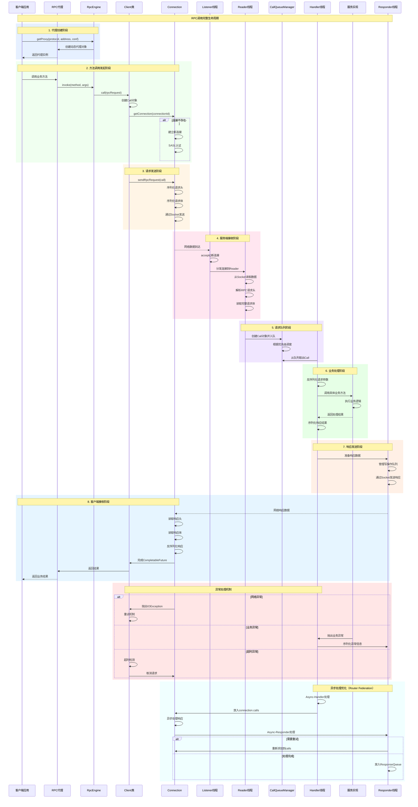

# RPC调用完整流程时序图

## 流程关键节点说明

### 🚀 **代理创建阶段**
- **RpcEngine.getProxy()**: 创建动态代理，封装网络通信细节
- **协议绑定**: 将业务接口与RPC传输协议绑定
- **配置初始化**: 设置连接参数、超时时间、重试策略

### 📤 **请求发送阶段**
- **Call对象创建**: 包含唯一ID、重试计数、CompletableFuture
- **连接管理**: 复用现有连接或建立新连接
- **序列化处理**: 将Java对象转换为网络传输格式
- **SASL认证**: 安全认证和授权检查

### 🔄 **服务端处理阶段**
- **多线程架构**: Listener→Reader→Handler→Responder的流水线处理
- **队列调度**: 支持优先级、公平性等多种调度策略
- **业务调用**: 通过反射机制调用具体的服务实现
- **资源管理**: 连接池、线程池的智能管理

### 📥 **响应处理阶段**
- **异步响应**: CompletableFuture支持非阻塞调用
- **错误处理**: 网络异常、业务异常、超时异常的分类处理
- **性能监控**: 详细的调用指标和性能数据收集

### ⚡ **异步优化机制**
- **Async-Handler**: 非阻塞的请求处理
- **nameservice隔离**: 多租户环境下的资源隔离
- **智能重试**: 基于异常类型的重试策略
- **响应队列**: 高效的响应管理机制
