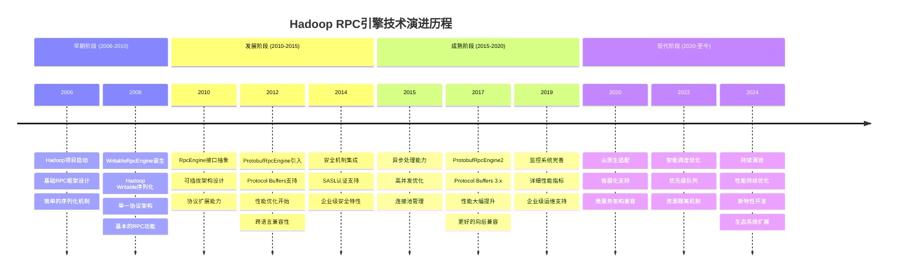

# RPC引擎演进时序图

## 演进关键节点说明

### 🚀 **WritableRpcEngine时代 (2008-2015)**
- **核心特点**: 基于Hadoop Writable序列化
- **优势**: 简单直接，与Hadoop生态紧密集成
- **局限**: 性能有限，跨语言支持不足

### ⚡ **ProtobufRpcEngine时代 (2012-2020)**
- **核心特点**: 引入Protocol Buffers序列化
- **优势**: 性能提升，跨语言支持，标准化协议
- **改进**: 更好的序列化效率和网络传输优化

### 🎯 **ProtobufRpcEngine2时代 (2017-至今)**
- **核心特点**: 支持Protocol Buffers 3.x
- **优势**: 显著性能提升，更好的向后兼容性
- **特性**: 异步处理、智能调度、企业级监控

### 🔮 **未来发展方向**
- **云原生**: 容器化、服务网格集成
- **性能**: 持续的序列化和网络优化
- **生态**: 更广泛的跨语言支持和工具集成
