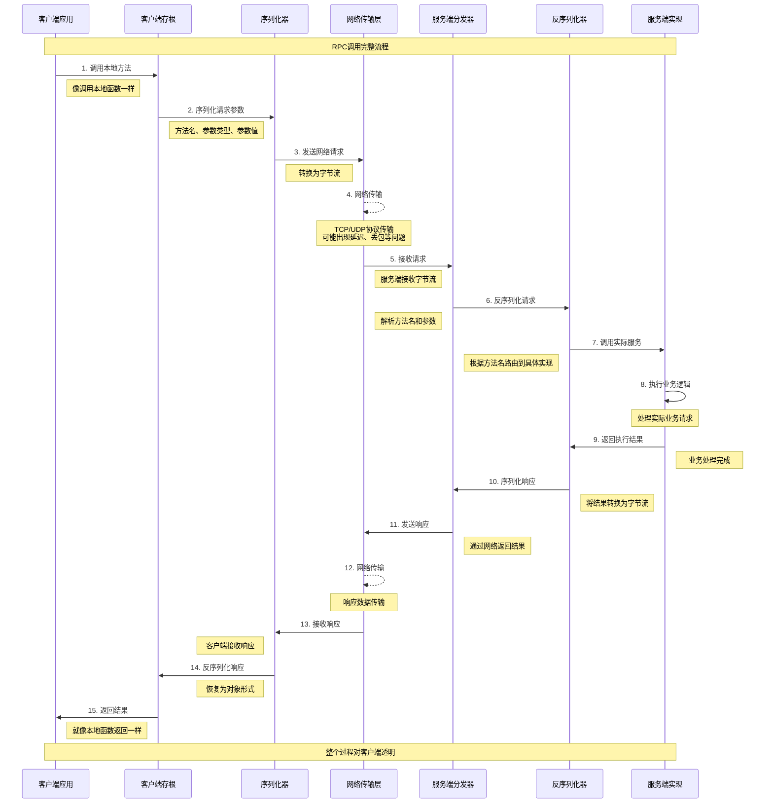

# RPC调用完整流程时序图

## 图表说明

这个时序图展示了一个完整的RPC调用过程，从客户端发起调用到服务端返回结果的全部步骤：

### 关键步骤解析

1. **客户端调用** - 应用程序调用看似本地的方法
2. **参数序列化** - 将方法调用转换为可传输的格式
3. **网络传输** - 通过网络协议发送请求
4. **服务端处理** - 接收、解析并执行实际业务逻辑
5. **结果返回** - 将执行结果通过相同路径返回客户端

### 透明性体现

整个过程对客户端应用是透明的，开发者只需要像调用本地函数一样使用RPC服务，底层的网络通信、序列化等复杂性都被RPC框架屏蔽了。
